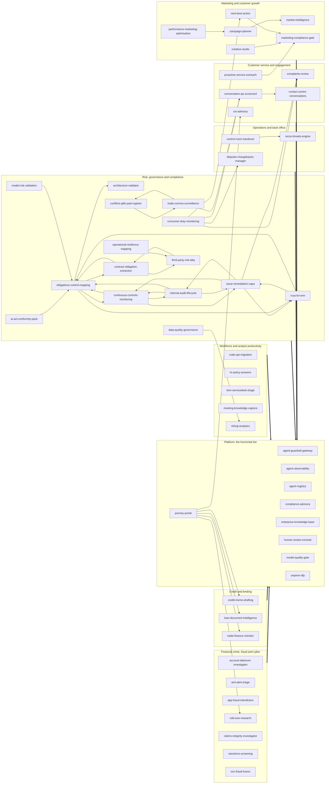

# portable-genai

Reference implementations of GenAI and agentic systems for regulated industries, built so
that the institution keeps the parts that matter.

## The question these repositories answer

Every enterprise system eventually faces one question: could we move it, in one piece, and
have it keep working somewhere else? In regulated industries a supervisor now asks it too.

Lock-in is not one decision. It accumulates in three places, and they have separate
switching costs:

- **The surface** users touch: the UI shell, the embedding model, the identity handshake.
- **The engine** that decides: where the consequential logic actually runs, and who owns
  the numbers it produces.
- **The ledger** that remembers: the audit trail, the citations, the records that outlive
  any vendor contract.

A system portable at only one or two of these has not removed the lock. It has moved it to
the layer nobody priced. These repositories are the worked answer at all three.

The argument in full, with the failure modes that produced it:
[Convergence: Agentic System Design with Portable Architecture for Lock-in Insurance](https://aawasthi.blogspot.com/2026/07/portable-agentic-systems-on-google-cloud.html).

## What that means in the code

Every repository here is built the same way, and the conventions are checkable rather than
aspirational.

**The domain imports nothing but the standard library.** Business logic sits in a pure core
reached through typed ports. Adapters for a managed cloud, a local machine or an on-premises
estate bind those ports; switching profiles changes zero domain code. If the whole system
runs on one machine, with no network and no vendor toolkit installed, the separation between
core and infrastructure is demonstrably real, and that is what the offline gate proves on
every commit.

**The consequential math is deterministic, pure and replayable.** The model narrates,
drafts and classifies. It never produces the number. Policy thresholds live in configuration
the institution owns, not in code and not in a prompt.

**Every generated claim carries a citation** with a source and a locator. Missing evidence
is a gap or a refusal, never an invention.

**Maker-checker on every consequential output.** Escalation only ever raises the bar.

**Identity is resolved, never accepted.** The server determines the actor and discards
client-supplied claims.

**A guard observed only green is indistinguishable from a guard that asserts nothing.**
Every quality gate must be shown to go red against a deliberate defect before it is allowed
to certify anything.

## Degradation is controlled, not silent

The same input, policy version and evidence produce the same consequential figures, checks,
escalation reasons and citation relationships in every profile. What changes between a
managed cloud profile and a laptop is quality, scale and durability, never policy.

| Concern | Managed profile | Local profile | Invariant |
|---|---|---|---|
| Business decision | Deterministic service, managed evidence | Same service, local evidence | Figures, rules, escalation reasons, evidence links |
| Model assistance | Frontier model, grounded retrieval | Local model or deterministic narration | The model never owns the outcome |
| Identity | Verified gateway or institution assertion | Seeded personas bound to loopback | The server resolves the actor |
| Audit | CMEK-backed WORM retention | Local hash chain | Event schema, actor attribution, correlation |

Degradation is a reduction in quality, scale or assurance. It is never an empty result
standing in for a successful query, an invented citation, or a passing grade over zero
evidence.

## Start with the shared packages

These are the pieces the systems share, versioned and pinned rather than copy-pasted:

| Package | What it carries |
|---|---|
| `hex-service-kit` | Identity primitives, service authentication, fail-closed network defaults, domain-neutral kernel types, the tracer port |
| `agent-eval-kit` | Eval report types, the evaluation gate port, and the not-falsely-green harness that makes a gate prove it can fail |
| `pii-kit` | Jurisdiction PII patterns, checksum validators, RE2-safe forms, the shared safety scorer |
| `review-kit` | The producer contract for routing consequential work to human review |
| `consent-preference-kit` | Consent wire types and a fail-closed client for asking whether a data subject may be contacted |
| `speech-lexicon-kit` | Pronunciation and terminology handling for voice surfaces |
| `obligation-register-kit` | Regulatory obligation register types and coverage scoring |
| `cost-latency-calculator` | The one cost and latency model: token-priced cost, decode-rate latency, and the pricing book a system is sized against |
| `hex-service-template` | The template and reusable CI a new service starts from |

Each is consumed from a version tag with no credentials required, and
`hex-service-template` is where a new service begins. `cost-latency-calculator` is the one
that runs in a browser rather than in a build: a repository sized by it ships a thin page
that loads the engine from a pinned tag, so the calculation and the prices live in one
place and a price change reaches all of them. Its app is public:
[size a system's cost and latency](https://portable-genai.github.io/cost-latency-calculator/).

## The systems

Each repository is a complete reference implementation: a pure domain core, typed
ports, an adapter family per profile, its own gate and its own deployment stack.

### The business use cases: user-facing applications

Every system in these tables is consumed directly by a named business persona, from
the MLRO's alert queue to the credit committee's memo pack. The last column names the
primary Gemini Enterprise services the managed profile rides, in three groups: `GE` is
the Gemini Enterprise app (search, research, analytics), `CX` is Customer Experience
(conversation, speech, agent assist), `AP` is the Agent Platform (agents, retrieval,
models, events). Every service sits behind a port (P-02), and the local and on-prem
profiles bind the same port to local adapters, so the platform is leverage rather than
lock-in. The deterministic engine that produces each consequential number stays in the
repository and is assigned to no platform service. A row marked (proposed) is scoped
in the catalog with no repository behind it yet, and follows the same conventions and
standing rules when built. The middle column is the BFSI go-to-market tier, not one of
the numbered design principles below: `P1` is the launch set pitched first, `P2` the
second wave, `P3` the broader BFSI core, `P4` adjacent verticals. The tier ranks buyer
motion and dependency order, not build status, which the (proposed) marker already
carries, so a scoped row can outrank a built one. Rows are ordered by tier, and each
tier carries its argument, written to survive challenge: read it as
the answer to why the row is not a tier higher or lower.

#### Risk, governance and compliance

| Repository and what it does | BFSI tier, and why | Primary Gemini Enterprise services |
|---|---|---|
| [`compliance-advisory`](https://github.com/portable-genai/compliance-advisory) Q&A + use-case-specific control checklists, automated test cases and the exact questions a regulator/CRO will ask | `P1` The door-opener: it sells to the CCO and CRO who must approve every other agent in this catalog, in their own regulatory language (MAS, HKMA, APRA, FSA), and the other pitched apps already depend on it. If it were not P1, the pitch would open with use cases the approver has no tool to evaluate. | • GE Agent Search: cited regulatory Q&A for analysts • AP RAG Engine: requirement retrieval for control mappings |
| [`architecture-validator`](https://github.com/portable-genai/architecture-validator) Validates a project's requirements / design against the General Principles (policy-as-code) + the reg KB | `P2` An internal gate, not a demo: the validator earns its keep at project intake (rule R6), so it sells after the first project exists. Challenged upward it fails the door-opener test, nothing about an architecture gate excites a business buyer in a first meeting; challenged down to P3 it fails too, because every adopted vertical immediately needs it. | • AP ADK: the root validation agent • AP RAG Engine: reg-KB retrieval |
| [`third-party-risk-ddq`](https://github.com/portable-genai/third-party-risk-ddq) Ingests a vendor's DDQs (SIG/CAIQ-style), SOC 2 / ISO 27001 reports, financials and adverse media | `P2` DDQ and SOC 2 review is documents-in, cited-memo-out, the lowest-integration relief in the RGC family, and it sells through the same CCO door compliance-advisory opens. Not P1 because TPRM platforms are entrenched and procurement-owned, so it converts a warm compliance relationship rather than opening one. | • GE Deep Research: vendor adverse-media research • AP RAG Engine: DDQ, SOC 2 and ISO corpus retrieval |
| `exam-rfi-orchestrator` (proposed) Turns an incoming regulator exam request list or supervisory inquiry into a managed, citation-backed response; handles RFIs and s.166-style reviews | `P2` Exam and RFI response is universal pain with no incumbent tooling, and it sells straight through the CCO door compliance-advisory opens, which is what ranks a row into the second wave here. Not P1 because the launch set must demo and this is unbuilt. The fair doubt is that it waits on enterprise-knowledge-base corpus discipline at scale, an unproven capability; it still outranks the roadmap because cited ACL-aware retrieval is the platform's sweet spot rather than a new build, and no vendor holds the category against it. | • GE Agent Search: ACL-aware exam-evidence retrieval • AP Agent Runtime: deadline-tracked response workflows |
| [`ai-act-conformity-pack`](https://github.com/portable-genai/ai-act-conformity-pack) Maps each deployed AI/agent system in the agent-registry to obligations under the EU AI Act, MAS FEAT/Veritas, HKMA, APRA CPS 234/230 AI guidance | `P3` The EU AI Act and FEAT conformity clock is real, but the pack sells only after the firm has agents in production to make conformant (it reads the agent-registry). P3 by dependency, not by weight; it moves up the moment a supervisor asks for the evidence. | • AP RAG Engine: AI-Act and FEAT rule-KB grounding • AP Model Garden: conformity-narrative drafting |
| [`conflicts-gifts-pad-register`](https://github.com/portable-genai/conflicts-gifts-pad-register) Ingests gifts & entertainment declarations, PAD/brokerage feeds, outside-business-interest and political-donation disclosures | `P3` Conflicts, gifts and PAD registers are universal but low-drama; the register wins on screening quality, not wow. P3 alongside trade-comms-surveillance, whose surveillance feeds it consumes. | • AP ADK: screening and declaration agents • AP Model Garden: free-text declaration reading |
| [`consumer-duty-monitoring`](https://github.com/portable-genai/consumer-duty-monitoring) Ingests product-governance packs, target-market definitions, fees/value-for-money data, complaints themes and sales/advice samples | `P3` Consumer-duty outcomes monitoring is board-level in the UK and spreading; it stays P3 because it consumes complaints, QA and disputes signals (complaints-review, conversation-qa-scorecard, disputes-chargebacks-manager), so it is only credible once those feeds exist. Challenging it into the launch set puts the dashboard before the data. | • CX Insights: complaint and conversation outcome signals • AP Model Garden: fair-value assessment drafting |
| [`continuous-controls-monitoring`](https://github.com/portable-genai/continuous-controls-monitoring) Continuously TESTS key controls against live system, transaction and config evidence on a defined cadence, scores design vs operating effectiveness | `P3` Continuous controls monitoring is the long-run prize, testing controls beats sampling them, and the doubt is why the prize sits at P3: because it must integrate with live systems evidence to be more than a demo, and integration-heavy proofs lose first meetings. It anchors the audit trio once internal-audit-lifecycle opens the account. | • AP BigQuery/Pub-Sub event-driven agents: test-cadence triggers and evidence feeds • AP Model Garden: auditor-ready exception narration |
| [`contract-obligation-extraction`](https://github.com/portable-genai/contract-obligation-extraction) Reads executed and draft contracts (MSAs, SOWs, DPAs, outsourcing agreements, ISDAs) and extracts a structured register of obligations, key clauses | `P3` Contract obligation extraction is proven ground (every legal-ops team wants the register), which is also why it is P3: the category has incumbents, and the differentiation (the obligation graph into obligations-control-mapping, the evidence discipline) shows best after the compliance estate is in. | • AP Model Garden: long-context clause and obligation extraction • AP ADK: contract-register agent tools |
| [`data-quality-governance`](https://github.com/portable-genai/data-quality-governance) Profiles a dataset, runs deterministic DQ, freshness, schema-drift and PII-classification checks | `P3` Data-quality governance is a prerequisite everywhere and a headline nowhere: no CDO buys agentic AI because of a DQ scorecard, but every deployed system leans on it. P3 as connective tissue; challenged upward it fails the door-opener test, challenged downward it breaks the estate. | • AP BigQuery/Pub-Sub event-driven agents: profiling feeds and DQ-check scheduling triggers • AP Model Garden: incident-narrative drafting |
| [`internal-audit-lifecycle`](https://github.com/portable-genai/internal-audit-lifecycle) End-to-end copilot for the internal-audit engagement lifecycle: risk-based annual planning, scoping, fieldwork test execution | `P3` The audit copilot has a clear buyer (the CAE) and a strong hours story; it is P3 because internal audit is a second budget after the CCO and CRO sale, and fieldwork value shows over an audit cycle, not in a demo. First-line GRC opens the door, third-line follows. | • AP RAG Engine: workpaper and prior-audit retrieval • AP Model Garden: planning and finding drafting |
| [`issue-remediation-capa`](https://github.com/portable-genai/issue-remediation-capa) OWNS the full post-finding lifecycle of audit/exam/incident issues and corrective-and-preventive actions (continuous-controls-monitoring DETECTS | `P3` Issue and CAPA tracking is the record regulators actually read, but a tracker demos poorly next to agentic research, and its value compounds only as findings flow in from internal-audit-lifecycle and continuous-controls-monitoring. P3: it completes the audit lifecycle rather than starting the conversation. | • AP ADK: issue-assessment and CAPA agents • AP BigQuery/Pub-Sub event-driven agents: five-source issue-feed intake |
| [`model-risk-validation`](https://github.com/portable-genai/model-risk-validation) Drafts model-development documentation, independent-validation reports | `P3` Model-risk validation drafting has an acute supervisory-driven backlog, so doubting P3 is fair. It stays there because the buyer (head of MRM) is narrow, the evidence bar is the highest in the building, and credibility transfers from model-quality-gate's evaluation discipline after the platform sale, not before. | • AP Model Garden: validation-report and breach-narrative drafting • AP ADK: MRM copilot agent tools |
| [`obligations-control-mapping`](https://github.com/portable-genai/obligations-control-mapping) Builds and maintains the firm's regulatory inventory and is the SINGLE SYSTEM OF RECORD for the obligation->policy->control->evidence graph: | `P3` The obligation-to-evidence graph is the system of record the rest of RGC writes into, and system-of-record sales are long, committee-driven and never first. P3 with the estate, indispensable once two or more RGC verticals are in. | • AP RAG Engine: policy, standard and control corpus retrieval • AP Model Garden: cited linkage proposals |
| [`operational-resilience-mapping`](https://github.com/portable-genai/operational-resilience-mapping) Builds and maintains the resilience map for each important/critical business service: ingests process docs, app-service catalogs | `P3` Operational resilience mapping (DORA, CPS 230) has a regulatory clock like ai-act-conformity-pack and the same shape of doubt. It ranks P3 because the map is only as good as the process and vendor inventories fed into it, an ingestion-heavy start that follows a relationship rather than opening one. | • AP Model Garden: runbook, CMDB and contract reading • AP ADK: resilience-studio agent tools |
| [`rcsa-kri-erm`](https://github.com/portable-genai/rcsa-kri-erm) Operates the second-line ERM cycle: drives Risk & Control Self-Assessment (drafts inherent-risk and control descriptions in house taxonomy | `P3` RCSA and KRI operations are the second line's daily grind and the copilot relieves real toil; P3 because ERM tooling is an incumbent-heavy replacement sale where a reference implementation persuades after the door-opener, not instead of it. | • AP BigQuery/Pub-Sub event-driven agents: KRI feeds and breach triggers • AP Model Garden: committee commentary drafting |
| [`trade-comms-surveillance`](https://github.com/portable-genai/trade-comms-surveillance) MOVED FROM FCC TO RGC per the SUBJECT-of-disposition rule: this surveils the firm's OWN employees and trades for conduct | `P3` Trade and comms surveillance is mandatory spend with entrenched vendors, the hardest category to displace, plus false-positive pain the incumbents own. P3: the pitch is assistive investigation on top of existing surveillance, credible once the platform tier is trusted with regulated data. | • CX channels & speech: voice transcription of monitored comms • CX Insights: sentiment and topic signals feeding the surveillance engine |
| `breach-reportability-assessor` (proposed) Takes any incident through a deterministic whether/whom/by-when reportability decision | `P3` Multi-regime reportability clocks (DORA, CPS 230, NDB, GDPR 72-hour) are acute, and a deterministic clock engine is exactly this catalog's shape. Not higher because it is unbuilt and its rule packs need jurisdiction-by-jurisdiction legal review before a credible demo exists. | • AP RAG Engine: per-regime notification-rule grounding • AP Agent Runtime: notification-clock case workflows |
| `esg-disclosure-studio` (proposed) Drafts the regulated climate / sustainability report by mapping governed source data and prior-year text onto the exact required datapoint taxonomy | `P3` ISSB-aligned reporting is now mandated across APAC listings, and datapoint-taxonomy completeness scoring fits the deterministic pattern. Not higher: disclosure tooling is crowded and the greenwashing gate already ships inside marketing-compliance-gate, so this is the report-assembly remainder. | • AP RAG Engine: datapoint-taxonomy and substantiation grounding • AP ADK: the multi-framework report-assembly agent |
| `regulatory-returns-qa` (proposed) Validates prudential and statistical regulatory returns before submission | `P3` Returns QA has a named buyer, the head of regulatory reporting, and BigQuery-resident data. The doubt is incumbent RegTech; the wedge is narrated variance commentary on top of the firm's existing validation engine, not replacement, which is also why it is not ranked higher. | • AP RAG Engine: reporting-instruction and taxonomy grounding • AP BigQuery/Pub-Sub event-driven agents: returns-vs-ledger reconciliation feeds |
| `stress-icaap-orsa-studio` (proposed) Assembles the qualitative narrative around quantitative stress and capital results, with every figure cited to the source model run | `P3` ICAAP and ORSA narrative assembly is heavy recurring toil for a small expert team, with the safest possible AI claim, the capital maths stays in the firm's own models. Not higher because the buyer count per institution is small and the sale rides the CRO relationship the second-line estate builds. | • AP RAG Engine: prior-filings and regulatory-expectation grounding • AP BigQuery/Pub-Sub event-driven agents: model-run output ingestion |

#### Financial crime, fraud and cyber

| Repository and what it does | BFSI tier, and why | Primary Gemini Enterprise services |
|---|---|---|
| [`cdd-sow-research`](https://github.com/portable-genai/cdd-sow-research) Grounded research over KYC docs + corporate registries + adverse media -> SoW narrative, risk rating, full citations and audit trail | `P1` The flagship: grounded multi-source SoW research with full citations turns days of financial-crime analyst work into minutes, a cost centre every bank, wealth manager and insurer carries. Doubters point at entrenched KYC vendors; those sell screening and workflow, not cited source-of-wealth research with a replayable audit trail, which is what the supervisor reads. | • GE Deep Research: adverse-media and registry research • GE Agent Search: KYC-corpus retrieval for the cited dossier |
| [`aml-alert-triage`](https://github.com/portable-genai/aml-alert-triage) Takes a deterministically-scored AML transaction-monitoring alert and produces a close / escalate-to-SAR / request-info recommendation with a | `P2` It rides the financial-crime motion: alert triage is the biggest analyst cost line in AML, and the buyer is the same MLRO the cdd-sow-research flagship wins. Not P1 because first proofs wait on transaction-monitoring feeds and model-risk sign-off, the classic stall of this category; pitched as cdd-sow-research's converting follow-on, those doors are already opening. | • AP RAG Engine: typology retrieval grounding SAR narratives • AP BigQuery/Pub-Sub event-driven agents: alert-triggered triage runs |
| [`account-takeover-investigator`](https://github.com/portable-genai/account-takeover-investigator) Correlates device, session | `P3` Account-takeover investigation packages device and session forensics well, but the SOC tooling market is crowded and its differentiators (citation discipline, replayable timelines) persuade security buyers slowly. P3 in the fraud-fusion cluster with soc-fraud-fusion. | • AP BigQuery/Pub-Sub event-driven agents: login, session and device signal triggers • AP Agent Runtime: the investigation agent and its A2A surface |
| [`app-fraud-interdiction`](https://github.com/portable-genai/app-fraud-interdiction) Scores an in-flight payment/checkout for scam and authorised-push-payment fraud (deterministic rules | `P3` Real-time scam interdiction is topical, APP reimbursement rules shift liability to banks, so doubting P3 is fair. It stays because in-flight payment integration is the deepest technical ask in the catalog, and no bank grants it to a first-meeting vendor; the liability clock will pull this up the tiers on its own. | • AP BigQuery/Pub-Sub event-driven agents: in-flight payment triggers • CX channels & speech: the inbound scam-call channel |
| [`claims-integrity-investigator`](https://github.com/portable-genai/claims-integrity-investigator) Reviews an insurance claim file (FNOL, adjuster notes, photos, invoices, medical/repair reports | `P3` Claims-fraud investigation is the strongest insurance entry and P1-shaped in a pure-insurer pitch; in this BFSI-first catalog it ranks P3 because the launch set leads banking-side. In an insurance-led pursuit, treat it as the local flagship alongside insurance-underwriting-intake. | • AP Model Garden: multimodal review of claim documents and photos • AP RAG Engine: policy-wording retrieval |
| [`sanctions-screening`](https://github.com/portable-genai/sanctions-screening) Resolves sanctions/PEP/watchlist and ISO 20022 / SWIFT payment-message screening hits | `P3` Sanctions hit disposition is high-volume toil with a clear cited-research fit; it sits with aml-alert-triage for the same reason: screening stacks are entrenched, regulated and slow to pilot. The wedge is disposition assistance, not stack replacement, and it follows the cdd-sow-research relationship. | • GE Deep Research: adverse-media research on screening hits • AP Agent Runtime: the disposition-drafting agent |
| [`soc-fraud-fusion`](https://github.com/portable-genai/soc-fraud-fusion) Ingests a deterministically-correlated security/fraud alert and produces a triaged incident summary | `P3` SOC fraud fusion needs both the security estate and the fraud estate wired in before the fusion claim means anything, and that is a second-year conversation at most institutions. P3 by integration depth, not by value. | • AP RAG Engine: runbook and threat-intel retrieval • AP Agent Gateway + Model Armor: injection screening before narration |

#### Credit and lending

| Repository and what it does | BFSI tier, and why | Primary Gemini Enterprise services |
|---|---|---|
| [`credit-memo-drafting`](https://github.com/portable-genai/credit-memo-drafting) Financials + filings -> cited credit memo, covenant extraction, risk flags, peer comps | `P1` Core credit workflow of every commercial bank: cited memo drafting with covenant extraction saves large analyst-hours per deal and fits model-risk expectations because a human approves the memo. The doubt is that memo drafting is commoditising; the answer is the deterministic covenant and ratio engine plus the citation discipline, which generic copilots do not carry. | • AP Model Garden: cited memo drafting from filings • AP RAG Engine: borrower-filings grounding |
| [`loan-document-intelligence`](https://github.com/portable-genai/loan-document-intelligence) Income and bank-statement extraction + cross-validation | `P2` Retail lending document intelligence serves a different buyer (retail lending ops) than credit-memo-drafting's credit committee, and two credit demos in the opening pitch dilute each other. It follows immediately once the credit-memo-drafting conversation starts, sharing the same extraction commons. | • AP Model Garden: income-figure normalisation and explanation • AP Agent Gateway + Model Armor: the PII guardrail pipeline |
| [`trade-finance-checker`](https://github.com/portable-genai/trade-finance-checker) Letter-of-credit vs UCP600 discrepancy detection across the document set | `P2` The differentiation card, played second: UCP600 document checking is scarce-expert work few vendors can demonstrate, but it shares credit-memo-drafting's buyer and carries niche volume, so it does not earn a launch slot on door-opening or daily throughput. P2: the second-meeting wow that proves the catalog's depth once credit-memo-drafting opens the credit conversation. | • AP RAG Engine: governed UCP600 rule-set retrieval • AP Model Garden: examiner-narrative drafting |
| `credit-portfolio-early-warning` (proposed) Post-origination monitoring of the lending book: covenant compliance tracked against the terms credit-memo-drafting extracts at origination | `P2` Post-origination early warning is where credit losses are actually prevented, supervisors expect a watchlist process, and it consumes credit-memo-drafting's covenant register, so it converts on the Chief Credit Officer relationship the launch set already lands. Not P1 because the opening pitch must demo and this is unbuilt. The fair doubt is whether an unbuilt row can hold a second-wave slot at all; this tier ranks buyer motion and dependency order, and the (proposed) marker already carries build status, so P3 would say twice what the marker says once. | • AP BigQuery/Pub-Sub event-driven agents: financials, transaction and news early-warning triggers • AP RAG Engine: cited covenant-terms and adverse-news evidence |

#### Operations and back office

| Repository and what it does | BFSI tier, and why | Primary Gemini Enterprise services |
|---|---|---|
| [`control-room-handover`](https://github.com/portable-genai/control-room-handover) Aggregates queue/backlog/SLA-breach/aging across the ops systems into a deterministic scorecard, then drafts the shift-handover brief | `P3` The shift-handover brief is loved by ops leads and demos in minutes; it is still a thin wedge that presumes the queue and SLA feeds of the systems around it. P3: it sells the ops cluster's coherence, not itself. | • AP BigQuery/Pub-Sub event-driven agents: shift-cadence ops-feed triggers • CX channels & speech: the optional spoken handover brief |
| [`disputes-chargebacks-manager`](https://github.com/portable-genai/disputes-chargebacks-manager) Forward-running dispute/chargeback lifecycle (card scheme for banking | `P3` Disputes and chargebacks carry scheme-clock urgency and real write-off money, so doubting P3 is reasonable. It ranks there because scheme workflows are bank-specific and the intake half rides contact-centre-conversations's channel stack; it accelerates wherever card operations own the pain. | • CX Agent Studio: in-channel dispute intake • AP ADK: representment-pack drafting agents |
| [`recon-breaks-engine`](https://github.com/portable-genai/recon-breaks-engine) Diffs two or more financial feeds (nostro/GL vs scheme/RTGS | `P3` Reconciliation breaks are unglamorous, universal and deterministic to the bone, which makes this the quiet workhorse sale: ops buyers trust it quickly, but no first meeting was ever won on recon. P3 with the ops cluster. | • AP BigQuery/Pub-Sub event-driven agents: feed-arrival triggers for reconciliation runs • AP ADK: root-cause note drafting |
| `corporate-actions-processor` (proposed) Reads corporate-action announcements (SWIFT MT564-style messages, vendor feeds, issuer documents) | `P3` Corporate-actions errors are among the costliest recurring ops losses in custody, and announcement-to-entitlement is the deterministic-plus-narration shape this catalog sells. The buyer set, securities services, is narrow, so it ranks with the ops cluster, not above it. | • AP BigQuery/Pub-Sub event-driven agents: announcement and position feeds with deadline clocks • AP RAG Engine: announcement-term grounding for the cited entitlement narrative |
| `insurance-underwriting-intake` (proposed) Ingests commercial and life underwriting submissions (broker packs, ACORD forms, loss runs, medical and financial evidence) | `P3` Submission triage is the top GenAI ask in commercial and life underwriting, unquoted submissions are lost premium, and it completes the lifecycle opposite claims-integrity-investigator. Ranked with the insurance cluster: it leads only when the pursuit is insurance-first. | • AP RAG Engine: appetite-guideline and policy-wording grounding for the cited appraisal • AP ADK: submission-ingestion and triage agents |

#### Customer service and engagement

| Repository and what it does | BFSI tier, and why | Primary Gemini Enterprise services |
|---|---|---|
| [`cio-advisory`](https://github.com/portable-genai/cio-advisory) RAG over the bank's CIO house-view articles + the client's portfolio -> personalised, suitability-checked RM talking points (decision-support | `P1` The revenue-side proof: personalising the CIO house view into suitability-checked RM talking points shows agentic AI in the front office without crossing the advice line. Doubters call wealth advisory too risky to pitch first; the decision-support guardrail and maker-checker routing are exactly the risk answer, and a revenue story is what brings a sponsor to the table. | • AP RAG Engine: house-view retrieval grounding RM talking points • AP ADK: the RM briefing agent |
| [`complaints-review`](https://github.com/portable-genai/complaints-review) Summarise, categorise and draft regulator-ready responses from complaint / conduct files | `P2` Complaints review is reactive back-office relief, strong on cost but weak as a door-opener next to compliance-advisory. Consumer Duty pressure makes it an easy attach once the CCO relationship exists, which is exactly what P2 means here. | • CX Agent Assist: file summaries and drafted responses beside officers • AP RAG Engine: policy retrieval for regulator-ready drafts |
| [`contact-centre-conversations`](https://github.com/portable-genai/contact-centre-conversations) One contact-centre conversational platform with two separately-gated modes, merged because they share one CCAI/RAG stack and buyer | `P2` Contact-centre AI is the biggest single GenAI budget line in FSI and the CX group is the platform's closest fit, so it cannot sit in the core estate. Not P1 because it is a CX-platform motion, CCAI stack, telephony and months of integration, with a different buyer than the GRC door the launch set opens; where a pursuit starts in CX, it leads outright. | • CX Agent Assist: the live whisper copilot • CX Agent Studio: gated self-service flows • CX channels & speech: streaming voice and chat |
| [`conversation-qa-scorecard`](https://github.com/portable-genai/conversation-qa-scorecard) Post-contact deterministic compliance/quality scorecard across 100% of contacts (script adherence, disclosure presence, sentiment | `P3` Conversation QA across every contact is the compliance twin of contact-centre-conversations and shares its stack; it cannot precede the platform it scores. P3, attached to contact-centre-conversations's motion. | • CX channels & speech: batch transcription of every contact • CX Insights: QA analytics over the scored contacts |
| [`proactive-service-outreach`](https://github.com/portable-genai/proactive-service-outreach) Detects operational service triggers (failed payment, delivery exception, expiring card, fraud hold, outage) and generates consent-gated | `P3` Proactive outreach converts service signals into consented contact; the economics are good but it presumes event feeds, consent plumbing and the marketing-compliance-gate. P3: a fast follower on either the CX or the marketing motion, a leader on neither. | • CX Agent Studio: consent-gated resolution conversations • AP BigQuery/Pub-Sub event-driven agents: operational trigger detection |
| `collections-hardship-assistant` (proposed) Consent-gated, vulnerability-aware collections and financial-hardship conversations | `P3` Collections is a conduct-sensitive cost centre where hardship rules (Consumer Duty, NCCP, fair dealing) bite and cure-rate economics are provable. It presumes contact-centre-conversations's channel stack and the consent kit, hence roadmap rather than launch. | • CX Agent Studio: deterministic-plus-generative hardship conversation flows • CX Agent Assist: vulnerability cues and required disclosures beside human collectors |

#### Marketing and customer growth

| Repository and what it does | BFSI tier, and why | Primary Gemini Enterprise services |
|---|---|---|
| [`marketing-compliance-gate`](https://github.com/portable-genai/marketing-compliance-gate) Reviews campaigns, creatives and offers against per-market, per-vertical advertising / consumer-protection / fair-trading rules | `P1` Financial promotions are a regulated activity, so the gate lands with the CMO and the CCO at once and extends the pitch to the revenue side without leaving GRC. Doubters ask why a marketing tool outranks AML triage; because every outbound-content system here must depend on it (rule R7), so it is the beachhead the second-wave marketing suite sells through. | • AP RAG Engine: per-market advertising rule-KB retrieval • AP Model Garden: finding narration |
| [`campaign-planner`](https://github.com/portable-genai/campaign-planner) Turns an objective and budget into a campaign plan for any vertical (banking or online retail): audience segmentation and propensity | `P2` The planning engine behind the marketing wave: deterministic budget allocation under auditable constraints. Not P1 because campaign planning alone does not open a regulated buyer's door; it converts once marketing-compliance-gate has made marketing a compliance conversation. | • AP Model Garden: brief and calendar drafting • AP ADK: campaign-planning agents |
| [`creative-studio`](https://github.com/portable-genai/creative-studio) Generates on-brand ad copy and creative variants (text + image) for a bank or retailer | `P2` Brand-safe creative generation is the most demoable of the marketing suite, but its claim stands only through the marketing-compliance-gate it feeds (rule R7); pitched alone it is indistinguishable from stock GenAI creative tools. P2 as the visible half of a gated pipeline. | • AP Model Garden: Gemini copy and Imagen creative variants • AP RAG Engine: brand-guideline grounding |
| [`market-intelligence`](https://github.com/portable-genai/market-intelligence) Deep, cited market research and competitor analysis for a bank OR online retailer: market and segment sizing | `P2` Cited market research is credible and built, but not BFSI-differentiating: any vertical buys competitor analysis, and Gemini Enterprise's own Deep Research covers the shallow half. It rides the P2 marketing wave behind the marketing-compliance-gate beachhead, where its governed-corpus grounding is the differentiator. | • GE Deep Research: cited market and competitor research • GE Agent Search: internal research-corpus grounding |
| [`next-best-action`](https://github.com/portable-genai/next-best-action) Per-customer / per-shopper next-best-offer and cross-sell / up-sell of products or merchandise: propensity plus deterministic eligibility ranking | `P2` Cross-sell with deterministic eligibility ranking sells revenue, but next-best-action is the most crowded claim in banking martech and that doubt is fair. What ranks it P2 rather than P3 is the compliance angle: eligibility, suitability and consent gates that CRM vendors do not carry, sold through marketing-compliance-gate. | • AP Model Garden: propensity and recommendation models • CX commerce agents: offer surfacing in customer journeys |
| [`performance-marketing-optimisation`](https://github.com/portable-genai/performance-marketing-optimisation) Measures and optimises paid and owned channels for any vertical: multi-touch attribution, ROAS / CAC, deterministic bid and budget optimisation | `P2` Attribution and ROAS optimisation with deterministic statistics is a strong CFO-adjacent story, but it needs months of channel data before it shows value, so it cannot lead a pitch. P2: land with the gate and the planner, prove with this. | • GE Conversational Analytics: conversational exploration of performance metrics • AP BigQuery/Pub-Sub event-driven agents: anomaly-alert triggers |

#### Workforce and analyst productivity

| Repository and what it does | BFSI tier, and why | Primary Gemini Enterprise services |
|---|---|---|
| [`nl2sql-analytics`](https://github.com/portable-genai/nl2sql-analytics) Answers an NL business question against a governed semantic layer (certified metrics, joins, row-level access), generates and validates SQL | `P3` Governed NL-to-SQL has the broadest appeal in the catalog and the most commoditised claim in analytics; the defensible part is the governed semantic layer and the refusal discipline. P3: analytics platforms buy it after the governance story is believed, and GE's own conversational analytics covers the ungoverned half. | • GE Conversational Analytics: NL questions to governed SQL over BigQuery • GE Agent Search: data-dictionary retrieval |
| [`code-api-migration`](https://github.com/portable-genai/code-api-migration) Plans and drafts code/API migrations (framework upgrades, deprecated-API replacement | `P4` Code-migration copilots are a crowded platform category, Agent Garden ships the template; this version adds eval-gated, reviewable plans, which engineering leaders like but BFSI buyers do not pay a premium for. P4 by commoditisation. | • AP Agent Garden: the code-modernisation template baseline • AP ADK: the migration agent loop over repo and CI |
| [`hr-policy-answers`](https://github.com/portable-genai/hr-policy-answers) Answers an HR/policy/payroll/leave question with a cited answer plus a deterministic entitlement/eligibility calculation (leave balance, allowance | `P4` HR entitlement answers prove the cited-answer-plus-deterministic-maths pattern, but HR is not a BFSI budget and Agent Gallery partner agents commoditise generic policy Q&A. P4: it rides along to show breadth, never leads. | • GE Agent Search: cited HR-policy answers • GE connectors: governed HR document ingestion |
| [`itsm-servicedesk-triage`](https://github.com/portable-genai/itsm-servicedesk-triage) Triages an IT/ops ticket, classifies and routes it | `P4` Service-desk triage is universal and useful, and exactly what Gallery partner agents (ServiceNow) already sell. P4: the deterministic routing engine is the only defensible part, not enough to outrank BFSI-core work. | • GE Agent Search: runbook and KB retrieval • CX Agent Studio: conversational ticket intake |
| [`meeting-knowledge-capture`](https://github.com/portable-genai/meeting-knowledge-capture) Turns meeting audio/transcripts into structured cited minutes, decisions and tracked action items | `P4` Meeting capture is the most commoditised claim in enterprise AI; the defensible sliver is routed, cited action registers. P4: breadth demonstration, not a sale. | • CX channels & speech: diarized meeting transcription • GE connectors: task and calendar routing |

### Platform and control-plane services

The shared control plane. Every application above consumes some of these, and none
of them is a business use case in its own right. Where Gemini Enterprise now ships a
named counterpart, the last column says so; the differentiation is the same in each
case: the regulated evidence trail, the offline profile and the portability proof,
none of which the managed service provides.

| Repository and what it does | Gemini Enterprise counterpart |
|---|---|
| [`agent-guardrail-gateway`](https://github.com/portable-genai/agent-guardrail-gateway) Runtime policy proxy in front of any model: PII redaction, prompt-injection / jailbreak defense, input & output filtering, model routing & fallback | • AP Agent Gateway + Model Armor: the managed counterpart |
| [`agent-observability`](https://github.com/portable-genai/agent-observability) OpenTelemetry tracing, token cost / latency / drift dashboards, PLUS compliance-grade immutable prompt & response audit (WORM, retention, redacted) | • AP Agent Observability: the managed counterpart |
| [`agent-registry`](https://github.com/portable-genai/agent-registry) Catalog / gallery, versioning, ownership + agent identity + scoped entitlements + access control; A2A / MCP interop; usage analytics | • AP Agent Registry: the managed counterpart • GE Agent Gallery: the discovery surface |
| [`enterprise-knowledge-base`](https://github.com/portable-genai/enterprise-knowledge-base) ACL-aware RAG over the bank corpus with citations, residency and freshness | • GE Agent Search: the enterprise knowledge base counterpart |
| [`human-review-console`](https://github.com/portable-genai/human-review-console) The shared destination for every requires_human_review escalation the catalog raises: a tenant-partitioned review queue | • n/a: no managed counterpart • the four-eyes queue is catalog IP |
| [`journey-portal`](https://github.com/portable-genai/journey-portal) Persona-journey host portal that composes the built launch-set app UIs into one UI per user via the implemented mode-1 same-origin reverse-proxy | • GE app: the persona-journey hub counterpart |
| [`model-quality-gate`](https://github.com/portable-genai/model-quality-gate) Eval / red-team harness + golden datasets + prompt versioning + model cards + MRM evidence | • AP Agent Evaluation: the managed counterpart • AP Agent Simulation: red-team runs |
| [`onprem-dlp`](https://github.com/portable-genai/onprem-dlp) Open-source, CPU-only, on-prem DLP gate that scrubs data BEFORE any cloud egress | • n/a: air-gapped by design |

Systems are designed toward enterprise-grade security and compliance throughout: SSO and
least-privilege authorization enforced server-side, full auditability, and data residency
aligned to MAS TRM, APRA CPS 234 and PDPA-class regimes.

## How the repositories depend on each other

Dependencies are derived, not chosen. A small set of standing rules decides what a
system must consume, so its dependency list follows from what it does.

### The estate at a glance

Every use-case box leans on the platform tier, so those dependencies are drawn as
one thick arrow per box rather than one per repository. The thin arrows are the
direct repository-to-repository dependencies that remain. A repository sits in the
platform box when it belongs to the platform tier or is a control-plane service,
whatever its business category.

### The standing rules

| Rule | A system that... | must depend on | for |
|---|---|---|---|
| **R1** | processes customer or personal data | [`agent-guardrail-gateway`](https://github.com/portable-genai/agent-guardrail-gateway) | redaction, injection defence, input and output filtering |
| **R2** | runs in production | [`agent-observability`](https://github.com/portable-genai/agent-observability) | tracing plus an immutable prompt and response audit |
| **R3** | answers from retrieved documents | [`enterprise-knowledge-base`](https://github.com/portable-genai/enterprise-knowledge-base) | ACL-aware retrieval, or another governed store |
| **R4** | exposes an agent or a tool | [`agent-registry`](https://github.com/portable-genai/agent-registry) | identity, scoped entitlements, discovery |
| **R5** | promotes a model or agent to production | [`model-quality-gate`](https://github.com/portable-genai/model-quality-gate) | the evaluation and red-team gate |
| **R6** | is a new project, at intake | [`architecture-validator`](https://github.com/portable-genai/architecture-validator) | the architecture and requirements gate (should, not must) |
| **R7** | emits customer-facing marketing | [`marketing-compliance-gate`](https://github.com/portable-genai/marketing-compliance-gate) | per-market advertising and consumer-protection checks |
| **R8** | sets `requires_human_review` | [`human-review-console`](https://github.com/portable-genai/human-review-console) | the tenant-partitioned four-eyes queue |

One baseline applies to all of them, cross-cutting and mandatory: a VPC Service Controls
perimeter, customer-managed encryption keys, single-region residency, Cloud Interconnect
for the hybrid path, and least-privilege IAM.

### The platform tier, and how much of the estate leans on it

| Platform service | Repositories requiring it |
|---|---:|
| [`agent-observability`](https://github.com/portable-genai/agent-observability) | 50 |
| [`agent-guardrail-gateway`](https://github.com/portable-genai/agent-guardrail-gateway) | 41 |
| [`model-quality-gate`](https://github.com/portable-genai/model-quality-gate) | 41 |
| [`agent-registry`](https://github.com/portable-genai/agent-registry) | 33 |
| [`enterprise-knowledge-base`](https://github.com/portable-genai/enterprise-knowledge-base) | 30 |
| [`human-review-console`](https://github.com/portable-genai/human-review-console) | 16 |
| [`compliance-advisory`](https://github.com/portable-genai/compliance-advisory) | 16 |

Adopting one vertical therefore means standing up the platform services it names,
not just cloning one repository. The second vertical is much cheaper than the first.

### Every repository and what it requires

Each repository is named by its repository name throughout, so nothing here has to be
resolved through a code first.

| Repository | Requires |
|---|---|
| [`account-takeover-investigator`](https://github.com/portable-genai/account-takeover-investigator) | [`agent-guardrail-gateway`](https://github.com/portable-genai/agent-guardrail-gateway), [`agent-observability`](https://github.com/portable-genai/agent-observability), [`model-quality-gate`](https://github.com/portable-genai/model-quality-gate) |
| [`agent-guardrail-gateway`](https://github.com/portable-genai/agent-guardrail-gateway) | nothing in this organization |
| [`agent-observability`](https://github.com/portable-genai/agent-observability) | [`agent-guardrail-gateway`](https://github.com/portable-genai/agent-guardrail-gateway) |
| [`agent-registry`](https://github.com/portable-genai/agent-registry) | [`agent-guardrail-gateway`](https://github.com/portable-genai/agent-guardrail-gateway), [`agent-observability`](https://github.com/portable-genai/agent-observability) |
| [`ai-act-conformity-pack`](https://github.com/portable-genai/ai-act-conformity-pack) | [`agent-guardrail-gateway`](https://github.com/portable-genai/agent-guardrail-gateway), [`enterprise-knowledge-base`](https://github.com/portable-genai/enterprise-knowledge-base), [`agent-registry`](https://github.com/portable-genai/agent-registry), [`model-quality-gate`](https://github.com/portable-genai/model-quality-gate), [`agent-observability`](https://github.com/portable-genai/agent-observability), [`compliance-advisory`](https://github.com/portable-genai/compliance-advisory), [`obligations-control-mapping`](https://github.com/portable-genai/obligations-control-mapping) |
| [`aml-alert-triage`](https://github.com/portable-genai/aml-alert-triage) | [`agent-guardrail-gateway`](https://github.com/portable-genai/agent-guardrail-gateway), [`enterprise-knowledge-base`](https://github.com/portable-genai/enterprise-knowledge-base), [`agent-observability`](https://github.com/portable-genai/agent-observability), [`model-quality-gate`](https://github.com/portable-genai/model-quality-gate) |
| [`app-fraud-interdiction`](https://github.com/portable-genai/app-fraud-interdiction) | [`agent-guardrail-gateway`](https://github.com/portable-genai/agent-guardrail-gateway), [`agent-observability`](https://github.com/portable-genai/agent-observability), [`model-quality-gate`](https://github.com/portable-genai/model-quality-gate) |
| [`architecture-validator`](https://github.com/portable-genai/architecture-validator) | [`compliance-advisory`](https://github.com/portable-genai/compliance-advisory), [`human-review-console`](https://github.com/portable-genai/human-review-console) |
| [`campaign-planner`](https://github.com/portable-genai/campaign-planner) | [`agent-guardrail-gateway`](https://github.com/portable-genai/agent-guardrail-gateway), [`enterprise-knowledge-base`](https://github.com/portable-genai/enterprise-knowledge-base), [`agent-registry`](https://github.com/portable-genai/agent-registry), [`agent-observability`](https://github.com/portable-genai/agent-observability), [`model-quality-gate`](https://github.com/portable-genai/model-quality-gate), [`market-intelligence`](https://github.com/portable-genai/market-intelligence), [`human-review-console`](https://github.com/portable-genai/human-review-console) |
| [`cdd-sow-research`](https://github.com/portable-genai/cdd-sow-research) | [`agent-guardrail-gateway`](https://github.com/portable-genai/agent-guardrail-gateway), [`enterprise-knowledge-base`](https://github.com/portable-genai/enterprise-knowledge-base), [`agent-registry`](https://github.com/portable-genai/agent-registry), [`agent-observability`](https://github.com/portable-genai/agent-observability), [`model-quality-gate`](https://github.com/portable-genai/model-quality-gate), [`human-review-console`](https://github.com/portable-genai/human-review-console), [`compliance-advisory`](https://github.com/portable-genai/compliance-advisory) |
| [`cio-advisory`](https://github.com/portable-genai/cio-advisory) | [`agent-guardrail-gateway`](https://github.com/portable-genai/agent-guardrail-gateway), [`enterprise-knowledge-base`](https://github.com/portable-genai/enterprise-knowledge-base), [`agent-registry`](https://github.com/portable-genai/agent-registry), [`agent-observability`](https://github.com/portable-genai/agent-observability), [`model-quality-gate`](https://github.com/portable-genai/model-quality-gate), [`human-review-console`](https://github.com/portable-genai/human-review-console) |
| [`claims-integrity-investigator`](https://github.com/portable-genai/claims-integrity-investigator) | [`agent-guardrail-gateway`](https://github.com/portable-genai/agent-guardrail-gateway), [`enterprise-knowledge-base`](https://github.com/portable-genai/enterprise-knowledge-base), [`agent-registry`](https://github.com/portable-genai/agent-registry), [`agent-observability`](https://github.com/portable-genai/agent-observability), [`model-quality-gate`](https://github.com/portable-genai/model-quality-gate) |
| [`code-api-migration`](https://github.com/portable-genai/code-api-migration) | [`agent-registry`](https://github.com/portable-genai/agent-registry), [`agent-observability`](https://github.com/portable-genai/agent-observability), [`model-quality-gate`](https://github.com/portable-genai/model-quality-gate) |
| [`complaints-review`](https://github.com/portable-genai/complaints-review) | [`agent-guardrail-gateway`](https://github.com/portable-genai/agent-guardrail-gateway), [`enterprise-knowledge-base`](https://github.com/portable-genai/enterprise-knowledge-base), [`agent-observability`](https://github.com/portable-genai/agent-observability), [`model-quality-gate`](https://github.com/portable-genai/model-quality-gate), [`human-review-console`](https://github.com/portable-genai/human-review-console) |
| [`compliance-advisory`](https://github.com/portable-genai/compliance-advisory) | [`agent-guardrail-gateway`](https://github.com/portable-genai/agent-guardrail-gateway), [`agent-observability`](https://github.com/portable-genai/agent-observability), [`enterprise-knowledge-base`](https://github.com/portable-genai/enterprise-knowledge-base), [`human-review-console`](https://github.com/portable-genai/human-review-console) |
| [`conflicts-gifts-pad-register`](https://github.com/portable-genai/conflicts-gifts-pad-register) | [`agent-guardrail-gateway`](https://github.com/portable-genai/agent-guardrail-gateway), [`enterprise-knowledge-base`](https://github.com/portable-genai/enterprise-knowledge-base), [`agent-registry`](https://github.com/portable-genai/agent-registry), [`agent-observability`](https://github.com/portable-genai/agent-observability), [`model-quality-gate`](https://github.com/portable-genai/model-quality-gate), [`compliance-advisory`](https://github.com/portable-genai/compliance-advisory), [`trade-comms-surveillance`](https://github.com/portable-genai/trade-comms-surveillance) |
| [`consumer-duty-monitoring`](https://github.com/portable-genai/consumer-duty-monitoring) | [`agent-guardrail-gateway`](https://github.com/portable-genai/agent-guardrail-gateway), [`enterprise-knowledge-base`](https://github.com/portable-genai/enterprise-knowledge-base), [`agent-registry`](https://github.com/portable-genai/agent-registry), [`agent-observability`](https://github.com/portable-genai/agent-observability), [`model-quality-gate`](https://github.com/portable-genai/model-quality-gate), [`complaints-review`](https://github.com/portable-genai/complaints-review), [`conversation-qa-scorecard`](https://github.com/portable-genai/conversation-qa-scorecard), [`disputes-chargebacks-manager`](https://github.com/portable-genai/disputes-chargebacks-manager), [`next-best-action`](https://github.com/portable-genai/next-best-action), [`compliance-advisory`](https://github.com/portable-genai/compliance-advisory) |
| [`contact-centre-conversations`](https://github.com/portable-genai/contact-centre-conversations) | [`agent-guardrail-gateway`](https://github.com/portable-genai/agent-guardrail-gateway), [`enterprise-knowledge-base`](https://github.com/portable-genai/enterprise-knowledge-base), [`agent-registry`](https://github.com/portable-genai/agent-registry), [`agent-observability`](https://github.com/portable-genai/agent-observability), [`model-quality-gate`](https://github.com/portable-genai/model-quality-gate) |
| [`continuous-controls-monitoring`](https://github.com/portable-genai/continuous-controls-monitoring) | [`agent-guardrail-gateway`](https://github.com/portable-genai/agent-guardrail-gateway), [`agent-registry`](https://github.com/portable-genai/agent-registry), [`agent-observability`](https://github.com/portable-genai/agent-observability), [`model-quality-gate`](https://github.com/portable-genai/model-quality-gate), [`obligations-control-mapping`](https://github.com/portable-genai/obligations-control-mapping), [`compliance-advisory`](https://github.com/portable-genai/compliance-advisory), [`issue-remediation-capa`](https://github.com/portable-genai/issue-remediation-capa), [`internal-audit-lifecycle`](https://github.com/portable-genai/internal-audit-lifecycle) |
| [`contract-obligation-extraction`](https://github.com/portable-genai/contract-obligation-extraction) | [`agent-guardrail-gateway`](https://github.com/portable-genai/agent-guardrail-gateway), [`enterprise-knowledge-base`](https://github.com/portable-genai/enterprise-knowledge-base), [`agent-registry`](https://github.com/portable-genai/agent-registry), [`agent-observability`](https://github.com/portable-genai/agent-observability), [`model-quality-gate`](https://github.com/portable-genai/model-quality-gate), [`obligations-control-mapping`](https://github.com/portable-genai/obligations-control-mapping), [`third-party-risk-ddq`](https://github.com/portable-genai/third-party-risk-ddq) |
| [`control-room-handover`](https://github.com/portable-genai/control-room-handover) | [`agent-observability`](https://github.com/portable-genai/agent-observability), [`recon-breaks-engine`](https://github.com/portable-genai/recon-breaks-engine), `procure-to-pay` (planned) |
| [`conversation-qa-scorecard`](https://github.com/portable-genai/conversation-qa-scorecard) | [`agent-guardrail-gateway`](https://github.com/portable-genai/agent-guardrail-gateway), [`agent-observability`](https://github.com/portable-genai/agent-observability), [`model-quality-gate`](https://github.com/portable-genai/model-quality-gate), [`contact-centre-conversations`](https://github.com/portable-genai/contact-centre-conversations) |
| [`creative-studio`](https://github.com/portable-genai/creative-studio) | [`agent-guardrail-gateway`](https://github.com/portable-genai/agent-guardrail-gateway), [`enterprise-knowledge-base`](https://github.com/portable-genai/enterprise-knowledge-base), [`agent-registry`](https://github.com/portable-genai/agent-registry), [`agent-observability`](https://github.com/portable-genai/agent-observability), [`model-quality-gate`](https://github.com/portable-genai/model-quality-gate), [`marketing-compliance-gate`](https://github.com/portable-genai/marketing-compliance-gate), [`human-review-console`](https://github.com/portable-genai/human-review-console) |
| [`credit-memo-drafting`](https://github.com/portable-genai/credit-memo-drafting) | [`agent-guardrail-gateway`](https://github.com/portable-genai/agent-guardrail-gateway), [`enterprise-knowledge-base`](https://github.com/portable-genai/enterprise-knowledge-base), [`agent-registry`](https://github.com/portable-genai/agent-registry), [`agent-observability`](https://github.com/portable-genai/agent-observability), [`model-quality-gate`](https://github.com/portable-genai/model-quality-gate), [`human-review-console`](https://github.com/portable-genai/human-review-console) |
| [`data-quality-governance`](https://github.com/portable-genai/data-quality-governance) | [`agent-observability`](https://github.com/portable-genai/agent-observability), [`nl2sql-analytics`](https://github.com/portable-genai/nl2sql-analytics), `pricing-promotion-optimiser` (planned), `demand-forecast-replenishment` (planned) |
| [`disputes-chargebacks-manager`](https://github.com/portable-genai/disputes-chargebacks-manager) | [`agent-guardrail-gateway`](https://github.com/portable-genai/agent-guardrail-gateway), [`agent-registry`](https://github.com/portable-genai/agent-registry), [`agent-observability`](https://github.com/portable-genai/agent-observability), [`model-quality-gate`](https://github.com/portable-genai/model-quality-gate), [`human-review-console`](https://github.com/portable-genai/human-review-console) |
| [`enterprise-knowledge-base`](https://github.com/portable-genai/enterprise-knowledge-base) | [`agent-guardrail-gateway`](https://github.com/portable-genai/agent-guardrail-gateway), [`agent-observability`](https://github.com/portable-genai/agent-observability), [`agent-registry`](https://github.com/portable-genai/agent-registry) |
| [`hr-policy-answers`](https://github.com/portable-genai/hr-policy-answers) | [`agent-guardrail-gateway`](https://github.com/portable-genai/agent-guardrail-gateway), [`enterprise-knowledge-base`](https://github.com/portable-genai/enterprise-knowledge-base), [`agent-observability`](https://github.com/portable-genai/agent-observability), [`model-quality-gate`](https://github.com/portable-genai/model-quality-gate) |
| [`human-review-console`](https://github.com/portable-genai/human-review-console) | [`agent-registry`](https://github.com/portable-genai/agent-registry), [`agent-observability`](https://github.com/portable-genai/agent-observability) |
| [`internal-audit-lifecycle`](https://github.com/portable-genai/internal-audit-lifecycle) | [`agent-guardrail-gateway`](https://github.com/portable-genai/agent-guardrail-gateway), [`enterprise-knowledge-base`](https://github.com/portable-genai/enterprise-knowledge-base), [`agent-registry`](https://github.com/portable-genai/agent-registry), [`agent-observability`](https://github.com/portable-genai/agent-observability), [`model-quality-gate`](https://github.com/portable-genai/model-quality-gate), [`compliance-advisory`](https://github.com/portable-genai/compliance-advisory), [`obligations-control-mapping`](https://github.com/portable-genai/obligations-control-mapping), [`continuous-controls-monitoring`](https://github.com/portable-genai/continuous-controls-monitoring), [`issue-remediation-capa`](https://github.com/portable-genai/issue-remediation-capa) |
| [`issue-remediation-capa`](https://github.com/portable-genai/issue-remediation-capa) | [`agent-guardrail-gateway`](https://github.com/portable-genai/agent-guardrail-gateway), [`enterprise-knowledge-base`](https://github.com/portable-genai/enterprise-knowledge-base), [`agent-registry`](https://github.com/portable-genai/agent-registry), [`agent-observability`](https://github.com/portable-genai/agent-observability), [`model-quality-gate`](https://github.com/portable-genai/model-quality-gate), [`internal-audit-lifecycle`](https://github.com/portable-genai/internal-audit-lifecycle), [`continuous-controls-monitoring`](https://github.com/portable-genai/continuous-controls-monitoring), [`compliance-advisory`](https://github.com/portable-genai/compliance-advisory), `breach-reportability-assessor` (planned), [`complaints-review`](https://github.com/portable-genai/complaints-review), [`rcsa-kri-erm`](https://github.com/portable-genai/rcsa-kri-erm) |
| [`itsm-servicedesk-triage`](https://github.com/portable-genai/itsm-servicedesk-triage) | [`agent-guardrail-gateway`](https://github.com/portable-genai/agent-guardrail-gateway), [`agent-registry`](https://github.com/portable-genai/agent-registry), [`agent-observability`](https://github.com/portable-genai/agent-observability), [`model-quality-gate`](https://github.com/portable-genai/model-quality-gate) |
| [`journey-portal`](https://github.com/portable-genai/journey-portal) | [`cdd-sow-research`](https://github.com/portable-genai/cdd-sow-research), [`credit-memo-drafting`](https://github.com/portable-genai/credit-memo-drafting), [`cio-advisory`](https://github.com/portable-genai/cio-advisory), [`trade-finance-checker`](https://github.com/portable-genai/trade-finance-checker), [`loan-document-intelligence`](https://github.com/portable-genai/loan-document-intelligence), [`compliance-advisory`](https://github.com/portable-genai/compliance-advisory), [`agent-observability`](https://github.com/portable-genai/agent-observability), [`human-review-console`](https://github.com/portable-genai/human-review-console) |
| [`loan-document-intelligence`](https://github.com/portable-genai/loan-document-intelligence) | [`agent-guardrail-gateway`](https://github.com/portable-genai/agent-guardrail-gateway), [`agent-registry`](https://github.com/portable-genai/agent-registry), [`agent-observability`](https://github.com/portable-genai/agent-observability), [`model-quality-gate`](https://github.com/portable-genai/model-quality-gate), [`human-review-console`](https://github.com/portable-genai/human-review-console) |
| [`market-intelligence`](https://github.com/portable-genai/market-intelligence) | [`enterprise-knowledge-base`](https://github.com/portable-genai/enterprise-knowledge-base), [`agent-registry`](https://github.com/portable-genai/agent-registry), [`agent-observability`](https://github.com/portable-genai/agent-observability), [`model-quality-gate`](https://github.com/portable-genai/model-quality-gate), [`human-review-console`](https://github.com/portable-genai/human-review-console) |
| [`marketing-compliance-gate`](https://github.com/portable-genai/marketing-compliance-gate) | [`agent-guardrail-gateway`](https://github.com/portable-genai/agent-guardrail-gateway), [`enterprise-knowledge-base`](https://github.com/portable-genai/enterprise-knowledge-base), [`agent-registry`](https://github.com/portable-genai/agent-registry), [`agent-observability`](https://github.com/portable-genai/agent-observability), [`model-quality-gate`](https://github.com/portable-genai/model-quality-gate), [`compliance-advisory`](https://github.com/portable-genai/compliance-advisory), [`human-review-console`](https://github.com/portable-genai/human-review-console) |
| [`meeting-knowledge-capture`](https://github.com/portable-genai/meeting-knowledge-capture) | [`enterprise-knowledge-base`](https://github.com/portable-genai/enterprise-knowledge-base), [`agent-observability`](https://github.com/portable-genai/agent-observability), [`model-quality-gate`](https://github.com/portable-genai/model-quality-gate) |
| [`model-quality-gate`](https://github.com/portable-genai/model-quality-gate) | [`enterprise-knowledge-base`](https://github.com/portable-genai/enterprise-knowledge-base), [`agent-observability`](https://github.com/portable-genai/agent-observability) |
| [`model-risk-validation`](https://github.com/portable-genai/model-risk-validation) | [`agent-guardrail-gateway`](https://github.com/portable-genai/agent-guardrail-gateway), [`enterprise-knowledge-base`](https://github.com/portable-genai/enterprise-knowledge-base), [`agent-registry`](https://github.com/portable-genai/agent-registry), [`agent-observability`](https://github.com/portable-genai/agent-observability), [`model-quality-gate`](https://github.com/portable-genai/model-quality-gate), [`compliance-advisory`](https://github.com/portable-genai/compliance-advisory), [`obligations-control-mapping`](https://github.com/portable-genai/obligations-control-mapping) |
| [`next-best-action`](https://github.com/portable-genai/next-best-action) | [`agent-guardrail-gateway`](https://github.com/portable-genai/agent-guardrail-gateway), [`enterprise-knowledge-base`](https://github.com/portable-genai/enterprise-knowledge-base), [`agent-registry`](https://github.com/portable-genai/agent-registry), [`agent-observability`](https://github.com/portable-genai/agent-observability), [`model-quality-gate`](https://github.com/portable-genai/model-quality-gate), [`marketing-compliance-gate`](https://github.com/portable-genai/marketing-compliance-gate), [`human-review-console`](https://github.com/portable-genai/human-review-console) |
| [`nl2sql-analytics`](https://github.com/portable-genai/nl2sql-analytics) | [`agent-guardrail-gateway`](https://github.com/portable-genai/agent-guardrail-gateway), [`agent-registry`](https://github.com/portable-genai/agent-registry), [`agent-observability`](https://github.com/portable-genai/agent-observability), [`model-quality-gate`](https://github.com/portable-genai/model-quality-gate) |
| [`obligations-control-mapping`](https://github.com/portable-genai/obligations-control-mapping) | [`agent-guardrail-gateway`](https://github.com/portable-genai/agent-guardrail-gateway), [`enterprise-knowledge-base`](https://github.com/portable-genai/enterprise-knowledge-base), [`agent-registry`](https://github.com/portable-genai/agent-registry), [`agent-observability`](https://github.com/portable-genai/agent-observability), [`model-quality-gate`](https://github.com/portable-genai/model-quality-gate), [`compliance-advisory`](https://github.com/portable-genai/compliance-advisory), [`compliance-advisory`](https://github.com/portable-genai/compliance-advisory), [`contract-obligation-extraction`](https://github.com/portable-genai/contract-obligation-extraction), [`architecture-validator`](https://github.com/portable-genai/architecture-validator), [`continuous-controls-monitoring`](https://github.com/portable-genai/continuous-controls-monitoring), [`rcsa-kri-erm`](https://github.com/portable-genai/rcsa-kri-erm) |
| [`onprem-dlp`](https://github.com/portable-genai/onprem-dlp) | [`agent-guardrail-gateway`](https://github.com/portable-genai/agent-guardrail-gateway), [`agent-observability`](https://github.com/portable-genai/agent-observability) |
| [`operational-resilience-mapping`](https://github.com/portable-genai/operational-resilience-mapping) | [`agent-guardrail-gateway`](https://github.com/portable-genai/agent-guardrail-gateway), [`enterprise-knowledge-base`](https://github.com/portable-genai/enterprise-knowledge-base), [`agent-registry`](https://github.com/portable-genai/agent-registry), [`agent-observability`](https://github.com/portable-genai/agent-observability), [`model-quality-gate`](https://github.com/portable-genai/model-quality-gate), [`third-party-risk-ddq`](https://github.com/portable-genai/third-party-risk-ddq), `breach-reportability-assessor` (planned) |
| [`performance-marketing-optimisation`](https://github.com/portable-genai/performance-marketing-optimisation) | [`agent-guardrail-gateway`](https://github.com/portable-genai/agent-guardrail-gateway), [`agent-registry`](https://github.com/portable-genai/agent-registry), [`agent-observability`](https://github.com/portable-genai/agent-observability), [`model-quality-gate`](https://github.com/portable-genai/model-quality-gate), [`campaign-planner`](https://github.com/portable-genai/campaign-planner), [`human-review-console`](https://github.com/portable-genai/human-review-console) |
| [`proactive-service-outreach`](https://github.com/portable-genai/proactive-service-outreach) | [`agent-guardrail-gateway`](https://github.com/portable-genai/agent-guardrail-gateway), [`agent-registry`](https://github.com/portable-genai/agent-registry), [`agent-observability`](https://github.com/portable-genai/agent-observability), [`model-quality-gate`](https://github.com/portable-genai/model-quality-gate), [`marketing-compliance-gate`](https://github.com/portable-genai/marketing-compliance-gate) |
| [`rcsa-kri-erm`](https://github.com/portable-genai/rcsa-kri-erm) | [`agent-guardrail-gateway`](https://github.com/portable-genai/agent-guardrail-gateway), [`enterprise-knowledge-base`](https://github.com/portable-genai/enterprise-knowledge-base), [`agent-registry`](https://github.com/portable-genai/agent-registry), [`agent-observability`](https://github.com/portable-genai/agent-observability), [`model-quality-gate`](https://github.com/portable-genai/model-quality-gate), [`obligations-control-mapping`](https://github.com/portable-genai/obligations-control-mapping), [`issue-remediation-capa`](https://github.com/portable-genai/issue-remediation-capa), [`compliance-advisory`](https://github.com/portable-genai/compliance-advisory) |
| [`recon-breaks-engine`](https://github.com/portable-genai/recon-breaks-engine) | [`agent-registry`](https://github.com/portable-genai/agent-registry), [`agent-observability`](https://github.com/portable-genai/agent-observability), [`model-quality-gate`](https://github.com/portable-genai/model-quality-gate) |
| [`sanctions-screening`](https://github.com/portable-genai/sanctions-screening) | [`agent-guardrail-gateway`](https://github.com/portable-genai/agent-guardrail-gateway), [`agent-observability`](https://github.com/portable-genai/agent-observability), [`model-quality-gate`](https://github.com/portable-genai/model-quality-gate) |
| [`soc-fraud-fusion`](https://github.com/portable-genai/soc-fraud-fusion) | [`enterprise-knowledge-base`](https://github.com/portable-genai/enterprise-knowledge-base), [`agent-observability`](https://github.com/portable-genai/agent-observability), [`model-quality-gate`](https://github.com/portable-genai/model-quality-gate) |
| [`third-party-risk-ddq`](https://github.com/portable-genai/third-party-risk-ddq) | [`agent-guardrail-gateway`](https://github.com/portable-genai/agent-guardrail-gateway), [`enterprise-knowledge-base`](https://github.com/portable-genai/enterprise-knowledge-base), [`agent-registry`](https://github.com/portable-genai/agent-registry), [`agent-observability`](https://github.com/portable-genai/agent-observability), [`model-quality-gate`](https://github.com/portable-genai/model-quality-gate), [`compliance-advisory`](https://github.com/portable-genai/compliance-advisory), [`contract-obligation-extraction`](https://github.com/portable-genai/contract-obligation-extraction) |
| [`trade-comms-surveillance`](https://github.com/portable-genai/trade-comms-surveillance) | [`agent-guardrail-gateway`](https://github.com/portable-genai/agent-guardrail-gateway), [`enterprise-knowledge-base`](https://github.com/portable-genai/enterprise-knowledge-base), [`agent-registry`](https://github.com/portable-genai/agent-registry), [`agent-observability`](https://github.com/portable-genai/agent-observability), [`model-quality-gate`](https://github.com/portable-genai/model-quality-gate), [`compliance-advisory`](https://github.com/portable-genai/compliance-advisory), [`conversation-qa-scorecard`](https://github.com/portable-genai/conversation-qa-scorecard), [`conflicts-gifts-pad-register`](https://github.com/portable-genai/conflicts-gifts-pad-register) |
| [`trade-finance-checker`](https://github.com/portable-genai/trade-finance-checker) | [`agent-guardrail-gateway`](https://github.com/portable-genai/agent-guardrail-gateway), [`enterprise-knowledge-base`](https://github.com/portable-genai/enterprise-knowledge-base), [`agent-observability`](https://github.com/portable-genai/agent-observability), [`model-quality-gate`](https://github.com/portable-genai/model-quality-gate), [`human-review-console`](https://github.com/portable-genai/human-review-console) |

## The principles every system is mapped against

Each repository ships a `COMPLIANCE.md` that ties its controls to these numbered
principles, plus a per-regulator crosswalk appendix that is deliberately left for
the adopter to own.

| Id | Principle | What it requires in practice | Enforced by |
|---|---|---|---|
| **P-01** | Hybrid on-prem + GCP (Interconnect + VPC-SC) | Systems-of-record stay on-prem; burst to GCP over Cloud Interconnect; all managed-service APIs inside a VPC Service Controls perimeter; no public egress | [`compliance-advisory`](https://github.com/portable-genai/compliance-advisory) control-mapping module, [`architecture-validator`](https://github.com/portable-genai/architecture-validator) residency validator |
| **P-02** | No vendor lock-in (ports & adapters) | Custom domain logic isolated from managed-service connectors behind adapter interfaces; open standards (MCP, A2A, OpenTelemetry, GKE); Gemma fallback path documented | [`architecture-validator`](https://github.com/portable-genai/architecture-validator) Requirements Validator |
| **P-03** | Single region by default (residency) | All data + processing pinned to one in-country region (asia-southeast1, australia-southeast1/2, asia-east2, asia-northeast1); exceptions flagged + signed off. The maintainer's reference deployment runs in `us-central1` and therefore satisfies no Asia-Pacific residency regime: it demonstrates that the residency mechanism works, not an in-country deployment. An institution sets its own region as one reviewed input on each side, with no code change | [`architecture-validator`](https://github.com/portable-genai/architecture-validator) residency validator (Org Policy) |
| **P-04** | Minimise data to the model | PII tokenised / redacted at the boundary (DLP) before any model call; least sensitive data necessary | [`agent-guardrail-gateway`](https://github.com/portable-genai/agent-guardrail-gateway) Guardrail Gateway |
| **P-05** | Grounding over fine-tuning | Sensitive use cases use RAG / grounding on governed data, not training on PII | [`architecture-validator`](https://github.com/portable-genai/architecture-validator) Requirements Validator, [`enterprise-knowledge-base`](https://github.com/portable-genai/enterprise-knowledge-base) KB |
| **P-06** | Human-in-the-loop / maker-checker | Consequential actions require human approval; autonomy phased in (assist -> supervised -> autonomous) | [`agent-guardrail-gateway`](https://github.com/portable-genai/agent-guardrail-gateway) Guardrail Gateway + [`human-review-console`](https://github.com/portable-genai/human-review-console) Case, Workflow & Human-Review Platform + app design |
| **P-07** | Auditable & explainable by design | Immutable logs, citations, reasoning traces and model cards present from day one | [`agent-observability`](https://github.com/portable-genai/agent-observability) Observability/Audit + [`model-quality-gate`](https://github.com/portable-genai/model-quality-gate) AI Quality |
| **P-08** | Eval-gated promotion | No model/prompt to production without passing the eval / red-team suite | [`model-quality-gate`](https://github.com/portable-genai/model-quality-gate) AI Quality & Model-Risk |
| **P-09** | Defense in depth / zero trust | CMEK, Assured Workloads, least-privilege IAM, private endpoints, distinct agent identities | [`compliance-advisory`](https://github.com/portable-genai/compliance-advisory) control-mapping module + [`agent-registry`](https://github.com/portable-genai/agent-registry) Registry |
| **P-10** | Resilience & graceful degradation | Fallbacks, circuit breakers, kill-switch; meets APRA CPS 230 / HKMA OR-2 | [`agent-guardrail-gateway`](https://github.com/portable-genai/agent-guardrail-gateway) Guardrail Gateway + design |
| **P-11** | Cost & latency control | Model routing (small model first), caching, token budgets | [`agent-observability`](https://github.com/portable-genai/agent-observability) FinOps + [`agent-guardrail-gateway`](https://github.com/portable-genai/agent-guardrail-gateway) Guardrail Gateway |
| **P-12** | Reversibility / documented exit | Portability and an exit plan exist (outsourcing / concentration-risk rules) | [`operational-resilience-mapping`](https://github.com/portable-genai/operational-resilience-mapping) concentration-and-exit module |
| **P-13** | Fair, consented marketing (advertising compliance) | Customer-facing marketing / advertising is screened for advertising / consumer-protection / fair-trading claim compliance per market (JP / AU / SG), brand-guideline adherence and valid marketing consent before publication; product offers are eligibility / suitability-checked | [`marketing-compliance-gate`](https://github.com/portable-genai/marketing-compliance-gate) Marketing & Claims Compliance Gate; [`agent-guardrail-gateway`](https://github.com/portable-genai/agent-guardrail-gateway) Guardrail |

## A note on what this is

Every repository is audited against a shared set of numbered checks, A1 to G7, defined in
[`common-base-practices.md`](https://github.com/portable-genai/.github/blob/main/common-base-practices.md).
Each repository's own `docs/practices-audit.md` records its verdict against them, including
the checks it does not pass.

These are reference implementations and design demonstrations, not a supported product. The
patterns are provider-neutral, with a high-assurance managed-cloud profile as one binding
among several. Applying any of it to a live regulated system still requires your own
security, legal and model-risk review.

Licensed Apache-2.0.
