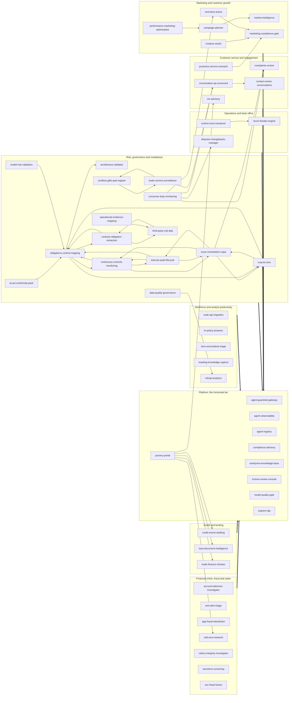

# portable-genai

Reference implementations of GenAI and agentic systems for regulated industries, built so
that the institution keeps the parts that matter.

## The question these repositories answer

Every enterprise system eventually faces one question: could we move it, in one piece, and
have it keep working somewhere else? In regulated industries a supervisor now asks it too.

Lock-in is not one decision. It accumulates in three places, and they have separate
switching costs:

- **The surface** users touch: the UI shell, the embedding model, the identity handshake.
- **The engine** that decides: where the consequential logic actually runs, and who owns
  the numbers it produces.
- **The ledger** that remembers: the audit trail, the citations, the records that outlive
  any vendor contract.

A system portable at only one or two of these has not removed the lock. It has moved it to
the layer nobody priced. These repositories are the worked answer at all three.

The argument in full, with the failure modes that produced it:
[Convergence: Agentic System Design with Portable Architecture for Lock-in Insurance](https://aawasthi.blogspot.com/2026/07/portable-agentic-systems-on-google-cloud.html).

## What that means in the code

Every repository here is built the same way, and the conventions are checkable rather than
aspirational.

**The domain imports nothing but the standard library.** Business logic sits in a pure core
reached through typed ports. Adapters for a managed cloud, a local machine or an on-premises
estate bind those ports; switching profiles changes zero domain code. If the whole system
runs on one machine, with no network and no vendor toolkit installed, the separation between
core and infrastructure is demonstrably real, and that is what the offline gate proves on
every commit.

**The consequential math is deterministic, pure and replayable.** The model narrates,
drafts and classifies. It never produces the number. Policy thresholds live in configuration
the institution owns, not in code and not in a prompt.

**Every generated claim carries a citation** with a source and a locator. Missing evidence
is a gap or a refusal, never an invention.

**Maker-checker on every consequential output.** Escalation only ever raises the bar.

**Identity is resolved, never accepted.** The server determines the actor and discards
client-supplied claims.

**A guard observed only green is indistinguishable from a guard that asserts nothing.**
Every quality gate must be shown to go red against a deliberate defect before it is allowed
to certify anything.

## Degradation is controlled, not silent

The same input, policy version and evidence produce the same consequential figures, checks,
escalation reasons and citation relationships in every profile. What changes between a
managed cloud profile and a laptop is quality, scale and durability, never policy.

| Concern | Managed profile | Local profile | Invariant |
|---|---|---|---|
| Business decision | Deterministic service, managed evidence | Same service, local evidence | Figures, rules, escalation reasons, evidence links |
| Model assistance | Frontier model, grounded retrieval | Local model or deterministic narration | The model never owns the outcome |
| Identity | Verified gateway or institution assertion | Seeded personas bound to loopback | The server resolves the actor |
| Audit | CMEK-backed WORM retention | Local hash chain | Event schema, actor attribution, correlation |

Degradation is a reduction in quality, scale or assurance. It is never an empty result
standing in for a successful query, an invented citation, or a passing grade over zero
evidence.

## Start with the shared packages

These are the pieces the systems share, versioned and pinned rather than copy-pasted:

| Package | What it carries |
|---|---|
| `hex-service-kit` | Identity primitives, service authentication, fail-closed network defaults, domain-neutral kernel types, the tracer port |
| `agent-eval-kit` | Eval report types, the evaluation gate port, and the not-falsely-green harness that makes a gate prove it can fail |
| `pii-kit` | Jurisdiction PII patterns, checksum validators, RE2-safe forms, the shared safety scorer |
| `review-kit` | The producer contract for routing consequential work to human review |
| `consent-preference-kit` | Consent wire types and a fail-closed client for asking whether a data subject may be contacted |
| `speech-lexicon-kit` | Pronunciation and terminology handling for voice surfaces |
| `obligation-register-kit` | Regulatory obligation register types and coverage scoring |
| `cost-latency-calculator` | The one cost and latency model: token-priced cost, decode-rate latency, and the pricing book a system is sized against |
| `hex-service-template` | The template and reusable CI a new service starts from |

Each is consumed from a version tag with no credentials required, and
`hex-service-template` is where a new service begins. `cost-latency-calculator` is the one
that runs in a browser rather than in a build: a repository sized by it ships a thin page
that loads the engine from a pinned tag, so the calculation and the prices live in one
place and a price change reaches all of them. Its app is public:
[size a system's cost and latency](https://portable-genai.github.io/cost-latency-calculator/).

## The systems

Each repository is a complete reference implementation: a pure domain core, typed
ports, an adapter family per profile, its own gate and its own deployment stack.

### The business use cases: user-facing applications

Every system in these tables is consumed directly by a named business persona, from
the MLRO's alert queue to the credit committee's memo pack. The last column names the
primary Gemini Enterprise services the managed profile rides, in three groups: `GE` is
the Gemini Enterprise app (search, research, analytics), `CX` is Customer Experience
(conversation, speech, agent assist), `AP` is the Agent Platform (agents, retrieval,
models, events). Every service sits behind a port (P-02), and the local and on-prem
profiles bind the same port to local adapters, so the platform is leverage rather than
lock-in. The deterministic engine that produces each consequential number stays in the
repository and is assigned to no platform service.

#### Risk, governance and compliance

| Repository | What it does | Primary Gemini Enterprise services |
|---|---|---|
| [`ai-act-conformity-pack`](https://github.com/portable-genai/ai-act-conformity-pack) | Maps each deployed AI/agent system in the Hrz3 registry to obligations under the EU AI Act, MAS FEAT/Veritas, HKMA, APRA CPS 234/230 AI guidance | AP RAG Engine: AI-Act and FEAT rule-KB grounding; AP Model Garden: conformity-narrative drafting |
| [`architecture-validator`](https://github.com/portable-genai/architecture-validator) | Validates a project's requirements / design against the General Principles (policy-as-code) + the reg KB | AP ADK: the root validation agent; AP RAG Engine: reg-KB retrieval |
| [`compliance-advisory`](https://github.com/portable-genai/compliance-advisory) | Q&A + use-case-specific control checklists, automated test cases and the exact questions a regulator/CRO will ask | GE Agent Search: cited regulatory Q&A for analysts; AP RAG Engine: requirement retrieval for control mappings |
| [`conflicts-gifts-pad-register`](https://github.com/portable-genai/conflicts-gifts-pad-register) | Ingests gifts & entertainment declarations, PAD/brokerage feeds, outside-business-interest and political-donation disclosures | AP ADK: screening and declaration agents; AP Model Garden: free-text declaration reading |
| [`consumer-duty-monitoring`](https://github.com/portable-genai/consumer-duty-monitoring) | Ingests product-governance packs, target-market definitions, fees/value-for-money data, complaints themes and sales/advice samples | CX Insights: complaint and conversation outcome signals; AP Model Garden: fair-value assessment drafting |
| [`continuous-controls-monitoring`](https://github.com/portable-genai/continuous-controls-monitoring) | Continuously TESTS key controls against live system, transaction and config evidence on a defined cadence, scores design vs operating effectiveness | AP BigQuery/Pub-Sub event-driven agents: test-cadence triggers and evidence feeds; AP Model Garden: auditor-ready exception narration |
| [`contract-obligation-extraction`](https://github.com/portable-genai/contract-obligation-extraction) | Reads executed and draft contracts (MSAs, SOWs, DPAs, outsourcing agreements, ISDAs) and extracts a structured register of obligations, key clauses | AP Model Garden: long-context clause and obligation extraction; AP ADK: contract-register agent tools |
| [`data-quality-governance`](https://github.com/portable-genai/data-quality-governance) | Profiles a dataset, runs deterministic DQ, freshness, schema-drift and PII-classification checks | AP BigQuery/Pub-Sub event-driven agents: profiling feeds and DQ-check scheduling triggers; AP Model Garden: incident-narrative drafting |
| [`internal-audit-lifecycle`](https://github.com/portable-genai/internal-audit-lifecycle) | End-to-end copilot for the internal-audit engagement lifecycle: risk-based annual planning, scoping, fieldwork test execution | AP RAG Engine: workpaper and prior-audit retrieval; AP Model Garden: planning and finding drafting |
| [`issue-remediation-capa`](https://github.com/portable-genai/issue-remediation-capa) | OWNS the full post-finding lifecycle of audit/exam/incident issues and corrective-and-preventive actions (Aud2 DETECTS, Aud3 OWNS to closure | AP ADK: issue-assessment and CAPA agents; AP BigQuery/Pub-Sub event-driven agents: five-source issue-feed intake |
| [`model-risk-validation`](https://github.com/portable-genai/model-risk-validation) | Drafts model-development documentation, independent-validation reports | AP Model Garden: validation-report and breach-narrative drafting; AP ADK: MRM copilot agent tools |
| [`obligations-control-mapping`](https://github.com/portable-genai/obligations-control-mapping) | Builds and maintains the firm's regulatory inventory and is the SINGLE SYSTEM OF RECORD for the obligation->policy->control->evidence graph: | AP RAG Engine: policy, standard and control corpus retrieval; AP Model Garden: cited linkage proposals |
| [`operational-resilience-mapping`](https://github.com/portable-genai/operational-resilience-mapping) | Builds and maintains the resilience map for each important/critical business service: ingests process docs, app-service catalogs | AP Model Garden: runbook, CMDB and contract reading; AP ADK: resilience-studio agent tools |
| [`rcsa-kri-erm`](https://github.com/portable-genai/rcsa-kri-erm) | Operates the second-line ERM cycle: drives Risk & Control Self-Assessment (drafts inherent-risk and control descriptions in house taxonomy | AP BigQuery/Pub-Sub event-driven agents: KRI feeds and breach triggers; AP Model Garden: committee commentary drafting |
| [`third-party-risk-ddq`](https://github.com/portable-genai/third-party-risk-ddq) | Ingests a vendor's DDQs (SIG/CAIQ-style), SOC 2 / ISO 27001 reports, financials and adverse media | GE Deep Research: vendor adverse-media research; AP RAG Engine: DDQ, SOC 2 and ISO corpus retrieval |
| [`trade-comms-surveillance`](https://github.com/portable-genai/trade-comms-surveillance) | MOVED FROM FCC TO RGC per the SUBJECT-of-disposition rule: this surveils the firm's OWN employees and trades for conduct | CX channels & speech: voice transcription of monitored comms; CX Insights: sentiment and topic signals feeding the surveillance engine |

#### Financial crime, fraud and cyber

| Repository | What it does | Primary Gemini Enterprise services |
|---|---|---|
| [`account-takeover-investigator`](https://github.com/portable-genai/account-takeover-investigator) | Correlates device, session | AP BigQuery/Pub-Sub event-driven agents: login, session and device signal triggers; AP Agent Runtime: the investigation agent and its A2A surface |
| [`aml-alert-triage`](https://github.com/portable-genai/aml-alert-triage) | Takes a deterministically-scored AML transaction-monitoring alert and produces a close / escalate-to-SAR / request-info recommendation with a | AP RAG Engine: typology retrieval grounding SAR narratives; AP BigQuery/Pub-Sub event-driven agents: alert-triggered triage runs |
| [`app-fraud-interdiction`](https://github.com/portable-genai/app-fraud-interdiction) | Scores an in-flight payment/checkout for scam and authorised-push-payment fraud (deterministic rules | AP BigQuery/Pub-Sub event-driven agents: in-flight payment triggers; CX channels & speech: the inbound scam-call channel |
| [`cdd-sow-research`](https://github.com/portable-genai/cdd-sow-research) | Grounded research over KYC docs + corporate registries + adverse media -> SoW narrative, risk rating, full citations and audit trail | GE Deep Research: adverse-media and registry research; GE Agent Search: KYC-corpus retrieval for the cited dossier |
| [`claims-integrity-investigator`](https://github.com/portable-genai/claims-integrity-investigator) | Reviews an insurance claim file (FNOL, adjuster notes, photos, invoices, medical/repair reports | AP Model Garden: multimodal review of claim documents and photos; AP RAG Engine: policy-wording retrieval |
| [`sanctions-screening`](https://github.com/portable-genai/sanctions-screening) | Resolves sanctions/PEP/watchlist and ISO 20022 / SWIFT payment-message screening hits | GE Deep Research: adverse-media research on screening hits; AP Agent Runtime: the disposition-drafting agent |
| [`soc-fraud-fusion`](https://github.com/portable-genai/soc-fraud-fusion) | Ingests a deterministically-correlated security/fraud alert and produces a triaged incident summary | AP RAG Engine: runbook and threat-intel retrieval; AP Agent Gateway + Model Armor: injection screening before narration |

#### Credit and lending

| Repository | What it does | Primary Gemini Enterprise services |
|---|---|---|
| [`credit-memo-drafting`](https://github.com/portable-genai/credit-memo-drafting) | Financials + filings -> cited credit memo, covenant extraction, risk flags, peer comps | AP Model Garden: cited memo drafting from filings; AP RAG Engine: borrower-filings grounding |
| [`loan-document-intelligence`](https://github.com/portable-genai/loan-document-intelligence) | Income and bank-statement extraction + cross-validation | AP Model Garden: income-figure normalisation and explanation; AP Agent Gateway + Model Armor: the PII guardrail pipeline |
| [`trade-finance-checker`](https://github.com/portable-genai/trade-finance-checker) | Letter-of-credit vs UCP600 discrepancy detection across the document set | AP RAG Engine: governed UCP600 rule-set retrieval; AP Model Garden: examiner-narrative drafting |

#### Operations and back office

| Repository | What it does | Primary Gemini Enterprise services |
|---|---|---|
| [`control-room-handover`](https://github.com/portable-genai/control-room-handover) | Aggregates queue/backlog/SLA-breach/aging across the ops systems into a deterministic scorecard, then drafts the shift-handover brief | AP BigQuery/Pub-Sub event-driven agents: shift-cadence ops-feed triggers; CX channels & speech: the optional spoken handover brief |
| [`disputes-chargebacks-manager`](https://github.com/portable-genai/disputes-chargebacks-manager) | Forward-running dispute/chargeback lifecycle (card scheme for banking | CX Agent Studio: in-channel dispute intake; AP ADK: representment-pack drafting agents |
| [`recon-breaks-engine`](https://github.com/portable-genai/recon-breaks-engine) | Diffs two or more financial feeds (nostro/GL vs scheme/RTGS | AP BigQuery/Pub-Sub event-driven agents: feed-arrival triggers for reconciliation runs; AP ADK: root-cause note drafting |

#### Customer service and engagement

| Repository | What it does | Primary Gemini Enterprise services |
|---|---|---|
| [`cio-advisory`](https://github.com/portable-genai/cio-advisory) | RAG over the bank's CIO house-view articles + the client's portfolio -> personalised, suitability-checked RM talking points (decision-support | AP RAG Engine: house-view retrieval grounding RM talking points; AP ADK: the RM briefing agent |
| [`complaints-review`](https://github.com/portable-genai/complaints-review) | Summarise, categorise and draft regulator-ready responses from complaint / conduct files | CX Agent Assist: file summaries and drafted responses beside officers; AP RAG Engine: policy retrieval for regulator-ready drafts |
| [`contact-centre-conversations`](https://github.com/portable-genai/contact-centre-conversations) | One contact-centre conversational platform with two separately-gated modes (absorbing ex-E1 and ex-E2 because they share one CCAI/RAG stack and | CX Agent Assist: the live whisper copilot; CX Agent Studio: gated self-service flows; CX channels & speech: streaming voice and chat |
| [`conversation-qa-scorecard`](https://github.com/portable-genai/conversation-qa-scorecard) | Post-contact deterministic compliance/quality scorecard across 100% of contacts (script adherence, disclosure presence, sentiment | CX channels & speech: batch transcription of every contact; CX Insights: QA analytics over the scored contacts |
| [`proactive-service-outreach`](https://github.com/portable-genai/proactive-service-outreach) | Detects operational service triggers (failed payment, delivery exception, expiring card, fraud hold, outage) and generates consent-gated | CX Agent Studio: consent-gated resolution conversations; AP BigQuery/Pub-Sub event-driven agents: operational trigger detection |

#### Marketing and customer growth

| Repository | What it does | Primary Gemini Enterprise services |
|---|---|---|
| [`campaign-planner`](https://github.com/portable-genai/campaign-planner) | Turns an objective and budget into a campaign plan for any vertical (banking or online retail): audience segmentation and propensity | AP Model Garden: brief and calendar drafting; AP ADK: campaign-planning agents |
| [`creative-studio`](https://github.com/portable-genai/creative-studio) | Generates on-brand ad copy and creative variants (text + image) for a bank or retailer | AP Model Garden: Gemini copy and Imagen creative variants; AP RAG Engine: brand-guideline grounding |
| [`market-intelligence`](https://github.com/portable-genai/market-intelligence) | Deep, cited market research and competitor analysis for a bank OR online retailer: market and segment sizing | GE Deep Research: cited market and competitor research; GE Agent Search: internal research-corpus grounding |
| [`marketing-compliance-gate`](https://github.com/portable-genai/marketing-compliance-gate) | Reviews campaigns, creatives and offers against per-market, per-vertical advertising / consumer-protection / fair-trading rules | AP RAG Engine: per-market advertising rule-KB retrieval; AP Model Garden: finding narration |
| [`next-best-action`](https://github.com/portable-genai/next-best-action) | Per-customer / per-shopper next-best-offer and cross-sell / up-sell of products or merchandise: propensity plus deterministic eligibility ranking | AP Model Garden: propensity and recommendation models; CX commerce agents: offer surfacing in customer journeys |
| [`performance-marketing-optimisation`](https://github.com/portable-genai/performance-marketing-optimisation) | Measures and optimises paid and owned channels for any vertical: multi-touch attribution, ROAS / CAC, deterministic bid and budget optimisation | GE Conversational Analytics: conversational exploration of performance metrics; AP BigQuery/Pub-Sub event-driven agents: anomaly-alert triggers |

#### Workforce and analyst productivity

| Repository | What it does | Primary Gemini Enterprise services |
|---|---|---|
| [`code-api-migration`](https://github.com/portable-genai/code-api-migration) | Plans and drafts code/API migrations (framework upgrades, deprecated-API replacement | AP Agent Garden: the code-modernisation template baseline; AP ADK: the migration agent loop over repo and CI |
| [`hr-policy-answers`](https://github.com/portable-genai/hr-policy-answers) | Answers an HR/policy/payroll/leave question with a cited answer plus a deterministic entitlement/eligibility calculation (leave balance, allowance | GE Agent Search: cited HR-policy answers; GE connectors: governed HR document ingestion |
| [`itsm-servicedesk-triage`](https://github.com/portable-genai/itsm-servicedesk-triage) | Triages an IT/ops ticket, classifies and routes it | GE Agent Search: runbook and KB retrieval; CX Agent Studio: conversational ticket intake |
| [`meeting-knowledge-capture`](https://github.com/portable-genai/meeting-knowledge-capture) | Turns meeting audio/transcripts into structured cited minutes, decisions and tracked action items | CX channels & speech: diarized meeting transcription; GE connectors: task and calendar routing |
| [`nl2sql-analytics`](https://github.com/portable-genai/nl2sql-analytics) | Answers an NL business question against a governed semantic layer (certified metrics, joins, row-level access), generates and validates SQL | GE Conversational Analytics: NL questions to governed SQL over BigQuery; GE Agent Search: data-dictionary retrieval |

### Platform and control-plane services

The shared control plane. Every application above consumes some of these, and none
of them is a business use case in its own right. Where Gemini Enterprise now ships a
named counterpart, the last column says so; the differentiation is the same in each
case: the regulated evidence trail, the offline profile and the portability proof,
none of which the managed service provides.

| Repository | What it does | Gemini Enterprise counterpart |
|---|---|---|
| [`agent-guardrail-gateway`](https://github.com/portable-genai/agent-guardrail-gateway) | Runtime policy proxy in front of any model: PII redaction, prompt-injection / jailbreak defense, input & output filtering, model routing & fallback | AP Agent Gateway + Model Armor: the managed counterpart |
| [`agent-observability`](https://github.com/portable-genai/agent-observability) | OpenTelemetry tracing, token cost / latency / drift dashboards, PLUS compliance-grade immutable prompt & response audit (WORM, retention, redacted) | AP Agent Observability: the managed counterpart |
| [`agent-registry`](https://github.com/portable-genai/agent-registry) | Catalog / gallery, versioning, ownership + agent identity + scoped entitlements + access control; A2A / MCP interop; usage analytics | AP Agent Registry: the managed counterpart; GE Agent Gallery: the discovery surface |
| [`enterprise-knowledge-base`](https://github.com/portable-genai/enterprise-knowledge-base) | ACL-aware RAG over the bank corpus with citations, residency and freshness | GE Agent Search: the enterprise knowledge base counterpart |
| [`human-review-console`](https://github.com/portable-genai/human-review-console) | The shared destination for every requires_human_review escalation the catalog raises: a tenant-partitioned review queue | n/a: no managed counterpart; the four-eyes queue is catalog IP |
| [`journey-portal`](https://github.com/portable-genai/journey-portal) | Persona-journey host portal that composes the built P1 app UIs into one UI per user via the implemented mode-1 same-origin reverse-proxy embedding | GE app: the persona-journey hub counterpart |
| [`model-quality-gate`](https://github.com/portable-genai/model-quality-gate) | Eval / red-team harness + golden datasets + prompt versioning + model cards + MRM evidence | AP Agent Evaluation: the managed counterpart; AP Agent Simulation: red-team runs |
| [`onprem-dlp`](https://github.com/portable-genai/onprem-dlp) | Open-source, CPU-only, on-prem DLP gate that scrubs data BEFORE any cloud egress | n/a: air-gapped by design |

### Proposed additions for financial services

Scoped in the catalog and not yet built: no repository stands behind these rows
yet. Each would follow the same conventions, the same standing rules and the same
platform posture as the systems above.

| Id | Proposed system | Business use case | Primary Gemini Enterprise services |
|---|---|---|---|
| `E6` | Collections & Financial-Hardship Assistant | Consent-gated, vulnerability-aware collections and financial-hardship conversations | CX Agent Studio: deterministic-plus-generative hardship conversation flows; CX Agent Assist: vulnerability cues and required disclosures beside human collectors |
| `F6` | Corporate-Actions Announcement & Election Processor | Reads corporate-action announcements (SWIFT MT564-style messages, vendor feeds, issuer documents) | AP BigQuery/Pub-Sub event-driven agents: announcement and position feeds with deadline clocks; AP RAG Engine: announcement-term grounding for the cited entitlement narrative |
| `Doc7` | Credit Portfolio Early-Warning & Covenant Monitoring | Post-origination monitoring of the lending book: covenant compliance tracked against the terms Doc2 extracts at origination | AP BigQuery/Pub-Sub event-driven agents: financials, transaction and news early-warning triggers; AP RAG Engine: cited covenant-terms and adverse-news evidence |
| `Prv1` | Data-Subject Request (DSAR/RTBF) Orchestrator | End-to-end intake, identity verification, fulfilment and response drafting for data-subject requests (access, correction, deletion/RTBF, portability | GE Agent Search: ACL-aware personal-data discovery; AP Agent Runtime: cross-system fan-out collection |
| `Ins2` | Insurance Underwriting Intake & Risk Appraisal | Ingests commercial and life underwriting submissions (broker packs, ACORD forms, loss runs, medical and financial evidence) | AP RAG Engine: appetite-guideline and policy-wording grounding for the cited appraisal; AP ADK: submission-ingestion and triage agents |
| `Cop2` | Regulatory Exam, RFI & Inquiry Response Orchestrator | Turns an incoming regulator exam request list, RFI | GE Agent Search: ACL-aware exam-evidence retrieval; AP Agent Runtime: deadline-tracked response workflows |
| `Rgc10` | Regulatory Notification & Reportability Assessor (pluggable rule packs: operational + privacy + prudential + market) | Takes any incident - operational/resilience outage, payment failure, third-party disruption, control breach | AP RAG Engine: per-regime notification-rule grounding; AP Agent Runtime: notification-clock case workflows |
| `Cop1` | Regulatory Returns QA & Reconciliation Assistant | Validates prudential and statistical regulatory returns (MAS 610/1003, APRA EFS/ARS, Solvency II QRTs | AP RAG Engine: reporting-instruction and taxonomy grounding; AP BigQuery/Pub-Sub event-driven agents: returns-vs-ledger reconciliation feeds |
| `Erm2` | Stress-Test, ICAAP/ORSA & Recovery-Plan Narrative Studio | Assembles the qualitative narrative around quantitative stress/capital results - scenario rationale, management-action descriptions | AP RAG Engine: prior-filings and regulatory-expectation grounding; AP BigQuery/Pub-Sub event-driven agents: model-run output ingestion |
| `Esg1` | Sustainability Disclosure Studio (ISSB/CSRD/ASRS) | Drafts the regulated climate / sustainability report by mapping governed source data and prior-year text onto the exact required datapoint taxonomy | AP RAG Engine: datapoint-taxonomy and substantiation grounding; AP ADK: the multi-framework report-assembly agent |
| `Rgc13` | Whistleblower / Speak-Up Triage & Investigation Copilot | Intake across hotline/email/portal | AP RAG Engine: policy and related-case grounding; AP Agent Runtime: SLA-clocked confidential investigations |

Systems are designed toward enterprise-grade security and compliance throughout: SSO and
least-privilege authorization enforced server-side, full auditability, and data residency
aligned to MAS TRM, APRA CPS 234 and PDPA-class regimes.

## How the repositories depend on each other

Dependencies are derived, not chosen. A small set of standing rules decides what a
system must consume, so its dependency list follows from what it does.

### The estate at a glance

Every use-case box leans on the platform tier, so those dependencies are drawn as
one thick arrow per box rather than one per repository. The thin arrows are the
direct repository-to-repository dependencies that remain. A repository sits in the
platform box when it belongs to the platform tier or is a control-plane service,
whatever its business category.

### The standing rules

| Rule | A system that... | must depend on | for |
|---|---|---|---|
| **R1** | processes customer or personal data | [`agent-guardrail-gateway`](https://github.com/portable-genai/agent-guardrail-gateway) | redaction, injection defence, input and output filtering |
| **R2** | runs in production | [`agent-observability`](https://github.com/portable-genai/agent-observability) | tracing plus an immutable prompt and response audit |
| **R3** | answers from retrieved documents | [`enterprise-knowledge-base`](https://github.com/portable-genai/enterprise-knowledge-base) | ACL-aware retrieval, or another governed store |
| **R4** | exposes an agent or a tool | [`agent-registry`](https://github.com/portable-genai/agent-registry) | identity, scoped entitlements, discovery |
| **R5** | promotes a model or agent to production | [`model-quality-gate`](https://github.com/portable-genai/model-quality-gate) | the evaluation and red-team gate |
| **R6** | is a new project, at intake | [`architecture-validator`](https://github.com/portable-genai/architecture-validator) | the architecture and requirements gate (should, not must) |
| **R7** | emits customer-facing marketing | [`marketing-compliance-gate`](https://github.com/portable-genai/marketing-compliance-gate) | per-market advertising and consumer-protection checks |
| **R8** | sets `requires_human_review` | [`human-review-console`](https://github.com/portable-genai/human-review-console) | the tenant-partitioned four-eyes queue |

One baseline applies to all of them, cross-cutting and mandatory: a VPC Service Controls
perimeter, customer-managed encryption keys, single-region residency, Cloud Interconnect
for the hybrid path, and least-privilege IAM.

### The platform tier, and how much of the estate leans on it

| Platform service | Repositories requiring it |
|---|---:|
| [`agent-observability`](https://github.com/portable-genai/agent-observability) | 50 |
| [`agent-guardrail-gateway`](https://github.com/portable-genai/agent-guardrail-gateway) | 41 |
| [`model-quality-gate`](https://github.com/portable-genai/model-quality-gate) | 41 |
| [`agent-registry`](https://github.com/portable-genai/agent-registry) | 33 |
| [`enterprise-knowledge-base`](https://github.com/portable-genai/enterprise-knowledge-base) | 30 |
| [`human-review-console`](https://github.com/portable-genai/human-review-console) | 16 |
| [`compliance-advisory`](https://github.com/portable-genai/compliance-advisory) | 16 |

Adopting one vertical therefore means standing up the platform services it names,
not just cloning one repository. The second vertical is much cheaper than the first.

### Every repository and what it requires

The catalog id is the stable identity used throughout each repository's own
documentation, so it is given alongside the repository name.

| Id | Repository | Requires |
|---|---|---|
| `G4` | [`account-takeover-investigator`](https://github.com/portable-genai/account-takeover-investigator) | [`agent-guardrail-gateway`](https://github.com/portable-genai/agent-guardrail-gateway), [`agent-observability`](https://github.com/portable-genai/agent-observability), [`model-quality-gate`](https://github.com/portable-genai/model-quality-gate) |
| `Hrz1` | [`agent-guardrail-gateway`](https://github.com/portable-genai/agent-guardrail-gateway) | nothing in this organization |
| `Hrz5` | [`agent-observability`](https://github.com/portable-genai/agent-observability) | [`agent-guardrail-gateway`](https://github.com/portable-genai/agent-guardrail-gateway) |
| `Hrz3` | [`agent-registry`](https://github.com/portable-genai/agent-registry) | [`agent-guardrail-gateway`](https://github.com/portable-genai/agent-guardrail-gateway), [`agent-observability`](https://github.com/portable-genai/agent-observability) |
| `Rgc14` | [`ai-act-conformity-pack`](https://github.com/portable-genai/ai-act-conformity-pack) | [`agent-guardrail-gateway`](https://github.com/portable-genai/agent-guardrail-gateway), [`enterprise-knowledge-base`](https://github.com/portable-genai/enterprise-knowledge-base), [`agent-registry`](https://github.com/portable-genai/agent-registry), [`model-quality-gate`](https://github.com/portable-genai/model-quality-gate), [`agent-observability`](https://github.com/portable-genai/agent-observability), [`compliance-advisory`](https://github.com/portable-genai/compliance-advisory), [`obligations-control-mapping`](https://github.com/portable-genai/obligations-control-mapping) |
| `G1` | [`aml-alert-triage`](https://github.com/portable-genai/aml-alert-triage) | [`agent-guardrail-gateway`](https://github.com/portable-genai/agent-guardrail-gateway), [`enterprise-knowledge-base`](https://github.com/portable-genai/enterprise-knowledge-base), [`agent-observability`](https://github.com/portable-genai/agent-observability), [`model-quality-gate`](https://github.com/portable-genai/model-quality-gate) |
| `G3` | [`app-fraud-interdiction`](https://github.com/portable-genai/app-fraud-interdiction) | [`agent-guardrail-gateway`](https://github.com/portable-genai/agent-guardrail-gateway), [`agent-observability`](https://github.com/portable-genai/agent-observability), [`model-quality-gate`](https://github.com/portable-genai/model-quality-gate) |
| `Rsk3` | [`architecture-validator`](https://github.com/portable-genai/architecture-validator) | [`compliance-advisory`](https://github.com/portable-genai/compliance-advisory), [`human-review-console`](https://github.com/portable-genai/human-review-console) |
| `Mkt2` | [`campaign-planner`](https://github.com/portable-genai/campaign-planner) | [`agent-guardrail-gateway`](https://github.com/portable-genai/agent-guardrail-gateway), [`enterprise-knowledge-base`](https://github.com/portable-genai/enterprise-knowledge-base), [`agent-registry`](https://github.com/portable-genai/agent-registry), [`agent-observability`](https://github.com/portable-genai/agent-observability), [`model-quality-gate`](https://github.com/portable-genai/model-quality-gate), [`market-intelligence`](https://github.com/portable-genai/market-intelligence), [`human-review-console`](https://github.com/portable-genai/human-review-console) |
| `Doc1` | [`cdd-sow-research`](https://github.com/portable-genai/cdd-sow-research) | [`agent-guardrail-gateway`](https://github.com/portable-genai/agent-guardrail-gateway), [`enterprise-knowledge-base`](https://github.com/portable-genai/enterprise-knowledge-base), [`agent-registry`](https://github.com/portable-genai/agent-registry), [`agent-observability`](https://github.com/portable-genai/agent-observability), [`model-quality-gate`](https://github.com/portable-genai/model-quality-gate), [`human-review-console`](https://github.com/portable-genai/human-review-console), [`compliance-advisory`](https://github.com/portable-genai/compliance-advisory) |
| `Doc3` | [`cio-advisory`](https://github.com/portable-genai/cio-advisory) | [`agent-guardrail-gateway`](https://github.com/portable-genai/agent-guardrail-gateway), [`enterprise-knowledge-base`](https://github.com/portable-genai/enterprise-knowledge-base), [`agent-registry`](https://github.com/portable-genai/agent-registry), [`agent-observability`](https://github.com/portable-genai/agent-observability), [`model-quality-gate`](https://github.com/portable-genai/model-quality-gate), [`human-review-console`](https://github.com/portable-genai/human-review-console) |
| `Ins1` | [`claims-integrity-investigator`](https://github.com/portable-genai/claims-integrity-investigator) | [`agent-guardrail-gateway`](https://github.com/portable-genai/agent-guardrail-gateway), [`enterprise-knowledge-base`](https://github.com/portable-genai/enterprise-knowledge-base), [`agent-registry`](https://github.com/portable-genai/agent-registry), [`agent-observability`](https://github.com/portable-genai/agent-observability), [`model-quality-gate`](https://github.com/portable-genai/model-quality-gate) |
| `H5` | [`code-api-migration`](https://github.com/portable-genai/code-api-migration) | [`agent-registry`](https://github.com/portable-genai/agent-registry), [`agent-observability`](https://github.com/portable-genai/agent-observability), [`model-quality-gate`](https://github.com/portable-genai/model-quality-gate) |
| `Doc6` | [`complaints-review`](https://github.com/portable-genai/complaints-review) | [`agent-guardrail-gateway`](https://github.com/portable-genai/agent-guardrail-gateway), [`enterprise-knowledge-base`](https://github.com/portable-genai/enterprise-knowledge-base), [`agent-observability`](https://github.com/portable-genai/agent-observability), [`model-quality-gate`](https://github.com/portable-genai/model-quality-gate), [`human-review-console`](https://github.com/portable-genai/human-review-console) |
| `Rsk1` | [`compliance-advisory`](https://github.com/portable-genai/compliance-advisory) | [`agent-guardrail-gateway`](https://github.com/portable-genai/agent-guardrail-gateway), [`agent-observability`](https://github.com/portable-genai/agent-observability), [`enterprise-knowledge-base`](https://github.com/portable-genai/enterprise-knowledge-base), [`human-review-console`](https://github.com/portable-genai/human-review-console) |
| `Rgc11` | [`conflicts-gifts-pad-register`](https://github.com/portable-genai/conflicts-gifts-pad-register) | [`agent-guardrail-gateway`](https://github.com/portable-genai/agent-guardrail-gateway), [`enterprise-knowledge-base`](https://github.com/portable-genai/enterprise-knowledge-base), [`agent-registry`](https://github.com/portable-genai/agent-registry), [`agent-observability`](https://github.com/portable-genai/agent-observability), [`model-quality-gate`](https://github.com/portable-genai/model-quality-gate), [`compliance-advisory`](https://github.com/portable-genai/compliance-advisory), [`trade-comms-surveillance`](https://github.com/portable-genai/trade-comms-surveillance) |
| `Rgc15` | [`consumer-duty-monitoring`](https://github.com/portable-genai/consumer-duty-monitoring) | [`agent-guardrail-gateway`](https://github.com/portable-genai/agent-guardrail-gateway), [`enterprise-knowledge-base`](https://github.com/portable-genai/enterprise-knowledge-base), [`agent-registry`](https://github.com/portable-genai/agent-registry), [`agent-observability`](https://github.com/portable-genai/agent-observability), [`model-quality-gate`](https://github.com/portable-genai/model-quality-gate), [`complaints-review`](https://github.com/portable-genai/complaints-review), [`conversation-qa-scorecard`](https://github.com/portable-genai/conversation-qa-scorecard), [`disputes-chargebacks-manager`](https://github.com/portable-genai/disputes-chargebacks-manager), [`next-best-action`](https://github.com/portable-genai/next-best-action), [`compliance-advisory`](https://github.com/portable-genai/compliance-advisory) |
| `E1` | [`contact-centre-conversations`](https://github.com/portable-genai/contact-centre-conversations) | [`agent-guardrail-gateway`](https://github.com/portable-genai/agent-guardrail-gateway), [`enterprise-knowledge-base`](https://github.com/portable-genai/enterprise-knowledge-base), [`agent-registry`](https://github.com/portable-genai/agent-registry), [`agent-observability`](https://github.com/portable-genai/agent-observability), [`model-quality-gate`](https://github.com/portable-genai/model-quality-gate) |
| `Aud2` | [`continuous-controls-monitoring`](https://github.com/portable-genai/continuous-controls-monitoring) | [`agent-guardrail-gateway`](https://github.com/portable-genai/agent-guardrail-gateway), [`agent-registry`](https://github.com/portable-genai/agent-registry), [`agent-observability`](https://github.com/portable-genai/agent-observability), [`model-quality-gate`](https://github.com/portable-genai/model-quality-gate), [`obligations-control-mapping`](https://github.com/portable-genai/obligations-control-mapping), [`compliance-advisory`](https://github.com/portable-genai/compliance-advisory), [`issue-remediation-capa`](https://github.com/portable-genai/issue-remediation-capa), [`internal-audit-lifecycle`](https://github.com/portable-genai/internal-audit-lifecycle) |
| `Rgc12` | [`contract-obligation-extraction`](https://github.com/portable-genai/contract-obligation-extraction) | [`agent-guardrail-gateway`](https://github.com/portable-genai/agent-guardrail-gateway), [`enterprise-knowledge-base`](https://github.com/portable-genai/enterprise-knowledge-base), [`agent-registry`](https://github.com/portable-genai/agent-registry), [`agent-observability`](https://github.com/portable-genai/agent-observability), [`model-quality-gate`](https://github.com/portable-genai/model-quality-gate), [`obligations-control-mapping`](https://github.com/portable-genai/obligations-control-mapping), [`third-party-risk-ddq`](https://github.com/portable-genai/third-party-risk-ddq) |
| `F5` | [`control-room-handover`](https://github.com/portable-genai/control-room-handover) | [`agent-observability`](https://github.com/portable-genai/agent-observability), [`recon-breaks-engine`](https://github.com/portable-genai/recon-breaks-engine), `procure-to-pay` (planned) |
| `E3` | [`conversation-qa-scorecard`](https://github.com/portable-genai/conversation-qa-scorecard) | [`agent-guardrail-gateway`](https://github.com/portable-genai/agent-guardrail-gateway), [`agent-observability`](https://github.com/portable-genai/agent-observability), [`model-quality-gate`](https://github.com/portable-genai/model-quality-gate), [`contact-centre-conversations`](https://github.com/portable-genai/contact-centre-conversations) |
| `Mkt3` | [`creative-studio`](https://github.com/portable-genai/creative-studio) | [`agent-guardrail-gateway`](https://github.com/portable-genai/agent-guardrail-gateway), [`enterprise-knowledge-base`](https://github.com/portable-genai/enterprise-knowledge-base), [`agent-registry`](https://github.com/portable-genai/agent-registry), [`agent-observability`](https://github.com/portable-genai/agent-observability), [`model-quality-gate`](https://github.com/portable-genai/model-quality-gate), [`marketing-compliance-gate`](https://github.com/portable-genai/marketing-compliance-gate), [`human-review-console`](https://github.com/portable-genai/human-review-console) |
| `Doc2` | [`credit-memo-drafting`](https://github.com/portable-genai/credit-memo-drafting) | [`agent-guardrail-gateway`](https://github.com/portable-genai/agent-guardrail-gateway), [`enterprise-knowledge-base`](https://github.com/portable-genai/enterprise-knowledge-base), [`agent-registry`](https://github.com/portable-genai/agent-registry), [`agent-observability`](https://github.com/portable-genai/agent-observability), [`model-quality-gate`](https://github.com/portable-genai/model-quality-gate), [`human-review-console`](https://github.com/portable-genai/human-review-console) |
| `H4` | [`data-quality-governance`](https://github.com/portable-genai/data-quality-governance) | [`agent-observability`](https://github.com/portable-genai/agent-observability), [`nl2sql-analytics`](https://github.com/portable-genai/nl2sql-analytics), `pricing-promotion-optimiser` (planned), `demand-forecast-replenishment` (planned) |
| `F2` | [`disputes-chargebacks-manager`](https://github.com/portable-genai/disputes-chargebacks-manager) | [`agent-guardrail-gateway`](https://github.com/portable-genai/agent-guardrail-gateway), [`agent-registry`](https://github.com/portable-genai/agent-registry), [`agent-observability`](https://github.com/portable-genai/agent-observability), [`model-quality-gate`](https://github.com/portable-genai/model-quality-gate), [`human-review-console`](https://github.com/portable-genai/human-review-console) |
| `Hrz2` | [`enterprise-knowledge-base`](https://github.com/portable-genai/enterprise-knowledge-base) | [`agent-guardrail-gateway`](https://github.com/portable-genai/agent-guardrail-gateway), [`agent-observability`](https://github.com/portable-genai/agent-observability), [`agent-registry`](https://github.com/portable-genai/agent-registry) |
| `H2` | [`hr-policy-answers`](https://github.com/portable-genai/hr-policy-answers) | [`agent-guardrail-gateway`](https://github.com/portable-genai/agent-guardrail-gateway), [`enterprise-knowledge-base`](https://github.com/portable-genai/enterprise-knowledge-base), [`agent-observability`](https://github.com/portable-genai/agent-observability), [`model-quality-gate`](https://github.com/portable-genai/model-quality-gate) |
| `Hrz7` | [`human-review-console`](https://github.com/portable-genai/human-review-console) | [`agent-registry`](https://github.com/portable-genai/agent-registry), [`agent-observability`](https://github.com/portable-genai/agent-observability) |
| `Aud1` | [`internal-audit-lifecycle`](https://github.com/portable-genai/internal-audit-lifecycle) | [`agent-guardrail-gateway`](https://github.com/portable-genai/agent-guardrail-gateway), [`enterprise-knowledge-base`](https://github.com/portable-genai/enterprise-knowledge-base), [`agent-registry`](https://github.com/portable-genai/agent-registry), [`agent-observability`](https://github.com/portable-genai/agent-observability), [`model-quality-gate`](https://github.com/portable-genai/model-quality-gate), [`compliance-advisory`](https://github.com/portable-genai/compliance-advisory), [`obligations-control-mapping`](https://github.com/portable-genai/obligations-control-mapping), [`continuous-controls-monitoring`](https://github.com/portable-genai/continuous-controls-monitoring), [`issue-remediation-capa`](https://github.com/portable-genai/issue-remediation-capa) |
| `Aud3` | [`issue-remediation-capa`](https://github.com/portable-genai/issue-remediation-capa) | [`agent-guardrail-gateway`](https://github.com/portable-genai/agent-guardrail-gateway), [`enterprise-knowledge-base`](https://github.com/portable-genai/enterprise-knowledge-base), [`agent-registry`](https://github.com/portable-genai/agent-registry), [`agent-observability`](https://github.com/portable-genai/agent-observability), [`model-quality-gate`](https://github.com/portable-genai/model-quality-gate), [`internal-audit-lifecycle`](https://github.com/portable-genai/internal-audit-lifecycle), [`continuous-controls-monitoring`](https://github.com/portable-genai/continuous-controls-monitoring), [`compliance-advisory`](https://github.com/portable-genai/compliance-advisory), `breach-reportability-assessor` (planned), [`complaints-review`](https://github.com/portable-genai/complaints-review), [`rcsa-kri-erm`](https://github.com/portable-genai/rcsa-kri-erm) |
| `H3` | [`itsm-servicedesk-triage`](https://github.com/portable-genai/itsm-servicedesk-triage) | [`agent-guardrail-gateway`](https://github.com/portable-genai/agent-guardrail-gateway), [`agent-registry`](https://github.com/portable-genai/agent-registry), [`agent-observability`](https://github.com/portable-genai/agent-observability), [`model-quality-gate`](https://github.com/portable-genai/model-quality-gate) |
| `Hrz9` | [`journey-portal`](https://github.com/portable-genai/journey-portal) | [`cdd-sow-research`](https://github.com/portable-genai/cdd-sow-research), [`credit-memo-drafting`](https://github.com/portable-genai/credit-memo-drafting), [`cio-advisory`](https://github.com/portable-genai/cio-advisory), [`trade-finance-checker`](https://github.com/portable-genai/trade-finance-checker), [`loan-document-intelligence`](https://github.com/portable-genai/loan-document-intelligence), [`compliance-advisory`](https://github.com/portable-genai/compliance-advisory), [`agent-observability`](https://github.com/portable-genai/agent-observability), [`human-review-console`](https://github.com/portable-genai/human-review-console) |
| `Doc5` | [`loan-document-intelligence`](https://github.com/portable-genai/loan-document-intelligence) | [`agent-guardrail-gateway`](https://github.com/portable-genai/agent-guardrail-gateway), [`agent-registry`](https://github.com/portable-genai/agent-registry), [`agent-observability`](https://github.com/portable-genai/agent-observability), [`model-quality-gate`](https://github.com/portable-genai/model-quality-gate), [`human-review-console`](https://github.com/portable-genai/human-review-console) |
| `Mkt1` | [`market-intelligence`](https://github.com/portable-genai/market-intelligence) | [`enterprise-knowledge-base`](https://github.com/portable-genai/enterprise-knowledge-base), [`agent-registry`](https://github.com/portable-genai/agent-registry), [`agent-observability`](https://github.com/portable-genai/agent-observability), [`model-quality-gate`](https://github.com/portable-genai/model-quality-gate), [`human-review-console`](https://github.com/portable-genai/human-review-console) |
| `Mkt6` | [`marketing-compliance-gate`](https://github.com/portable-genai/marketing-compliance-gate) | [`agent-guardrail-gateway`](https://github.com/portable-genai/agent-guardrail-gateway), [`enterprise-knowledge-base`](https://github.com/portable-genai/enterprise-knowledge-base), [`agent-registry`](https://github.com/portable-genai/agent-registry), [`agent-observability`](https://github.com/portable-genai/agent-observability), [`model-quality-gate`](https://github.com/portable-genai/model-quality-gate), [`compliance-advisory`](https://github.com/portable-genai/compliance-advisory), [`human-review-console`](https://github.com/portable-genai/human-review-console) |
| `H6` | [`meeting-knowledge-capture`](https://github.com/portable-genai/meeting-knowledge-capture) | [`enterprise-knowledge-base`](https://github.com/portable-genai/enterprise-knowledge-base), [`agent-observability`](https://github.com/portable-genai/agent-observability), [`model-quality-gate`](https://github.com/portable-genai/model-quality-gate) |
| `Hrz4` | [`model-quality-gate`](https://github.com/portable-genai/model-quality-gate) | [`enterprise-knowledge-base`](https://github.com/portable-genai/enterprise-knowledge-base), [`agent-observability`](https://github.com/portable-genai/agent-observability) |
| `Mrm1` | [`model-risk-validation`](https://github.com/portable-genai/model-risk-validation) | [`agent-guardrail-gateway`](https://github.com/portable-genai/agent-guardrail-gateway), [`enterprise-knowledge-base`](https://github.com/portable-genai/enterprise-knowledge-base), [`agent-registry`](https://github.com/portable-genai/agent-registry), [`agent-observability`](https://github.com/portable-genai/agent-observability), [`model-quality-gate`](https://github.com/portable-genai/model-quality-gate), [`compliance-advisory`](https://github.com/portable-genai/compliance-advisory), [`obligations-control-mapping`](https://github.com/portable-genai/obligations-control-mapping) |
| `Mkt5` | [`next-best-action`](https://github.com/portable-genai/next-best-action) | [`agent-guardrail-gateway`](https://github.com/portable-genai/agent-guardrail-gateway), [`enterprise-knowledge-base`](https://github.com/portable-genai/enterprise-knowledge-base), [`agent-registry`](https://github.com/portable-genai/agent-registry), [`agent-observability`](https://github.com/portable-genai/agent-observability), [`model-quality-gate`](https://github.com/portable-genai/model-quality-gate), [`marketing-compliance-gate`](https://github.com/portable-genai/marketing-compliance-gate), [`human-review-console`](https://github.com/portable-genai/human-review-console) |
| `H1` | [`nl2sql-analytics`](https://github.com/portable-genai/nl2sql-analytics) | [`agent-guardrail-gateway`](https://github.com/portable-genai/agent-guardrail-gateway), [`agent-registry`](https://github.com/portable-genai/agent-registry), [`agent-observability`](https://github.com/portable-genai/agent-observability), [`model-quality-gate`](https://github.com/portable-genai/model-quality-gate) |
| `Rgc7` | [`obligations-control-mapping`](https://github.com/portable-genai/obligations-control-mapping) | [`agent-guardrail-gateway`](https://github.com/portable-genai/agent-guardrail-gateway), [`enterprise-knowledge-base`](https://github.com/portable-genai/enterprise-knowledge-base), [`agent-registry`](https://github.com/portable-genai/agent-registry), [`agent-observability`](https://github.com/portable-genai/agent-observability), [`model-quality-gate`](https://github.com/portable-genai/model-quality-gate), [`compliance-advisory`](https://github.com/portable-genai/compliance-advisory), [`compliance-advisory`](https://github.com/portable-genai/compliance-advisory), [`contract-obligation-extraction`](https://github.com/portable-genai/contract-obligation-extraction), [`architecture-validator`](https://github.com/portable-genai/architecture-validator), [`continuous-controls-monitoring`](https://github.com/portable-genai/continuous-controls-monitoring), [`rcsa-kri-erm`](https://github.com/portable-genai/rcsa-kri-erm) |
| `Rsk6` | [`onprem-dlp`](https://github.com/portable-genai/onprem-dlp) | [`agent-guardrail-gateway`](https://github.com/portable-genai/agent-guardrail-gateway), [`agent-observability`](https://github.com/portable-genai/agent-observability) |
| `Rgc9` | [`operational-resilience-mapping`](https://github.com/portable-genai/operational-resilience-mapping) | [`agent-guardrail-gateway`](https://github.com/portable-genai/agent-guardrail-gateway), [`enterprise-knowledge-base`](https://github.com/portable-genai/enterprise-knowledge-base), [`agent-registry`](https://github.com/portable-genai/agent-registry), [`agent-observability`](https://github.com/portable-genai/agent-observability), [`model-quality-gate`](https://github.com/portable-genai/model-quality-gate), [`third-party-risk-ddq`](https://github.com/portable-genai/third-party-risk-ddq), `breach-reportability-assessor` (planned) |
| `Mkt4` | [`performance-marketing-optimisation`](https://github.com/portable-genai/performance-marketing-optimisation) | [`agent-guardrail-gateway`](https://github.com/portable-genai/agent-guardrail-gateway), [`agent-registry`](https://github.com/portable-genai/agent-registry), [`agent-observability`](https://github.com/portable-genai/agent-observability), [`model-quality-gate`](https://github.com/portable-genai/model-quality-gate), [`campaign-planner`](https://github.com/portable-genai/campaign-planner), [`human-review-console`](https://github.com/portable-genai/human-review-console) |
| `E5` | [`proactive-service-outreach`](https://github.com/portable-genai/proactive-service-outreach) | [`agent-guardrail-gateway`](https://github.com/portable-genai/agent-guardrail-gateway), [`agent-registry`](https://github.com/portable-genai/agent-registry), [`agent-observability`](https://github.com/portable-genai/agent-observability), [`model-quality-gate`](https://github.com/portable-genai/model-quality-gate), [`marketing-compliance-gate`](https://github.com/portable-genai/marketing-compliance-gate) |
| `Erm1` | [`rcsa-kri-erm`](https://github.com/portable-genai/rcsa-kri-erm) | [`agent-guardrail-gateway`](https://github.com/portable-genai/agent-guardrail-gateway), [`enterprise-knowledge-base`](https://github.com/portable-genai/enterprise-knowledge-base), [`agent-registry`](https://github.com/portable-genai/agent-registry), [`agent-observability`](https://github.com/portable-genai/agent-observability), [`model-quality-gate`](https://github.com/portable-genai/model-quality-gate), [`obligations-control-mapping`](https://github.com/portable-genai/obligations-control-mapping), [`issue-remediation-capa`](https://github.com/portable-genai/issue-remediation-capa), [`compliance-advisory`](https://github.com/portable-genai/compliance-advisory) |
| `F1` | [`recon-breaks-engine`](https://github.com/portable-genai/recon-breaks-engine) | [`agent-registry`](https://github.com/portable-genai/agent-registry), [`agent-observability`](https://github.com/portable-genai/agent-observability), [`model-quality-gate`](https://github.com/portable-genai/model-quality-gate) |
| `G2` | [`sanctions-screening`](https://github.com/portable-genai/sanctions-screening) | [`agent-guardrail-gateway`](https://github.com/portable-genai/agent-guardrail-gateway), [`agent-observability`](https://github.com/portable-genai/agent-observability), [`model-quality-gate`](https://github.com/portable-genai/model-quality-gate) |
| `G5` | [`soc-fraud-fusion`](https://github.com/portable-genai/soc-fraud-fusion) | [`enterprise-knowledge-base`](https://github.com/portable-genai/enterprise-knowledge-base), [`agent-observability`](https://github.com/portable-genai/agent-observability), [`model-quality-gate`](https://github.com/portable-genai/model-quality-gate) |
| `Rgc8` | [`third-party-risk-ddq`](https://github.com/portable-genai/third-party-risk-ddq) | [`agent-guardrail-gateway`](https://github.com/portable-genai/agent-guardrail-gateway), [`enterprise-knowledge-base`](https://github.com/portable-genai/enterprise-knowledge-base), [`agent-registry`](https://github.com/portable-genai/agent-registry), [`agent-observability`](https://github.com/portable-genai/agent-observability), [`model-quality-gate`](https://github.com/portable-genai/model-quality-gate), [`compliance-advisory`](https://github.com/portable-genai/compliance-advisory), [`contract-obligation-extraction`](https://github.com/portable-genai/contract-obligation-extraction) |
| `Cmp1` | [`trade-comms-surveillance`](https://github.com/portable-genai/trade-comms-surveillance) | [`agent-guardrail-gateway`](https://github.com/portable-genai/agent-guardrail-gateway), [`enterprise-knowledge-base`](https://github.com/portable-genai/enterprise-knowledge-base), [`agent-registry`](https://github.com/portable-genai/agent-registry), [`agent-observability`](https://github.com/portable-genai/agent-observability), [`model-quality-gate`](https://github.com/portable-genai/model-quality-gate), [`compliance-advisory`](https://github.com/portable-genai/compliance-advisory), [`conversation-qa-scorecard`](https://github.com/portable-genai/conversation-qa-scorecard), [`conflicts-gifts-pad-register`](https://github.com/portable-genai/conflicts-gifts-pad-register) |
| `Doc4` | [`trade-finance-checker`](https://github.com/portable-genai/trade-finance-checker) | [`agent-guardrail-gateway`](https://github.com/portable-genai/agent-guardrail-gateway), [`enterprise-knowledge-base`](https://github.com/portable-genai/enterprise-knowledge-base), [`agent-observability`](https://github.com/portable-genai/agent-observability), [`model-quality-gate`](https://github.com/portable-genai/model-quality-gate), [`human-review-console`](https://github.com/portable-genai/human-review-console) |

## The principles every system is mapped against

Each repository ships a `COMPLIANCE.md` that ties its controls to these numbered
principles, plus a per-regulator crosswalk appendix that is deliberately left for
the adopter to own.

| Id | Principle | What it requires in practice | Enforced by |
|---|---|---|---|
| **P-01** | Hybrid on-prem + GCP (Interconnect + VPC-SC) | Systems-of-record stay on-prem; burst to GCP over Cloud Interconnect; all managed-service APIs inside a VPC Service Controls perimeter; no public egress | [`compliance-advisory`](https://github.com/portable-genai/compliance-advisory) control-mapping module, [`architecture-validator`](https://github.com/portable-genai/architecture-validator) residency validator |
| **P-02** | No vendor lock-in (ports & adapters) | Custom domain logic isolated from managed-service connectors behind adapter interfaces; open standards (MCP, A2A, OpenTelemetry, GKE); Gemma fallback path documented | [`architecture-validator`](https://github.com/portable-genai/architecture-validator) Requirements Validator |
| **P-03** | Single region by default (residency) | All data + processing pinned to one in-country region (asia-southeast1, australia-southeast1/2, asia-east2, asia-northeast1); exceptions flagged + signed off. The maintainer's reference deployment runs in `us-central1` and therefore satisfies no Asia-Pacific residency regime: it demonstrates that the residency mechanism works, not an in-country deployment. An institution sets its own region as one reviewed input on each side, with no code change | [`architecture-validator`](https://github.com/portable-genai/architecture-validator) residency validator (Org Policy) |
| **P-04** | Minimise data to the model | PII tokenised / redacted at the boundary (DLP) before any model call; least sensitive data necessary | [`agent-guardrail-gateway`](https://github.com/portable-genai/agent-guardrail-gateway) Guardrail Gateway |
| **P-05** | Grounding over fine-tuning | Sensitive use cases use RAG / grounding on governed data, not training on PII | [`architecture-validator`](https://github.com/portable-genai/architecture-validator) Requirements Validator, [`enterprise-knowledge-base`](https://github.com/portable-genai/enterprise-knowledge-base) KB |
| **P-06** | Human-in-the-loop / maker-checker | Consequential actions require human approval; autonomy phased in (assist -> supervised -> autonomous) | [`agent-guardrail-gateway`](https://github.com/portable-genai/agent-guardrail-gateway) Guardrail Gateway + [`human-review-console`](https://github.com/portable-genai/human-review-console) Case, Workflow & Human-Review Platform + app design |
| **P-07** | Auditable & explainable by design | Immutable logs, citations, reasoning traces and model cards present from day one | [`agent-observability`](https://github.com/portable-genai/agent-observability) Observability/Audit + [`model-quality-gate`](https://github.com/portable-genai/model-quality-gate) AI Quality |
| **P-08** | Eval-gated promotion | No model/prompt to production without passing the eval / red-team suite | [`model-quality-gate`](https://github.com/portable-genai/model-quality-gate) AI Quality & Model-Risk |
| **P-09** | Defense in depth / zero trust | CMEK, Assured Workloads, least-privilege IAM, private endpoints, distinct agent identities | [`compliance-advisory`](https://github.com/portable-genai/compliance-advisory) control-mapping module + [`agent-registry`](https://github.com/portable-genai/agent-registry) Registry |
| **P-10** | Resilience & graceful degradation | Fallbacks, circuit breakers, kill-switch; meets APRA CPS 230 / HKMA OR-2 | [`agent-guardrail-gateway`](https://github.com/portable-genai/agent-guardrail-gateway) Guardrail Gateway + design |
| **P-11** | Cost & latency control | Model routing (small model first), caching, token budgets | [`agent-observability`](https://github.com/portable-genai/agent-observability) FinOps + [`agent-guardrail-gateway`](https://github.com/portable-genai/agent-guardrail-gateway) Guardrail Gateway |
| **P-12** | Reversibility / documented exit | Portability and an exit plan exist (outsourcing / concentration-risk rules) | [`operational-resilience-mapping`](https://github.com/portable-genai/operational-resilience-mapping) concentration-and-exit module (ex-Rsk5) |
| **P-13** | Fair, consented marketing (advertising compliance) | Customer-facing marketing / advertising is screened for advertising / consumer-protection / fair-trading claim compliance per market (JP / AU / SG), brand-guideline adherence and valid marketing consent before publication; product offers are eligibility / suitability-checked | [`marketing-compliance-gate`](https://github.com/portable-genai/marketing-compliance-gate) Marketing & Claims Compliance Gate; [`agent-guardrail-gateway`](https://github.com/portable-genai/agent-guardrail-gateway) Guardrail |

## A note on what this is

Every repository is audited against a shared set of numbered checks, A1 to G7, defined in
[`common-base-practices.md`](https://github.com/portable-genai/.github/blob/main/common-base-practices.md).
Each repository's own `docs/practices-audit.md` records its verdict against them, including
the checks it does not pass.

These are reference implementations and design demonstrations, not a supported product. The
patterns are provider-neutral, with a high-assurance managed-cloud profile as one binding
among several. Applying any of it to a live regulated system still requires your own
security, legal and model-risk review.

Licensed Apache-2.0.
