# portable-genai

Reference implementations of GenAI and agentic systems for regulated industries, built so
that the institution keeps the parts that matter.

## The question these repositories answer

Every enterprise system eventually faces one question: could we move it, in one piece, and
have it keep working somewhere else? In regulated industries a supervisor now asks it too.

Lock-in is not one decision. It accumulates in three places, and they have separate
switching costs:

- **The surface** users touch: the UI shell, the embedding model, the identity handshake.
- **The engine** that decides: where the consequential logic actually runs, and who owns
  the numbers it produces.
- **The ledger** that remembers: the audit trail, the citations, the records that outlive
  any vendor contract.

A system portable at only one or two of these has not removed the lock. It has moved it to
the layer nobody priced. These repositories are the worked answer at all three.

The argument in full, with the failure modes that produced it:
[Convergence: Agentic System Design with Portable Architecture for Lock-in Insurance](https://aawasthi.blogspot.com/2026/07/portable-agentic-systems-on-google-cloud.html).

## What that means in the code

Every repository here is built the same way, and the conventions are checkable rather than
aspirational.

**The domain imports nothing but the standard library.** Business logic sits in a pure core
reached through typed ports. Adapters for a managed cloud, a local machine or an on-premises
estate bind those ports; switching profiles changes zero domain code. If the whole system
runs on one machine, with no network and no vendor toolkit installed, the separation between
core and infrastructure is demonstrably real, and that is what the offline gate proves on
every commit.

**The consequential math is deterministic, pure and replayable.** The model narrates,
drafts and classifies. It never produces the number. Policy thresholds live in configuration
the institution owns, not in code and not in a prompt.

**Every generated claim carries a citation** with a source and a locator. Missing evidence
is a gap or a refusal, never an invention.

**Maker-checker on every consequential output.** Escalation only ever raises the bar.

**Identity is resolved, never accepted.** The server determines the actor and discards
client-supplied claims.

**A guard observed only green is indistinguishable from a guard that asserts nothing.**
Every quality gate must be shown to go red against a deliberate defect before it is allowed
to certify anything.

## Degradation is controlled, not silent

The same input, policy version and evidence produce the same consequential figures, checks,
escalation reasons and citation relationships in every profile. What changes between a
managed cloud profile and a laptop is quality, scale and durability, never policy.

| Concern | Managed profile | Local profile | Invariant |
|---|---|---|---|
| Business decision | Deterministic service, managed evidence | Same service, local evidence | Figures, rules, escalation reasons, evidence links |
| Model assistance | Frontier model, grounded retrieval | Local model or deterministic narration | The model never owns the outcome |
| Identity | Verified gateway or institution assertion | Seeded personas bound to loopback | The server resolves the actor |
| Audit | CMEK-backed WORM retention | Local hash chain | Event schema, actor attribution, correlation |

Degradation is a reduction in quality, scale or assurance. It is never an empty result
standing in for a successful query, an invented citation, or a passing grade over zero
evidence.

## Start with the shared packages

These are the pieces the systems share, versioned and pinned rather than copy-pasted:

| Package | What it carries |
|---|---|
| `hex-service-kit` | Identity primitives, service authentication, fail-closed network defaults, domain-neutral kernel types, the tracer port |
| `agent-eval-kit` | Eval report types, the evaluation gate port, and the not-falsely-green harness that makes a gate prove it can fail |
| `pii-kit` | Jurisdiction PII patterns, checksum validators, RE2-safe forms, the shared safety scorer |
| `review-kit` | The producer contract for routing consequential work to human review |
| `consent-preference-kit` | Consent wire types and a fail-closed client for asking whether a data subject may be contacted |
| `speech-lexicon-kit` | Pronunciation and terminology handling for voice surfaces |
| `obligation-register-kit` | Regulatory obligation register types and coverage scoring |
| `cost-latency-calculator` | The one cost and latency model: token-priced cost, decode-rate latency, and the pricing book a system is sized against |
| `hex-service-template` | The template and reusable CI a new service starts from |

Each is consumed from a version tag with no credentials required, and
`hex-service-template` is where a new service begins. `cost-latency-calculator` is the one
that runs in a browser rather than in a build: a repository sized by it ships a thin page
that loads the engine from a pinned tag, so the calculation and the prices live in one
place and a price change reaches all of them. Its app is public:
[size a system's cost and latency](https://portable-genai.github.io/cost-latency-calculator/).

## The systems

Each repository is a complete reference implementation: a pure domain core, typed
ports, an adapter family per profile, its own gate and its own deployment stack.

### The business use cases: user-facing applications

Every system in these tables is consumed directly by a named business persona, from
the MLRO's alert queue to the credit committee's memo pack. The last column names the
primary Gemini Enterprise services the managed profile rides, in three groups: `GE` is
the Gemini Enterprise app (search, research, analytics), `CX` is Customer Experience
(conversation, speech, agent assist), `AP` is the Agent Platform (agents, retrieval,
models, events). Every service sits behind a port (P-02), and the local and on-prem
profiles bind the same port to local adapters, so the platform is leverage rather than
lock-in. The deterministic engine that produces each consequential number stays in the
repository and is assigned to no platform service. A row marked (proposed) is scoped
in the catalog with no repository behind it yet, and follows the same conventions and
standing rules when built. The middle column is the BFSI go-to-market tier, not one of
the numbered design principles below: `P1` is the launch set adopted first, `P2` the
second wave, `P3` the broader BFSI core, `P4` adjacent verticals. The tier ranks
adoption sequence and dependency order, not build status, which the (proposed) marker
already carries, so a scoped row can outrank a built one. Rows are ordered by tier,
and each row's argument states what the system delivers, why it sits at that point in
the adoption sequence, and where Gemini and Google Cloud give it particular strength.

#### Financial crime, fraud and cyber

| Repository and what it does | BFSI tier, and why | Primary Gemini Enterprise services |
|---|---|---|
| [`cdd-sow-research`](https://github.com/portable-genai/cdd-sow-research) Grounded research over KYC docs + corporate registries + adverse media -> SoW narrative, risk rating, full citations and audit trail | `P1` The flagship of the launch set: grounded multi-source source-of-wealth research with full citations turns days of financial-crime analyst work into minutes, a cost centre every bank, wealth manager and insurer carries. It plays to Gemini's deepest strengths, Deep Research and Google Search grounding over adverse media and corporate registries, fused with retrieval over the institution's own KYC corpus. Incumbent KYC vendors cover screening and workflow; cited source-of-wealth research with a replayable audit trail is the part the supervisor reads. | • AP Grounding with Google Search: adverse-media and registry research • GE Agent Search: KYC-corpus retrieval for the cited dossier |
| [`aml-alert-triage`](https://github.com/portable-genai/aml-alert-triage) Takes a deterministically-scored AML transaction-monitoring alert and produces a close / escalate-to-SAR / request-info recommendation with a | `P2` Alert triage is the biggest analyst cost line in AML, and a grounded recommendation with rationale on every alert (close, escalate to SAR, or request information, each backed by typology retrieval) is where a governed Gemini workflow relieves the most hours. Second wave rather than launch set because a credible first proof needs the institution's transaction-monitoring feeds and model-risk sign-off in place; adopted alongside cdd-sow-research it reuses the same financial-crime evidence discipline and platform services. | • AP RAG Engine: typology retrieval grounding SAR narratives • AP BigQuery/Pub-Sub event-driven agents: alert-triggered triage runs |
| [`account-takeover-investigator`](https://github.com/portable-genai/account-takeover-investigator) Correlates device, session | `P3` Correlating device, session and behaviour signals into a cited, replayable investigation timeline produces the evidence form a fraud review and a regulator can both accept. BFSI core tier because the correlation needs the institution's login and device telemetry flowing through BigQuery before it shows its value; adopted with soc-fraud-fusion it completes the fraud-fusion cluster. | • AP BigQuery/Pub-Sub event-driven agents: login, session and device signal triggers • AP Agent Runtime: the investigation agent and its A2A surface |
| [`app-fraud-interdiction`](https://github.com/portable-genai/app-fraud-interdiction) Scores an in-flight payment/checkout for scam and authorised-push-payment fraud (deterministic rules | `P3` Authorised-push-payment reimbursement rules are shifting scam liability onto banks, so in-flight interdiction that pairs deterministic rules with model-read context carries a hard financial case, including on the inbound scam-call channel. BFSI core tier because it sits in the payment path, the deepest integration in this catalog, which institutions rightly grant only after the platform has earned production trust; the liability clock pulls it up as that trust is established. | • AP BigQuery/Pub-Sub event-driven agents: in-flight payment triggers • CX channels & speech: the inbound scam-call channel |
| [`claims-integrity-investigator`](https://github.com/portable-genai/claims-integrity-investigator) Reviews an insurance claim file (FNOL, adjuster notes, photos, invoices, medical/repair reports | `P3` The strongest insurance entry: Gemini's multimodal reading of the full claim file, adjuster notes, photos, invoices and medical or repair reports, grounds a cited integrity review no text-only tool can produce. It ranks with the BFSI core only because this catalog's launch set leads banking-side; in an insurance-led adoption it steps forward as the flagship alongside insurance-underwriting-intake. | • AP Model Garden: multimodal review of claim documents and photos • AP RAG Engine: policy-wording retrieval |
| [`sanctions-screening`](https://github.com/portable-genai/sanctions-screening) Resolves sanctions/PEP/watchlist and ISO 20022 / SWIFT payment-message screening hits | `P3` Sanctions and PEP hit disposition is high-volume analyst toil, and cited adverse-media research on each hit is exactly what Gemini Deep Research over public sources does well. Positioned as disposition assistance on top of the institution's existing screening stack rather than as stack replacement, so it follows the financial-crime adoption cdd-sow-research starts. | • adverse-media research on screening hits: unimplemented (GroundedAdverseMediaAdapter raises NotImplementedError after importing discoveryengine) • AP Agent Runtime: the disposition-drafting agent |
| [`soc-fraud-fusion`](https://github.com/portable-genai/soc-fraud-fusion) Ingests a deterministically-correlated security/fraud alert and produces a triaged incident summary | `P3` Fusing security and fraud signals into one triaged, narrated incident view closes the gap attackers exploit between the SOC and the fraud team. BFSI core tier by integration depth rather than value: the fusion claim means something only once both estates feed it, which most institutions reach in a second phase of adoption. | • AP RAG Engine: runbook and threat-intel retrieval • AP Agent Gateway + Model Armor: injection screening before narration |

#### Customer service and engagement

| Repository and what it does | BFSI tier, and why | Primary Gemini Enterprise services |
|---|---|---|
| [`cio-advisory`](https://github.com/portable-genai/cio-advisory) RAG over the bank's CIO house-view articles + the client's portfolio -> personalised, suitability-checked RM talking points (decision-support | `P1` The revenue-side case in the launch set: Gemini's strength in financial analysis turns the bank's CIO house view and each client's actual portfolio into personalised, suitability-checked RM talking points, decision support that stays firmly on the right side of the advice line. Wealth advisory is often judged too sensitive to automate first; the suitability guardrail and maker-checker routing are the risk answer, and a front-office revenue story is what earns executive sponsorship for the rest of the catalog. | • AP RAG Engine: house-view retrieval grounding RM talking points • AP ADK: the RM briefing agent |
| [`complaints-review`](https://github.com/portable-genai/complaints-review) Summarise, categorise and draft regulator-ready responses from complaint / conduct files | `P2` Summarising a complaint file, categorising it and drafting the regulator-ready response is steady, measurable relief on a cost line every retail institution carries, with Consumer Duty raising the stakes. Second wave because it lands most naturally as an extension of the compliance-advisory adoption, reusing the same policy retrieval and human-review console the compliance team already runs. | • CX Agent Assist: file summaries and drafted responses beside officers • AP RAG Engine: policy retrieval for regulator-ready drafts |
| [`contact-centre-conversations`](https://github.com/portable-genai/contact-centre-conversations) One contact-centre conversational platform with two separately-gated modes, merged because they share one CCAI/RAG stack and buyer | `P2` Contact-centre AI is the largest single GenAI investment line in financial services, and it sits exactly where Google's Customer Experience stack is strongest: live streaming voice, real-time agent assist and gated self-service on one CCAI and RAG platform. Second wave only because telephony and CX integration take months and involve a different sponsor than the governance-led launch set; where an adoption starts in customer experience, this system leads outright. | • CX Agent Assist: the live whisper copilot • CX Agent Studio: gated self-service flows • CX channels & speech: streaming voice and chat |
| [`conversation-qa-scorecard`](https://github.com/portable-genai/conversation-qa-scorecard) Post-contact deterministic compliance/quality scorecard across 100% of contacts (script adherence, disclosure presence, sentiment | `P3` Scoring every contact for script adherence, required disclosures and sentiment replaces the sampled QA regime regulators increasingly challenge, and it runs on the same speech and analytics stack contact-centre-conversations deploys. It follows in the BFSI core tier because it cannot precede the conversation platform it scores; adopted together they make every contact both served and evidenced. | • CX channels & speech: batch transcription of every contact • CX Insights: QA analytics over the scored contacts |
| [`proactive-service-outreach`](https://github.com/portable-genai/proactive-service-outreach) Detects operational service triggers (failed payment, delivery exception, expiring card, fraud hold, outage) and generates consent-gated | `P3` Turning operational events, a failed payment, an expiring card, a fraud hold, into consent-gated proactive contact resolves issues before customers call and measurably lifts trust. BFSI core tier because it presumes event feeds on Pub/Sub, consent plumbing and the marketing-compliance-gate; it is a fast follower on either the customer-service or the marketing adoption path. | • CX Agent Studio: consent-gated resolution conversations • AP BigQuery/Pub-Sub event-driven agents: operational trigger detection |
| `collections-hardship-assistant` (proposed) Consent-gated, vulnerability-aware collections and financial-hardship conversations | `P3` Collections is a conduct-sensitive cost centre where hardship rules (Consumer Duty, NCCP, fair dealing) bite hardest and cure-rate economics are provable, so vulnerability-aware conversations with required disclosures built in are both the compliant and the profitable path. Roadmap rather than launch because it rides contact-centre-conversations's channel stack and the consent framework, which must be in place first. | • CX Agent Studio: deterministic-plus-generative hardship conversation flows • CX Agent Assist: vulnerability cues and required disclosures beside human collectors |

#### Marketing and customer growth

| Repository and what it does | BFSI tier, and why | Primary Gemini Enterprise services |
|---|---|---|
| [`marketing-compliance-gate`](https://github.com/portable-genai/marketing-compliance-gate) Reviews campaigns, creatives and offers against per-market, per-vertical advertising / consumer-protection / fair-trading rules | `P1` Financial promotions are a regulated activity, so one maker-checker gate over campaigns, creatives and offers serves the CMO and the CCO at once and extends governed GenAI to the revenue side without leaving compliance ground. It ranks in the launch set because every outbound-content system in this catalog must depend on it (rule R7): adopting the gate first is what lets the whole marketing suite go live safely afterwards. | • AP RAG Engine: per-market advertising rule-KB retrieval • AP Model Garden: finding narration |
| [`campaign-planner`](https://github.com/portable-genai/campaign-planner) Turns an objective and budget into a campaign plan for any vertical (banking or online retail): audience segmentation and propensity | `P2` The planning engine of the marketing wave: Gemini drafts the briefs, audience narratives and channel calendars while a deterministic engine allocates budget under auditable eligibility and consent constraints, so the creative thinking is generated and the spend decision stays replayable. Second wave because it delivers most once marketing-compliance-gate is in place and market-intelligence feeds it: planning, screening and evidence then form one governed pipeline. | • AP Model Garden: brief and calendar drafting • AP ADK: campaign-planning agents |
| [`creative-studio`](https://github.com/portable-genai/creative-studio) Generates on-brand ad copy and creative variants (text + image) for a bank or retailer | `P2` The most visible of the marketing suite: Gemini writes the on-brand copy and Imagen generates the image variants, grounded in the institution's own brand guidelines, so campaign creative that once took an agency cycle takes an afternoon. Second wave because its brand-safety claim stands through the marketing-compliance-gate every variant must pass (rule R7): generation and gate together are what set it apart from ungoverned creative tools. | • AP Model Garden: Gemini copy and Imagen creative variants • AP RAG Engine: brand-guideline grounding |
| [`market-intelligence`](https://github.com/portable-genai/market-intelligence) Deep, cited market research and competitor analysis for a bank OR online retailer: market and segment sizing | `P2` Cited market and competitor research that pairs Gemini Deep Research over the open web with grounding in the institution's own research corpus, so market sizing and competitor claims arrive with checkable sources on both sides. Second wave with the marketing suite: governed-corpus grounding and citation discipline are what it adds over ungoverned research tools, and they show best once the marketing pipeline it feeds is live. | • AP Grounding with Google Search: cited market and competitor research • GE Agent Search: internal research-corpus grounding |
| [`next-best-action`](https://github.com/portable-genai/next-best-action) Per-customer / per-shopper next-best-offer and cross-sell / up-sell of products or merchandise: propensity plus deterministic eligibility ranking | `P2` Next-best-action is the most crowded claim in banking martech; this one earns its place through what the crowded field does not carry: deterministic eligibility, suitability and consent gates in front of every offer, so cross-sell revenue arrives already evidenced for conduct review. Propensity runs on platform models, the ranking stays replayable, and every offer reaches the customer through the marketing-compliance-gate. | • AP Model Garden: propensity and recommendation models • CX commerce agents: offer surfacing in customer journeys |
| [`performance-marketing-optimisation`](https://github.com/portable-genai/performance-marketing-optimisation) Measures and optimises paid and owned channels for any vertical: multi-touch attribution, ROAS / CAC, deterministic bid and budget optimisation | `P2` Multi-touch attribution and ROAS optimisation with deterministic statistics give the CMO and CFO one auditable account of what marketing spend returns, with conversational exploration of the numbers over BigQuery. Second wave by data dependency: it needs months of channel history flowing before optimisation shows value, so it is adopted with the gate and the planner and proves the suite's return over the following quarters. | • GE Conversational Analytics: conversational exploration of performance metrics • AP BigQuery/Pub-Sub event-driven agents: anomaly-alert triggers |

#### Credit and lending

| Repository and what it does | BFSI tier, and why | Primary Gemini Enterprise services |
|---|---|---|
| [`credit-memo-drafting`](https://github.com/portable-genai/credit-memo-drafting) Financials + filings -> cited credit memo, covenant extraction, risk flags, peer comps | `P1` Core credit workflow of every commercial bank and a direct showcase of Gemini's strength in financial analysis: it reads financials and filings, drafts the cited memo and extracts covenants, saving large analyst-hours per deal, while a human approves every memo as model-risk expectations require. Generic drafting copilots stop at prose; the deterministic covenant and ratio engine plus the citation discipline are the parts a credit committee can actually rely on. | • AP Model Garden: cited memo drafting from filings • AP RAG Engine: borrower-filings grounding |
| [`credit-portfolio-early-warning`](https://github.com/portable-genai/credit-portfolio-early-warning) Post-origination monitoring of the lending book: covenant compliance tracked against the terms credit-memo-drafting extracts at origination | `P2` Post-origination early warning is where credit losses are actually prevented and supervisors expect a live watchlist process; event-driven monitoring of financials, transactions and news over BigQuery and Pub/Sub is the platform-native way to run one. Second wave because it monitors the covenant register credit-memo-drafting extracts at origination, so it follows that system by construction; it ranks above the broader core because that prerequisite already ships and its deterministic, replayable scoring is what a credit committee is permitted to act on. | • AP BigQuery/Pub-Sub event-driven agents: financials, transaction and news early-warning triggers • AP RAG Engine: cited covenant-terms and adverse-news evidence |
| [`loan-document-intelligence`](https://github.com/portable-genai/loan-document-intelligence) Income and bank-statement extraction + cross-validation | `P2` High-volume income and bank-statement extraction with cross-validation: Gemini's multimodal document reading plus a deterministic verification layer moves retail lending's slowest step towards straight-through processing, with a PII guardrail in front. Second wave as the retail counterpart to credit-memo-drafting: it serves retail lending operations rather than the credit committee, shares the same extraction commons, and follows naturally once the commercial credit workflow is adopted. | • AP Model Garden: income-figure normalisation and explanation • AP Agent Gateway + Model Armor: the PII guardrail pipeline |
| [`trade-finance-checker`](https://github.com/portable-genai/trade-finance-checker) Letter-of-credit vs UCP600 discrepancy detection across the document set | `P2` Letter-of-credit checking against UCP600 across a full document set is scarce-expert work that few tools of any kind can demonstrate, and grounding the examiner's narrative in a governed rule set is a natural fit for Gemini over managed retrieval. Second wave by sequencing rather than weight: it shares credit-memo-drafting's sponsor and serves specialist volume, so it lands best as the depth proof once the mainstream credit workflow is in. | • AP RAG Engine: governed UCP600 rule-set retrieval • AP Model Garden: examiner-narrative drafting |

#### Risk, governance and compliance

| Repository and what it does | BFSI tier, and why | Primary Gemini Enterprise services |
|---|---|---|
| [`compliance-advisory`](https://github.com/portable-genai/compliance-advisory) Q&A + use-case-specific control checklists, automated test cases and the exact questions a regulator/CRO will ask | `P1` The natural first adoption in the launch set: it equips the CCO and CRO, who must approve every other agent in this catalog, with cited answers in their own regulatory language (MAS, HKMA, APRA, FSA), plus the control checklists and GCP control mappings that make approval an evidence review rather than a leap of faith. The other launch applications already depend on it, so adopting it first gives every later use case its compliance groundwork. | • GE Agent Search: cited regulatory Q&A for analysts • AP RAG Engine: requirement retrieval for control mappings |
| [`architecture-validator`](https://github.com/portable-genai/architecture-validator) Validates a project's requirements / design against the General Principles (policy-as-code) + the reg KB | `P2` An internal engineering gate rather than an end-user application: it validates each new project's requirements and design against the numbered principles and the regulatory KB at intake (rule R6), which is how an institution scales from one governed agent to many without re-litigating architecture each time. Second wave because it starts earning from the first follow-on project onwards, and every adopted vertical immediately needs it. | • AP ADK: the root validation agent • AP RAG Engine: reg-KB retrieval |
| [`exam-rfi-orchestrator`](https://github.com/portable-genai/exam-rfi-orchestrator) Turns an incoming regulator exam request list or supervisory inquiry into a managed, citation-backed response; handles RFIs and s.166-style reviews | `P2` Regulator exam requests and RFIs are universal pain with no incumbent tooling: this turns each request list into a managed, deadline-tracked, citation-backed response over the institution's own evidence. Second wave as the natural next step after compliance-advisory for the same compliance team, and a strong platform fit besides: ACL-aware cited retrieval at corpus scale is exactly what Agent Search provides, so adoption is more configuration than construction. | • GE Agent Search: ACL-aware exam-evidence retrieval • AP Agent Runtime: deadline-tracked response workflows |
| [`third-party-risk-ddq`](https://github.com/portable-genai/third-party-risk-ddq) Ingests a vendor's DDQs (SIG/CAIQ-style), SOC 2 / ISO 27001 reports, financials and adverse media | `P2` Vendor DDQ and SOC 2 review is documents-in, cited-memo-out, the lowest-integration relief in the governance family, with Gemini Deep Research adding the adverse-media sweep on each vendor. Second wave because it complements the entrenched, procurement-owned TPRM platforms rather than replacing them, so it lands best as an extension of the compliance-advisory adoption already underway. | • vendor adverse-media research: unimplemented (CloudAdverseMediaAdapter raises RuntimeError, grounding sub-agent unbound) • AP RAG Engine: DDQ, SOC 2 and ISO corpus retrieval |
| [`ai-act-conformity-pack`](https://github.com/portable-genai/ai-act-conformity-pack) Maps each deployed AI/agent system in the agent-registry to obligations under the EU AI Act, MAS FEAT/Veritas, HKMA, APRA CPS 234/230 AI guidance | `P3` The EU AI Act and FEAT conformity clock is real, and mapping each deployed agent to its obligations with drafted conformity narratives is work every AI-adopting institution now owes. BFSI core tier by dependency rather than weight: it reads the agent-registry, so it becomes valuable exactly when agents reach production, and it moves up the moment a supervisor asks for the evidence. | • AP RAG Engine: AI-Act and FEAT rule-KB grounding • AP Model Garden: conformity-narrative drafting |
| [`conflicts-gifts-pad-register`](https://github.com/portable-genai/conflicts-gifts-pad-register) Ingests gifts & entertainment declarations, PAD/brokerage feeds, outside-business-interest and political-donation disclosures | `P3` Conflicts, gifts and personal-account-dealing registers are universal obligations where the value is screening quality: free-text declarations read properly and cross-checked against brokerage feeds and disclosure history. BFSI core tier alongside trade-comms-surveillance, whose surveillance signals it consumes; together they close the personal-conduct loop. | • AP ADK: screening and declaration agents • AP Model Garden: free-text declaration reading |
| [`consumer-duty-monitoring`](https://github.com/portable-genai/consumer-duty-monitoring) Ingests product-governance packs, target-market definitions, fees/value-for-money data, complaints themes and sales/advice samples | `P3` Consumer-duty outcomes monitoring is board-level in the UK and spreading through APAC conduct regimes, and the platform's conversation-insight signals give it evidence that sampling never had. BFSI core tier because it consumes the complaints, QA and disputes feeds (complaints-review, conversation-qa-scorecard, disputes-chargebacks-manager), so it becomes credible exactly when those systems are producing data. | • CX Insights: complaint and conversation outcome signals • AP Model Garden: fair-value assessment drafting |
| [`continuous-controls-monitoring`](https://github.com/portable-genai/continuous-controls-monitoring) Continuously TESTS key controls against live system, transaction and config evidence on a defined cadence, scores design vs operating effectiveness | `P3` Continuously testing key controls against live system, transaction and configuration evidence beats sampling them, and event-driven agents over BigQuery and Pub/Sub are the natural way to run the cadence. The long-run prize of the governance estate sits in the BFSI core tier because it must integrate with live systems evidence to deliver, and it anchors the audit trio once internal-audit-lifecycle is in place. | • AP BigQuery/Pub-Sub event-driven agents: test-cadence triggers and evidence feeds • AP Model Garden: auditor-ready exception narration |
| [`contract-obligation-extraction`](https://github.com/portable-genai/contract-obligation-extraction) Reads executed and draft contracts (MSAs, SOWs, DPAs, outsourcing agreements, ISDAs) and extracts a structured register of obligations, key clauses | `P3` Reading MSAs, SOWs, DPAs and ISDAs into a structured register of obligations and key clauses is proven ground, and Gemini's long-context reading does the heavy lifting across full contract sets. BFSI core tier because the category has incumbents and this system's differentiation, the obligation graph feeding obligations-control-mapping and the evidence discipline, shows best once the surrounding compliance estate is in place. | • AP Model Garden: long-context clause and obligation extraction • AP ADK: contract-register agent tools |
| [`data-quality-governance`](https://github.com/portable-genai/data-quality-governance) Profiles a dataset, runs deterministic DQ, freshness, schema-drift and PII-classification checks | `P3` Data-quality governance is a prerequisite everywhere and a headline nowhere: deterministic DQ, freshness, schema-drift and PII-classification checks are what every deployed system in this catalog quietly leans on. BFSI core tier as connective tissue: it is adopted alongside the systems it protects, and ranking it lower would undermine the estate it underpins. | • AP BigQuery/Pub-Sub event-driven agents: profiling feeds and DQ-check scheduling triggers • AP Model Garden: incident-narrative drafting |
| [`internal-audit-lifecycle`](https://github.com/portable-genai/internal-audit-lifecycle) End-to-end copilot for the internal-audit engagement lifecycle: risk-based annual planning, scoping, fieldwork test execution | `P3` An end-to-end copilot for the audit engagement lifecycle with a clear owner, the Chief Audit Executive, and a strong hours case across planning, fieldwork and reporting, grounded in workpaper and prior-audit retrieval. BFSI core tier because third-line adoption naturally follows the first and second-line systems, and fieldwork value proves out over an audit cycle. | • AP RAG Engine: workpaper and prior-audit retrieval • AP Model Garden: planning and finding drafting |
| [`issue-remediation-capa`](https://github.com/portable-genai/issue-remediation-capa) OWNS the full post-finding lifecycle of audit/exam/incident issues and corrective-and-preventive actions (continuous-controls-monitoring DETECTS | `P3` The issue and CAPA register is the record regulators actually read when they test whether findings get fixed, and owning the full post-finding lifecycle is what turns detection into closure. BFSI core tier because its value compounds as findings flow in from internal-audit-lifecycle and continuous-controls-monitoring: it completes the audit lifecycle rather than starting it. | • AP ADK: issue-assessment and CAPA agents • AP BigQuery/Pub-Sub event-driven agents: five-source issue-feed intake |
| [`model-risk-validation`](https://github.com/portable-genai/model-risk-validation) Drafts model-development documentation, independent-validation reports | `P3` Model-risk validation teams carry an acute, supervisory-driven documentation backlog, and drafting development documentation and validation reports against the firm's own model evidence is relief that discipline can accept. BFSI core tier because the evidence bar in model risk is the highest in the building: credibility transfers from model-quality-gate's evaluation discipline once the platform is proven in production. | • AP Model Garden: validation-report and breach-narrative drafting • AP ADK: MRM copilot agent tools |
| [`obligations-control-mapping`](https://github.com/portable-genai/obligations-control-mapping) Builds and maintains the firm's regulatory inventory and is the SINGLE SYSTEM OF RECORD for the obligation->policy->control->evidence graph: | `P3` The obligation-to-policy-to-control-to-evidence graph is the system of record the rest of the governance estate writes into, and the single place a regulator's show-me question gets one consistent answer. BFSI core tier because a system of record is adopted deliberately, by committee, once its writers exist: with two or more governance systems live, it becomes indispensable. | • AP RAG Engine: policy, standard and control corpus retrieval • AP Model Garden: cited linkage proposals |
| [`operational-resilience-mapping`](https://github.com/portable-genai/operational-resilience-mapping) Builds and maintains the resilience map for each important/critical business service: ingests process docs, app-service catalogs | `P3` Operational resilience mapping under DORA and CPS 230 runs on a regulatory clock, and reading process documents, CMDBs and vendor contracts into a living service map is exactly the document-heavy work Gemini takes off a resilience team. BFSI core tier because the map is only as good as the process and vendor inventories fed into it: an ingestion-heavy build that pays off once those sources are connected, so it follows the estate rather than leading it. | • AP Model Garden: runbook, CMDB and contract reading • AP ADK: resilience-studio agent tools |
| [`rcsa-kri-erm`](https://github.com/portable-genai/rcsa-kri-erm) Operates the second-line ERM cycle: drives Risk & Control Self-Assessment (drafts inherent-risk and control descriptions in house taxonomy | `P3` RCSA drafting, KRI monitoring and committee reporting are the second line's daily grind, and a copilot that drafts in the house taxonomy with breach triggers wired to live feeds relieves real toil. BFSI core tier because ERM platforms are entrenched: this earns adoption as the assistive layer over them once the governance estate is trusted, not as a first replacement. | • AP BigQuery/Pub-Sub event-driven agents: KRI feeds and breach triggers • AP Model Garden: committee commentary drafting |
| [`trade-comms-surveillance`](https://github.com/portable-genai/trade-comms-surveillance) MOVED FROM FCC TO RGC per the SUBJECT-of-disposition rule: this surveils the firm's OWN employees and trades for conduct | `P3` Trade and communications surveillance is mandatory spend where false-positive volume is the industry's standing complaint; platform voice transcription plus sentiment and topic signals sharpen the investigation of what the incumbent stack surfaces. BFSI core tier because the position is assistive investigation on top of existing surveillance, which becomes credible once the platform tier is trusted with regulated communications data. | • CX channels & speech: voice transcription of monitored comms • CX Insights: sentiment and topic signals feeding the surveillance engine |
| `breach-reportability-assessor` (proposed) Takes any incident through a deterministic whether/whom/by-when reportability decision | `P3` Multi-regime reportability clocks (DORA, CPS 230, NDB, the GDPR 72-hour rule) press on every incident team, and a deterministic whether, whom and by-when engine with per-regime rule grounding is exactly this catalog's shape. It holds its core-tier rank for now because it is not yet built and its rule packs need jurisdiction-by-jurisdiction legal review before the decision output can be relied on. | • AP RAG Engine: per-regime notification-rule grounding • AP Agent Runtime: notification-clock case workflows |
| `esg-disclosure-studio` (proposed) Drafts the regulated climate / sustainability report by mapping governed source data and prior-year text onto the exact required datapoint taxonomy | `P3` ISSB-aligned sustainability reporting is now mandated across APAC listings, and datapoint-taxonomy completeness scoring over governed source data fits this catalog's deterministic pattern exactly. BFSI core tier because disclosure tooling is a crowded category and the greenwashing-claims gate already ships inside marketing-compliance-gate, so what remains here is the report-assembly workflow that follows it. | • AP RAG Engine: datapoint-taxonomy and substantiation grounding • AP ADK: the multi-framework report-assembly agent |
| `regulatory-returns-qa` (proposed) Validates prudential and statistical regulatory returns before submission | `P3` Pre-submission returns QA has a clear owner, the head of regulatory reporting, and the data already lives in BigQuery, so validation runs and narrated variance commentary are platform-native work. BFSI core tier because it complements the firm's existing validation engine rather than replacing it: the addition is explainable commentary and reconciliation evidence, adopted once the reporting team trusts the platform. | • AP RAG Engine: reporting-instruction and taxonomy grounding • AP BigQuery/Pub-Sub event-driven agents: returns-vs-ledger reconciliation feeds |
| `stress-icaap-orsa-studio` (proposed) Assembles the qualitative narrative around quantitative stress and capital results, with every figure cited to the source model run | `P3` ICAAP and ORSA narrative assembly is heavy recurring toil for a small expert team, and the AI claim is the safest possible one: the capital mathematics stays in the firm's own models and every figure is cited to its source run. BFSI core tier because the team it serves is small and specialist, so it is adopted on the strength of the second-line estate already in place. | • AP RAG Engine: prior-filings and regulatory-expectation grounding • AP BigQuery/Pub-Sub event-driven agents: model-run output ingestion |

#### Operations and back office

| Repository and what it does | BFSI tier, and why | Primary Gemini Enterprise services |
|---|---|---|
| [`control-room-handover`](https://github.com/portable-genai/control-room-handover) Aggregates queue/backlog/SLA-breach/aging across the ops systems into a deterministic scorecard, then drafts the shift-handover brief | `P3` The deterministic shift scorecard and drafted handover brief give operations leads every queue, backlog and SLA breach in one page at shift change, with an optional spoken brief through the speech stack. BFSI core tier because it aggregates the feeds of the ops systems around it, so it is adopted with the cluster whose coherence it demonstrates rather than on its own. | • AP BigQuery/Pub-Sub event-driven agents: shift-cadence ops-feed triggers • CX channels & speech: the optional spoken handover brief |
| [`disputes-chargebacks-manager`](https://github.com/portable-genai/disputes-chargebacks-manager) Forward-running dispute/chargeback lifecycle (card scheme for banking | `P3` Disputes and chargebacks carry scheme-clock deadlines and real write-off money: running the lifecycle against those clocks with drafted representment packs saves analyst hours and recovers losses. BFSI core tier because scheme workflows are bank-specific to integrate and the intake half rides contact-centre-conversations's channel stack; it accelerates wherever card operations feel the volume. | • CX Agent Studio: in-channel dispute intake • AP ADK: representment-pack drafting agents |
| [`recon-breaks-engine`](https://github.com/portable-genai/recon-breaks-engine) Diffs two or more financial feeds (nostro/GL vs scheme/RTGS | `P3` Reconciliation breaks are unglamorous, universal and deterministic to the bone: feed-triggered matching with drafted root-cause notes is the quiet workhorse operations teams learn to trust quickly. BFSI core tier with the ops cluster, where its evidence-first pattern reinforces the systems around it. | • AP BigQuery/Pub-Sub event-driven agents: feed-arrival triggers for reconciliation runs • AP ADK: root-cause note drafting |
| `corporate-actions-processor` (proposed) Reads corporate-action announcements (SWIFT MT564-style messages, vendor feeds, issuer documents) | `P3` Corporate-actions errors are among the costliest recurring operations losses in custody, and announcement-to-entitlement processing with deadline clocks is exactly the deterministic-engine-plus-cited-narration shape this catalog is built on. It ranks with the ops cluster because securities services is a specialist constituency: deep value for institutions running custody, rather than universal demand. | • AP BigQuery/Pub-Sub event-driven agents: announcement and position feeds with deadline clocks • AP RAG Engine: announcement-term grounding for the cited entitlement narrative |
| `insurance-underwriting-intake` (proposed) Ingests commercial and life underwriting submissions (broker packs, ACORD forms, loss runs, medical and financial evidence) | `P3` Submission triage is the top GenAI ask in commercial and life underwriting: broker packs, ACORD forms, loss runs and medical evidence read into a cited appraisal against appetite guidelines, so unquoted submissions stop leaking premium. Ranked with the insurance cluster in this banking-led catalog; in an insurance-led adoption it steps forward alongside claims-integrity-investigator to cover the policy lifecycle end to end. | • AP RAG Engine: appetite-guideline and policy-wording grounding for the cited appraisal • AP ADK: submission-ingestion and triage agents |

#### Workforce and analyst productivity

| Repository and what it does | BFSI tier, and why | Primary Gemini Enterprise services |
|---|---|---|
| [`nl2sql-analytics`](https://github.com/portable-genai/nl2sql-analytics) Answers an NL business question against a governed semantic layer (certified metrics, joins, row-level access), generates and validates SQL | `P3` Natural-language analytics has the broadest appeal in the catalog, and Conversational Analytics over BigQuery carries the conversational half natively; what this system adds is the governed semantic layer, certified metrics, row-level access and the discipline to refuse rather than guess. BFSI core tier because the governed layer is the point, and it is adopted once that governance story is established rather than before it. | • GE Conversational Analytics: NL questions to governed SQL over BigQuery • GE Agent Search: data-dictionary retrieval |
| [`code-api-migration`](https://github.com/portable-genai/code-api-migration) Plans and drafts code/API migrations (framework upgrades, deprecated-API replacement | `P4` Code and API migration rides the platform directly: Agent Garden ships the code-modernisation template this system extends with eval-gated, reviewable migration plans. Adjacent tier because it serves the engineering organisation of any industry rather than a BFSI business line, so it demonstrates the catalog's engineering discipline without competing for the BFSI adoption sequence. | • AP Agent Garden: the code-modernisation template baseline • AP ADK: the migration agent loop over repo and CI |
| [`hr-policy-answers`](https://github.com/portable-genai/hr-policy-answers) Answers an HR/policy/payroll/leave question with a cited answer plus a deterministic entitlement/eligibility calculation (leave balance, allowance | `P4` Cited HR policy answers with a deterministic entitlement calculation attached prove the catalog's answer-plus-mathematics pattern in a domain every organisation shares. Adjacent tier because HR serves any industry rather than a BFSI business line, and Agent Gallery partner agents already cover generic policy Q&A: it demonstrates breadth and pattern reuse rather than leading adoption. | • GE Agent Search: cited HR-policy answers • GE connectors: governed HR document ingestion |
| [`itsm-servicedesk-triage`](https://github.com/portable-genai/itsm-servicedesk-triage) Triages an IT/ops ticket, classifies and routes it | `P4` Service-desk triage is universal and immediately useful, and Agent Gallery partner agents (ServiceNow among them) already serve the mainstream of it. Adjacent tier: what this reference adds is the deterministic routing engine and its evidence trail, worthwhile alongside the partner ecosystem but not ahead of BFSI-core work. | • GE Agent Search: runbook and KB retrieval • CX Agent Studio: conversational ticket intake |
| [`meeting-knowledge-capture`](https://github.com/portable-genai/meeting-knowledge-capture) Turns meeting audio/transcripts into structured cited minutes, decisions and tracked action items | `P4` Meeting capture is the most commoditised claim in enterprise AI, with diarized transcription handled natively by the platform's speech stack; the distinct part here is the routed, cited action register with tracked owners. Adjacent tier: a breadth demonstration of the citation-and-routing pattern rather than a BFSI adoption priority. | • CX channels & speech: diarized meeting transcription • GE connectors: task and calendar routing |

### Platform and control-plane services

The shared control plane. Every application above consumes some of these, and none
of them is a business use case in its own right. Where Gemini Enterprise now ships a
named counterpart, the last column says so; the differentiation is the same in each
case: the regulated evidence trail, the offline profile and the portability proof,
none of which the managed service provides.

| Repository and what it does | Gemini Enterprise counterpart |
|---|---|
| [`agent-guardrail-gateway`](https://github.com/portable-genai/agent-guardrail-gateway) Runtime policy proxy in front of any model: PII redaction, prompt-injection / jailbreak defense, input & output filtering, model routing & fallback | • AP Agent Gateway + Model Armor: the managed counterpart |
| [`agent-observability`](https://github.com/portable-genai/agent-observability) OpenTelemetry tracing, token cost / latency / drift dashboards, PLUS compliance-grade immutable prompt & response audit (WORM, retention, redacted) | • AP Agent Observability: the managed counterpart |
| [`agent-registry`](https://github.com/portable-genai/agent-registry) Catalog / gallery, versioning, ownership + agent identity + scoped entitlements + access control; A2A / MCP interop; usage analytics | • AP Agent Registry: the managed counterpart • GE Agent Gallery: the discovery surface |
| [`enterprise-knowledge-base`](https://github.com/portable-genai/enterprise-knowledge-base) ACL-aware RAG over the bank corpus with citations, residency and freshness | • GE Agent Search: the enterprise knowledge base counterpart |
| [`human-review-console`](https://github.com/portable-genai/human-review-console) The shared destination for every requires_human_review escalation the catalog raises: a tenant-partitioned review queue | • n/a: no managed counterpart • the four-eyes queue is catalog IP |
| [`journey-portal`](https://github.com/portable-genai/journey-portal) Persona-journey host portal that composes the built launch-set app UIs into one UI per user via the implemented mode-1 same-origin reverse-proxy | • GE app: the persona-journey hub counterpart |
| [`model-quality-gate`](https://github.com/portable-genai/model-quality-gate) Eval / red-team harness + golden datasets + prompt versioning + model cards + MRM evidence | • AP Agent Evaluation: the managed counterpart • AP Agent Simulation: red-team runs |
| [`onprem-dlp`](https://github.com/portable-genai/onprem-dlp) Open-source, CPU-only, on-prem DLP gate that scrubs data BEFORE any cloud egress | • n/a: air-gapped by design |

Systems are designed toward enterprise-grade security and compliance throughout: SSO and
least-privilege authorization enforced server-side, full auditability, and data residency
aligned to MAS TRM, APRA CPS 234 and PDPA-class regimes.

## How the repositories depend on each other

Dependencies are derived, not chosen. A small set of standing rules decides what a
system must consume, so its dependency list follows from what it does.

### The estate at a glance

Every use-case box leans on the platform tier, so those dependencies are drawn as
one thick arrow per box rather than one per repository. The thin arrows are the
direct repository-to-repository dependencies that remain. A repository sits in the
platform box when it belongs to the platform tier or is a control-plane service,
whatever its business category.

```mermaid
flowchart LR
  subgraph PLAT["Platform: the horizontal tier"]
    agent_guardrail_gateway["agent-guardrail-gateway"]
    agent_observability["agent-observability"]
    agent_registry["agent-registry"]
    compliance_advisory["compliance-advisory"]
    enterprise_knowledge_base["enterprise-knowledge-base"]
    human_review_console["human-review-console"]
    journey_portal["journey-portal"]
    model_quality_gate["model-quality-gate"]
    onprem_dlp["onprem-dlp"]
  end
  subgraph FCC["Financial crime, fraud and cyber"]
    account_takeover_investigator["account-takeover-investigator"]
    aml_alert_triage["aml-alert-triage"]
    app_fraud_interdiction["app-fraud-interdiction"]
    cdd_sow_research["cdd-sow-research"]
    claims_integrity_investigator["claims-integrity-investigator"]
    sanctions_screening["sanctions-screening"]
    soc_fraud_fusion["soc-fraud-fusion"]
  end
  subgraph SVC["Customer service and engagement"]
    cio_advisory["cio-advisory"]
    complaints_review["complaints-review"]
    contact_centre_conversations["contact-centre-conversations"]
    conversation_qa_scorecard["conversation-qa-scorecard"]
    proactive_service_outreach["proactive-service-outreach"]
  end
  subgraph MKT["Marketing and customer growth"]
    campaign_planner["campaign-planner"]
    creative_studio["creative-studio"]
    market_intelligence["market-intelligence"]
    marketing_compliance_gate["marketing-compliance-gate"]
    next_best_action["next-best-action"]
    performance_marketing_optimisation["performance-marketing-optimisation"]
  end
  subgraph LND["Credit and lending"]
    credit_memo_drafting["credit-memo-drafting"]
    credit_portfolio_early_warning["credit-portfolio-early-warning"]
    loan_document_intelligence["loan-document-intelligence"]
    trade_finance_checker["trade-finance-checker"]
  end
  subgraph RGC["Risk, governance and compliance"]
    ai_act_conformity_pack["ai-act-conformity-pack"]
    architecture_validator["architecture-validator"]
    conflicts_gifts_pad_register["conflicts-gifts-pad-register"]
    consumer_duty_monitoring["consumer-duty-monitoring"]
    continuous_controls_monitoring["continuous-controls-monitoring"]
    contract_obligation_extraction["contract-obligation-extraction"]
    data_quality_governance["data-quality-governance"]
    exam_rfi_orchestrator["exam-rfi-orchestrator"]
    internal_audit_lifecycle["internal-audit-lifecycle"]
    issue_remediation_capa["issue-remediation-capa"]
    model_risk_validation["model-risk-validation"]
    obligations_control_mapping["obligations-control-mapping"]
    operational_resilience_mapping["operational-resilience-mapping"]
    rcsa_kri_erm["rcsa-kri-erm"]
    third_party_risk_ddq["third-party-risk-ddq"]
    trade_comms_surveillance["trade-comms-surveillance"]
  end
  subgraph OPS["Operations and back office"]
    control_room_handover["control-room-handover"]
    disputes_chargebacks_manager["disputes-chargebacks-manager"]
    recon_breaks_engine["recon-breaks-engine"]
  end
  subgraph WRK["Workforce and analyst productivity"]
    code_api_migration["code-api-migration"]
    hr_policy_answers["hr-policy-answers"]
    itsm_servicedesk_triage["itsm-servicedesk-triage"]
    meeting_knowledge_capture["meeting-knowledge-capture"]
    nl2sql_analytics["nl2sql-analytics"]
  end
  FCC ==> PLAT
  SVC ==> PLAT
  MKT ==> PLAT
  LND ==> PLAT
  RGC ==> PLAT
  OPS ==> PLAT
  WRK ==> PLAT
  ai_act_conformity_pack --> obligations_control_mapping
  campaign_planner --> market_intelligence
  conflicts_gifts_pad_register --> trade_comms_surveillance
  consumer_duty_monitoring --> complaints_review
  consumer_duty_monitoring --> conversation_qa_scorecard
  consumer_duty_monitoring --> disputes_chargebacks_manager
  consumer_duty_monitoring --> next_best_action
  continuous_controls_monitoring --> internal_audit_lifecycle
  continuous_controls_monitoring --> issue_remediation_capa
  continuous_controls_monitoring --> obligations_control_mapping
  contract_obligation_extraction --> obligations_control_mapping
  contract_obligation_extraction --> third_party_risk_ddq
  control_room_handover --> disputes_chargebacks_manager
  control_room_handover --> recon_breaks_engine
  conversation_qa_scorecard --> contact_centre_conversations
  creative_studio --> marketing_compliance_gate
  credit_portfolio_early_warning --> credit_memo_drafting
  data_quality_governance --> nl2sql_analytics
  exam_rfi_orchestrator --> obligations_control_mapping
  internal_audit_lifecycle --> continuous_controls_monitoring
  internal_audit_lifecycle --> issue_remediation_capa
  internal_audit_lifecycle --> obligations_control_mapping
  issue_remediation_capa --> complaints_review
  issue_remediation_capa --> continuous_controls_monitoring
  issue_remediation_capa --> internal_audit_lifecycle
  issue_remediation_capa --> rcsa_kri_erm
  journey_portal --> cdd_sow_research
  journey_portal --> cio_advisory
  journey_portal --> credit_memo_drafting
  journey_portal --> loan_document_intelligence
  journey_portal --> trade_finance_checker
  model_risk_validation --> obligations_control_mapping
  next_best_action --> marketing_compliance_gate
  obligations_control_mapping --> architecture_validator
  obligations_control_mapping --> continuous_controls_monitoring
  obligations_control_mapping --> contract_obligation_extraction
  obligations_control_mapping --> rcsa_kri_erm
  operational_resilience_mapping --> third_party_risk_ddq
  performance_marketing_optimisation --> campaign_planner
  proactive_service_outreach --> marketing_compliance_gate
  rcsa_kri_erm --> issue_remediation_capa
  rcsa_kri_erm --> obligations_control_mapping
  third_party_risk_ddq --> contract_obligation_extraction
  trade_comms_surveillance --> conflicts_gifts_pad_register
  trade_comms_surveillance --> conversation_qa_scorecard
```

### The standing rules

| Rule | A system that... | must depend on | for |
|---|---|---|---|
| **R1** | processes customer or personal data | [`agent-guardrail-gateway`](https://github.com/portable-genai/agent-guardrail-gateway) | redaction, injection defence, input and output filtering |
| **R2** | runs in production | [`agent-observability`](https://github.com/portable-genai/agent-observability) | tracing plus an immutable prompt and response audit |
| **R3** | answers from retrieved documents | [`enterprise-knowledge-base`](https://github.com/portable-genai/enterprise-knowledge-base) | ACL-aware retrieval, or another governed store |
| **R4** | exposes an agent or a tool | [`agent-registry`](https://github.com/portable-genai/agent-registry) | identity, scoped entitlements, discovery |
| **R5** | promotes a model or agent to production | [`model-quality-gate`](https://github.com/portable-genai/model-quality-gate) | the evaluation and red-team gate |
| **R6** | is a new project, at intake | [`architecture-validator`](https://github.com/portable-genai/architecture-validator) | the architecture and requirements gate (should, not must) |
| **R7** | emits customer-facing marketing | [`marketing-compliance-gate`](https://github.com/portable-genai/marketing-compliance-gate) | per-market advertising and consumer-protection checks |
| **R8** | sets `requires_human_review` | [`human-review-console`](https://github.com/portable-genai/human-review-console) | the tenant-partitioned four-eyes queue |

One baseline applies to all of them, cross-cutting and mandatory: a VPC Service Controls
perimeter, customer-managed encryption keys, single-region residency, Cloud Interconnect
for the hybrid path, and least-privilege IAM.

### The platform tier, and how much of the estate leans on it

| Platform service | Repositories requiring it |
|---|---:|
| [`agent-observability`](https://github.com/portable-genai/agent-observability) | 52 |
| [`agent-guardrail-gateway`](https://github.com/portable-genai/agent-guardrail-gateway) | 43 |
| [`model-quality-gate`](https://github.com/portable-genai/model-quality-gate) | 43 |
| [`agent-registry`](https://github.com/portable-genai/agent-registry) | 35 |
| [`enterprise-knowledge-base`](https://github.com/portable-genai/enterprise-knowledge-base) | 32 |
| [`human-review-console`](https://github.com/portable-genai/human-review-console) | 17 |
| [`compliance-advisory`](https://github.com/portable-genai/compliance-advisory) | 16 |

Adopting one vertical therefore means standing up the platform services it names,
not just cloning one repository. The second vertical is much cheaper than the first.

### Every repository and what it requires

Each repository is named by its repository name throughout, so nothing here has to be
resolved through a code first.

| Repository | Requires |
|---|---|
| [`account-takeover-investigator`](https://github.com/portable-genai/account-takeover-investigator) | [`agent-guardrail-gateway`](https://github.com/portable-genai/agent-guardrail-gateway), [`agent-observability`](https://github.com/portable-genai/agent-observability), [`model-quality-gate`](https://github.com/portable-genai/model-quality-gate) |
| [`agent-guardrail-gateway`](https://github.com/portable-genai/agent-guardrail-gateway) | nothing in this organization |
| [`agent-observability`](https://github.com/portable-genai/agent-observability) | [`agent-guardrail-gateway`](https://github.com/portable-genai/agent-guardrail-gateway) |
| [`agent-registry`](https://github.com/portable-genai/agent-registry) | [`agent-guardrail-gateway`](https://github.com/portable-genai/agent-guardrail-gateway), [`agent-observability`](https://github.com/portable-genai/agent-observability) |
| [`ai-act-conformity-pack`](https://github.com/portable-genai/ai-act-conformity-pack) | [`agent-guardrail-gateway`](https://github.com/portable-genai/agent-guardrail-gateway), [`enterprise-knowledge-base`](https://github.com/portable-genai/enterprise-knowledge-base), [`agent-registry`](https://github.com/portable-genai/agent-registry), [`model-quality-gate`](https://github.com/portable-genai/model-quality-gate), [`agent-observability`](https://github.com/portable-genai/agent-observability), [`compliance-advisory`](https://github.com/portable-genai/compliance-advisory), [`obligations-control-mapping`](https://github.com/portable-genai/obligations-control-mapping) |
| [`aml-alert-triage`](https://github.com/portable-genai/aml-alert-triage) | [`agent-guardrail-gateway`](https://github.com/portable-genai/agent-guardrail-gateway), [`enterprise-knowledge-base`](https://github.com/portable-genai/enterprise-knowledge-base), [`agent-observability`](https://github.com/portable-genai/agent-observability), [`model-quality-gate`](https://github.com/portable-genai/model-quality-gate) |
| [`app-fraud-interdiction`](https://github.com/portable-genai/app-fraud-interdiction) | [`agent-guardrail-gateway`](https://github.com/portable-genai/agent-guardrail-gateway), [`agent-observability`](https://github.com/portable-genai/agent-observability), [`model-quality-gate`](https://github.com/portable-genai/model-quality-gate) |
| [`architecture-validator`](https://github.com/portable-genai/architecture-validator) | [`compliance-advisory`](https://github.com/portable-genai/compliance-advisory), [`human-review-console`](https://github.com/portable-genai/human-review-console) |
| [`campaign-planner`](https://github.com/portable-genai/campaign-planner) | [`agent-guardrail-gateway`](https://github.com/portable-genai/agent-guardrail-gateway), [`enterprise-knowledge-base`](https://github.com/portable-genai/enterprise-knowledge-base), [`agent-registry`](https://github.com/portable-genai/agent-registry), [`agent-observability`](https://github.com/portable-genai/agent-observability), [`model-quality-gate`](https://github.com/portable-genai/model-quality-gate), [`market-intelligence`](https://github.com/portable-genai/market-intelligence), [`human-review-console`](https://github.com/portable-genai/human-review-console) |
| [`cdd-sow-research`](https://github.com/portable-genai/cdd-sow-research) | [`agent-guardrail-gateway`](https://github.com/portable-genai/agent-guardrail-gateway), [`enterprise-knowledge-base`](https://github.com/portable-genai/enterprise-knowledge-base), [`agent-registry`](https://github.com/portable-genai/agent-registry), [`agent-observability`](https://github.com/portable-genai/agent-observability), [`model-quality-gate`](https://github.com/portable-genai/model-quality-gate), [`human-review-console`](https://github.com/portable-genai/human-review-console), [`compliance-advisory`](https://github.com/portable-genai/compliance-advisory) |
| [`cio-advisory`](https://github.com/portable-genai/cio-advisory) | [`agent-guardrail-gateway`](https://github.com/portable-genai/agent-guardrail-gateway), [`enterprise-knowledge-base`](https://github.com/portable-genai/enterprise-knowledge-base), [`agent-registry`](https://github.com/portable-genai/agent-registry), [`agent-observability`](https://github.com/portable-genai/agent-observability), [`model-quality-gate`](https://github.com/portable-genai/model-quality-gate), [`human-review-console`](https://github.com/portable-genai/human-review-console) |
| [`claims-integrity-investigator`](https://github.com/portable-genai/claims-integrity-investigator) | [`agent-guardrail-gateway`](https://github.com/portable-genai/agent-guardrail-gateway), [`enterprise-knowledge-base`](https://github.com/portable-genai/enterprise-knowledge-base), [`agent-registry`](https://github.com/portable-genai/agent-registry), [`agent-observability`](https://github.com/portable-genai/agent-observability), [`model-quality-gate`](https://github.com/portable-genai/model-quality-gate) |
| [`code-api-migration`](https://github.com/portable-genai/code-api-migration) | [`agent-registry`](https://github.com/portable-genai/agent-registry), [`agent-observability`](https://github.com/portable-genai/agent-observability), [`model-quality-gate`](https://github.com/portable-genai/model-quality-gate) |
| [`complaints-review`](https://github.com/portable-genai/complaints-review) | [`agent-guardrail-gateway`](https://github.com/portable-genai/agent-guardrail-gateway), [`enterprise-knowledge-base`](https://github.com/portable-genai/enterprise-knowledge-base), [`agent-observability`](https://github.com/portable-genai/agent-observability), [`model-quality-gate`](https://github.com/portable-genai/model-quality-gate), [`human-review-console`](https://github.com/portable-genai/human-review-console) |
| [`compliance-advisory`](https://github.com/portable-genai/compliance-advisory) | [`agent-guardrail-gateway`](https://github.com/portable-genai/agent-guardrail-gateway), [`agent-observability`](https://github.com/portable-genai/agent-observability), [`enterprise-knowledge-base`](https://github.com/portable-genai/enterprise-knowledge-base), [`human-review-console`](https://github.com/portable-genai/human-review-console) |
| [`conflicts-gifts-pad-register`](https://github.com/portable-genai/conflicts-gifts-pad-register) | [`agent-guardrail-gateway`](https://github.com/portable-genai/agent-guardrail-gateway), [`enterprise-knowledge-base`](https://github.com/portable-genai/enterprise-knowledge-base), [`agent-registry`](https://github.com/portable-genai/agent-registry), [`agent-observability`](https://github.com/portable-genai/agent-observability), [`model-quality-gate`](https://github.com/portable-genai/model-quality-gate), [`compliance-advisory`](https://github.com/portable-genai/compliance-advisory), [`trade-comms-surveillance`](https://github.com/portable-genai/trade-comms-surveillance) |
| [`consumer-duty-monitoring`](https://github.com/portable-genai/consumer-duty-monitoring) | [`agent-guardrail-gateway`](https://github.com/portable-genai/agent-guardrail-gateway), [`enterprise-knowledge-base`](https://github.com/portable-genai/enterprise-knowledge-base), [`agent-registry`](https://github.com/portable-genai/agent-registry), [`agent-observability`](https://github.com/portable-genai/agent-observability), [`model-quality-gate`](https://github.com/portable-genai/model-quality-gate), [`complaints-review`](https://github.com/portable-genai/complaints-review), [`conversation-qa-scorecard`](https://github.com/portable-genai/conversation-qa-scorecard), [`disputes-chargebacks-manager`](https://github.com/portable-genai/disputes-chargebacks-manager), [`next-best-action`](https://github.com/portable-genai/next-best-action), [`compliance-advisory`](https://github.com/portable-genai/compliance-advisory) |
| [`contact-centre-conversations`](https://github.com/portable-genai/contact-centre-conversations) | [`agent-guardrail-gateway`](https://github.com/portable-genai/agent-guardrail-gateway), [`enterprise-knowledge-base`](https://github.com/portable-genai/enterprise-knowledge-base), [`agent-registry`](https://github.com/portable-genai/agent-registry), [`agent-observability`](https://github.com/portable-genai/agent-observability), [`model-quality-gate`](https://github.com/portable-genai/model-quality-gate) |
| [`continuous-controls-monitoring`](https://github.com/portable-genai/continuous-controls-monitoring) | [`agent-guardrail-gateway`](https://github.com/portable-genai/agent-guardrail-gateway), [`agent-registry`](https://github.com/portable-genai/agent-registry), [`agent-observability`](https://github.com/portable-genai/agent-observability), [`model-quality-gate`](https://github.com/portable-genai/model-quality-gate), [`obligations-control-mapping`](https://github.com/portable-genai/obligations-control-mapping), [`compliance-advisory`](https://github.com/portable-genai/compliance-advisory), [`issue-remediation-capa`](https://github.com/portable-genai/issue-remediation-capa), [`internal-audit-lifecycle`](https://github.com/portable-genai/internal-audit-lifecycle) |
| [`contract-obligation-extraction`](https://github.com/portable-genai/contract-obligation-extraction) | [`agent-guardrail-gateway`](https://github.com/portable-genai/agent-guardrail-gateway), [`enterprise-knowledge-base`](https://github.com/portable-genai/enterprise-knowledge-base), [`agent-registry`](https://github.com/portable-genai/agent-registry), [`agent-observability`](https://github.com/portable-genai/agent-observability), [`model-quality-gate`](https://github.com/portable-genai/model-quality-gate), [`obligations-control-mapping`](https://github.com/portable-genai/obligations-control-mapping), [`third-party-risk-ddq`](https://github.com/portable-genai/third-party-risk-ddq) |
| [`control-room-handover`](https://github.com/portable-genai/control-room-handover) | [`agent-observability`](https://github.com/portable-genai/agent-observability), [`recon-breaks-engine`](https://github.com/portable-genai/recon-breaks-engine), [`disputes-chargebacks-manager`](https://github.com/portable-genai/disputes-chargebacks-manager), `order-returns-rma` (planned), `procure-to-pay` (planned) |
| [`conversation-qa-scorecard`](https://github.com/portable-genai/conversation-qa-scorecard) | [`agent-guardrail-gateway`](https://github.com/portable-genai/agent-guardrail-gateway), [`agent-observability`](https://github.com/portable-genai/agent-observability), [`model-quality-gate`](https://github.com/portable-genai/model-quality-gate), [`contact-centre-conversations`](https://github.com/portable-genai/contact-centre-conversations) |
| [`creative-studio`](https://github.com/portable-genai/creative-studio) | [`agent-guardrail-gateway`](https://github.com/portable-genai/agent-guardrail-gateway), [`enterprise-knowledge-base`](https://github.com/portable-genai/enterprise-knowledge-base), [`agent-registry`](https://github.com/portable-genai/agent-registry), [`agent-observability`](https://github.com/portable-genai/agent-observability), [`model-quality-gate`](https://github.com/portable-genai/model-quality-gate), [`marketing-compliance-gate`](https://github.com/portable-genai/marketing-compliance-gate), [`human-review-console`](https://github.com/portable-genai/human-review-console) |
| [`credit-memo-drafting`](https://github.com/portable-genai/credit-memo-drafting) | [`agent-guardrail-gateway`](https://github.com/portable-genai/agent-guardrail-gateway), [`enterprise-knowledge-base`](https://github.com/portable-genai/enterprise-knowledge-base), [`agent-registry`](https://github.com/portable-genai/agent-registry), [`agent-observability`](https://github.com/portable-genai/agent-observability), [`model-quality-gate`](https://github.com/portable-genai/model-quality-gate), [`human-review-console`](https://github.com/portable-genai/human-review-console) |
| [`credit-portfolio-early-warning`](https://github.com/portable-genai/credit-portfolio-early-warning) | [`agent-guardrail-gateway`](https://github.com/portable-genai/agent-guardrail-gateway), [`enterprise-knowledge-base`](https://github.com/portable-genai/enterprise-knowledge-base), [`agent-registry`](https://github.com/portable-genai/agent-registry), [`agent-observability`](https://github.com/portable-genai/agent-observability), [`model-quality-gate`](https://github.com/portable-genai/model-quality-gate), [`human-review-console`](https://github.com/portable-genai/human-review-console), [`credit-memo-drafting`](https://github.com/portable-genai/credit-memo-drafting) |
| [`data-quality-governance`](https://github.com/portable-genai/data-quality-governance) | [`agent-observability`](https://github.com/portable-genai/agent-observability), [`nl2sql-analytics`](https://github.com/portable-genai/nl2sql-analytics), `pricing-promotion-optimiser` (planned), `demand-forecast-replenishment` (planned) |
| [`disputes-chargebacks-manager`](https://github.com/portable-genai/disputes-chargebacks-manager) | [`agent-guardrail-gateway`](https://github.com/portable-genai/agent-guardrail-gateway), [`agent-registry`](https://github.com/portable-genai/agent-registry), [`agent-observability`](https://github.com/portable-genai/agent-observability), [`model-quality-gate`](https://github.com/portable-genai/model-quality-gate), [`human-review-console`](https://github.com/portable-genai/human-review-console) |
| [`enterprise-knowledge-base`](https://github.com/portable-genai/enterprise-knowledge-base) | [`agent-guardrail-gateway`](https://github.com/portable-genai/agent-guardrail-gateway), [`agent-observability`](https://github.com/portable-genai/agent-observability), [`agent-registry`](https://github.com/portable-genai/agent-registry) |
| [`exam-rfi-orchestrator`](https://github.com/portable-genai/exam-rfi-orchestrator) | [`agent-guardrail-gateway`](https://github.com/portable-genai/agent-guardrail-gateway), [`enterprise-knowledge-base`](https://github.com/portable-genai/enterprise-knowledge-base), [`agent-registry`](https://github.com/portable-genai/agent-registry), [`agent-observability`](https://github.com/portable-genai/agent-observability), [`model-quality-gate`](https://github.com/portable-genai/model-quality-gate), [`compliance-advisory`](https://github.com/portable-genai/compliance-advisory), [`obligations-control-mapping`](https://github.com/portable-genai/obligations-control-mapping) |
| [`hr-policy-answers`](https://github.com/portable-genai/hr-policy-answers) | [`agent-guardrail-gateway`](https://github.com/portable-genai/agent-guardrail-gateway), [`enterprise-knowledge-base`](https://github.com/portable-genai/enterprise-knowledge-base), [`agent-observability`](https://github.com/portable-genai/agent-observability), [`model-quality-gate`](https://github.com/portable-genai/model-quality-gate) |
| [`human-review-console`](https://github.com/portable-genai/human-review-console) | [`agent-registry`](https://github.com/portable-genai/agent-registry), [`agent-observability`](https://github.com/portable-genai/agent-observability) |
| [`internal-audit-lifecycle`](https://github.com/portable-genai/internal-audit-lifecycle) | [`agent-guardrail-gateway`](https://github.com/portable-genai/agent-guardrail-gateway), [`enterprise-knowledge-base`](https://github.com/portable-genai/enterprise-knowledge-base), [`agent-registry`](https://github.com/portable-genai/agent-registry), [`agent-observability`](https://github.com/portable-genai/agent-observability), [`model-quality-gate`](https://github.com/portable-genai/model-quality-gate), [`compliance-advisory`](https://github.com/portable-genai/compliance-advisory), [`obligations-control-mapping`](https://github.com/portable-genai/obligations-control-mapping), [`continuous-controls-monitoring`](https://github.com/portable-genai/continuous-controls-monitoring), [`issue-remediation-capa`](https://github.com/portable-genai/issue-remediation-capa) |
| [`issue-remediation-capa`](https://github.com/portable-genai/issue-remediation-capa) | [`agent-guardrail-gateway`](https://github.com/portable-genai/agent-guardrail-gateway), [`enterprise-knowledge-base`](https://github.com/portable-genai/enterprise-knowledge-base), [`agent-registry`](https://github.com/portable-genai/agent-registry), [`agent-observability`](https://github.com/portable-genai/agent-observability), [`model-quality-gate`](https://github.com/portable-genai/model-quality-gate), [`internal-audit-lifecycle`](https://github.com/portable-genai/internal-audit-lifecycle), [`continuous-controls-monitoring`](https://github.com/portable-genai/continuous-controls-monitoring), [`compliance-advisory`](https://github.com/portable-genai/compliance-advisory), `breach-reportability-assessor` (planned), [`complaints-review`](https://github.com/portable-genai/complaints-review), [`rcsa-kri-erm`](https://github.com/portable-genai/rcsa-kri-erm) |
| [`itsm-servicedesk-triage`](https://github.com/portable-genai/itsm-servicedesk-triage) | [`agent-guardrail-gateway`](https://github.com/portable-genai/agent-guardrail-gateway), [`agent-registry`](https://github.com/portable-genai/agent-registry), [`agent-observability`](https://github.com/portable-genai/agent-observability), [`model-quality-gate`](https://github.com/portable-genai/model-quality-gate) |
| [`journey-portal`](https://github.com/portable-genai/journey-portal) | [`cdd-sow-research`](https://github.com/portable-genai/cdd-sow-research), [`credit-memo-drafting`](https://github.com/portable-genai/credit-memo-drafting), [`cio-advisory`](https://github.com/portable-genai/cio-advisory), [`trade-finance-checker`](https://github.com/portable-genai/trade-finance-checker), [`loan-document-intelligence`](https://github.com/portable-genai/loan-document-intelligence), [`compliance-advisory`](https://github.com/portable-genai/compliance-advisory), [`agent-observability`](https://github.com/portable-genai/agent-observability), [`human-review-console`](https://github.com/portable-genai/human-review-console) |
| [`loan-document-intelligence`](https://github.com/portable-genai/loan-document-intelligence) | [`agent-guardrail-gateway`](https://github.com/portable-genai/agent-guardrail-gateway), [`agent-registry`](https://github.com/portable-genai/agent-registry), [`agent-observability`](https://github.com/portable-genai/agent-observability), [`model-quality-gate`](https://github.com/portable-genai/model-quality-gate), [`human-review-console`](https://github.com/portable-genai/human-review-console) |
| [`market-intelligence`](https://github.com/portable-genai/market-intelligence) | [`enterprise-knowledge-base`](https://github.com/portable-genai/enterprise-knowledge-base), [`agent-registry`](https://github.com/portable-genai/agent-registry), [`agent-observability`](https://github.com/portable-genai/agent-observability), [`model-quality-gate`](https://github.com/portable-genai/model-quality-gate), [`human-review-console`](https://github.com/portable-genai/human-review-console) |
| [`marketing-compliance-gate`](https://github.com/portable-genai/marketing-compliance-gate) | [`agent-guardrail-gateway`](https://github.com/portable-genai/agent-guardrail-gateway), [`enterprise-knowledge-base`](https://github.com/portable-genai/enterprise-knowledge-base), [`agent-registry`](https://github.com/portable-genai/agent-registry), [`agent-observability`](https://github.com/portable-genai/agent-observability), [`model-quality-gate`](https://github.com/portable-genai/model-quality-gate), [`compliance-advisory`](https://github.com/portable-genai/compliance-advisory), [`human-review-console`](https://github.com/portable-genai/human-review-console) |
| [`meeting-knowledge-capture`](https://github.com/portable-genai/meeting-knowledge-capture) | [`enterprise-knowledge-base`](https://github.com/portable-genai/enterprise-knowledge-base), [`agent-observability`](https://github.com/portable-genai/agent-observability), [`model-quality-gate`](https://github.com/portable-genai/model-quality-gate) |
| [`model-quality-gate`](https://github.com/portable-genai/model-quality-gate) | [`enterprise-knowledge-base`](https://github.com/portable-genai/enterprise-knowledge-base), [`agent-observability`](https://github.com/portable-genai/agent-observability) |
| [`model-risk-validation`](https://github.com/portable-genai/model-risk-validation) | [`agent-guardrail-gateway`](https://github.com/portable-genai/agent-guardrail-gateway), [`enterprise-knowledge-base`](https://github.com/portable-genai/enterprise-knowledge-base), [`agent-registry`](https://github.com/portable-genai/agent-registry), [`agent-observability`](https://github.com/portable-genai/agent-observability), [`model-quality-gate`](https://github.com/portable-genai/model-quality-gate), [`compliance-advisory`](https://github.com/portable-genai/compliance-advisory), [`obligations-control-mapping`](https://github.com/portable-genai/obligations-control-mapping) |
| [`next-best-action`](https://github.com/portable-genai/next-best-action) | [`agent-guardrail-gateway`](https://github.com/portable-genai/agent-guardrail-gateway), [`enterprise-knowledge-base`](https://github.com/portable-genai/enterprise-knowledge-base), [`agent-registry`](https://github.com/portable-genai/agent-registry), [`agent-observability`](https://github.com/portable-genai/agent-observability), [`model-quality-gate`](https://github.com/portable-genai/model-quality-gate), [`marketing-compliance-gate`](https://github.com/portable-genai/marketing-compliance-gate), [`human-review-console`](https://github.com/portable-genai/human-review-console) |
| [`nl2sql-analytics`](https://github.com/portable-genai/nl2sql-analytics) | [`agent-guardrail-gateway`](https://github.com/portable-genai/agent-guardrail-gateway), [`agent-registry`](https://github.com/portable-genai/agent-registry), [`agent-observability`](https://github.com/portable-genai/agent-observability), [`model-quality-gate`](https://github.com/portable-genai/model-quality-gate) |
| [`obligations-control-mapping`](https://github.com/portable-genai/obligations-control-mapping) | [`agent-guardrail-gateway`](https://github.com/portable-genai/agent-guardrail-gateway), [`enterprise-knowledge-base`](https://github.com/portable-genai/enterprise-knowledge-base), [`agent-registry`](https://github.com/portable-genai/agent-registry), [`agent-observability`](https://github.com/portable-genai/agent-observability), [`model-quality-gate`](https://github.com/portable-genai/model-quality-gate), [`compliance-advisory`](https://github.com/portable-genai/compliance-advisory), [`contract-obligation-extraction`](https://github.com/portable-genai/contract-obligation-extraction), [`architecture-validator`](https://github.com/portable-genai/architecture-validator), [`continuous-controls-monitoring`](https://github.com/portable-genai/continuous-controls-monitoring), [`rcsa-kri-erm`](https://github.com/portable-genai/rcsa-kri-erm) |
| [`onprem-dlp`](https://github.com/portable-genai/onprem-dlp) | [`agent-guardrail-gateway`](https://github.com/portable-genai/agent-guardrail-gateway), [`agent-observability`](https://github.com/portable-genai/agent-observability) |
| [`operational-resilience-mapping`](https://github.com/portable-genai/operational-resilience-mapping) | [`agent-guardrail-gateway`](https://github.com/portable-genai/agent-guardrail-gateway), [`enterprise-knowledge-base`](https://github.com/portable-genai/enterprise-knowledge-base), [`agent-registry`](https://github.com/portable-genai/agent-registry), [`agent-observability`](https://github.com/portable-genai/agent-observability), [`model-quality-gate`](https://github.com/portable-genai/model-quality-gate), [`third-party-risk-ddq`](https://github.com/portable-genai/third-party-risk-ddq), `breach-reportability-assessor` (planned) |
| [`performance-marketing-optimisation`](https://github.com/portable-genai/performance-marketing-optimisation) | [`agent-guardrail-gateway`](https://github.com/portable-genai/agent-guardrail-gateway), [`agent-registry`](https://github.com/portable-genai/agent-registry), [`agent-observability`](https://github.com/portable-genai/agent-observability), [`model-quality-gate`](https://github.com/portable-genai/model-quality-gate), [`campaign-planner`](https://github.com/portable-genai/campaign-planner), [`human-review-console`](https://github.com/portable-genai/human-review-console) |
| [`proactive-service-outreach`](https://github.com/portable-genai/proactive-service-outreach) | [`agent-guardrail-gateway`](https://github.com/portable-genai/agent-guardrail-gateway), [`agent-registry`](https://github.com/portable-genai/agent-registry), [`agent-observability`](https://github.com/portable-genai/agent-observability), [`model-quality-gate`](https://github.com/portable-genai/model-quality-gate), [`marketing-compliance-gate`](https://github.com/portable-genai/marketing-compliance-gate) |
| [`rcsa-kri-erm`](https://github.com/portable-genai/rcsa-kri-erm) | [`agent-guardrail-gateway`](https://github.com/portable-genai/agent-guardrail-gateway), [`enterprise-knowledge-base`](https://github.com/portable-genai/enterprise-knowledge-base), [`agent-registry`](https://github.com/portable-genai/agent-registry), [`agent-observability`](https://github.com/portable-genai/agent-observability), [`model-quality-gate`](https://github.com/portable-genai/model-quality-gate), [`obligations-control-mapping`](https://github.com/portable-genai/obligations-control-mapping), [`issue-remediation-capa`](https://github.com/portable-genai/issue-remediation-capa), [`compliance-advisory`](https://github.com/portable-genai/compliance-advisory) |
| [`recon-breaks-engine`](https://github.com/portable-genai/recon-breaks-engine) | [`agent-registry`](https://github.com/portable-genai/agent-registry), [`agent-observability`](https://github.com/portable-genai/agent-observability), [`model-quality-gate`](https://github.com/portable-genai/model-quality-gate) |
| [`sanctions-screening`](https://github.com/portable-genai/sanctions-screening) | [`agent-guardrail-gateway`](https://github.com/portable-genai/agent-guardrail-gateway), [`agent-observability`](https://github.com/portable-genai/agent-observability), [`model-quality-gate`](https://github.com/portable-genai/model-quality-gate) |
| [`soc-fraud-fusion`](https://github.com/portable-genai/soc-fraud-fusion) | [`enterprise-knowledge-base`](https://github.com/portable-genai/enterprise-knowledge-base), [`agent-observability`](https://github.com/portable-genai/agent-observability), [`model-quality-gate`](https://github.com/portable-genai/model-quality-gate) |
| [`third-party-risk-ddq`](https://github.com/portable-genai/third-party-risk-ddq) | [`agent-guardrail-gateway`](https://github.com/portable-genai/agent-guardrail-gateway), [`enterprise-knowledge-base`](https://github.com/portable-genai/enterprise-knowledge-base), [`agent-registry`](https://github.com/portable-genai/agent-registry), [`agent-observability`](https://github.com/portable-genai/agent-observability), [`model-quality-gate`](https://github.com/portable-genai/model-quality-gate), [`compliance-advisory`](https://github.com/portable-genai/compliance-advisory), [`contract-obligation-extraction`](https://github.com/portable-genai/contract-obligation-extraction) |
| [`trade-comms-surveillance`](https://github.com/portable-genai/trade-comms-surveillance) | [`agent-guardrail-gateway`](https://github.com/portable-genai/agent-guardrail-gateway), [`enterprise-knowledge-base`](https://github.com/portable-genai/enterprise-knowledge-base), [`agent-registry`](https://github.com/portable-genai/agent-registry), [`agent-observability`](https://github.com/portable-genai/agent-observability), [`model-quality-gate`](https://github.com/portable-genai/model-quality-gate), [`compliance-advisory`](https://github.com/portable-genai/compliance-advisory), [`conversation-qa-scorecard`](https://github.com/portable-genai/conversation-qa-scorecard), [`conflicts-gifts-pad-register`](https://github.com/portable-genai/conflicts-gifts-pad-register) |
| [`trade-finance-checker`](https://github.com/portable-genai/trade-finance-checker) | [`agent-guardrail-gateway`](https://github.com/portable-genai/agent-guardrail-gateway), [`enterprise-knowledge-base`](https://github.com/portable-genai/enterprise-knowledge-base), [`agent-observability`](https://github.com/portable-genai/agent-observability), [`model-quality-gate`](https://github.com/portable-genai/model-quality-gate), [`human-review-console`](https://github.com/portable-genai/human-review-console) |

## The principles every system is mapped against

Each repository ships a `COMPLIANCE.md` that ties its controls to these numbered
principles, plus a per-regulator crosswalk appendix that is deliberately left for
the adopter to own.

| Id | Principle | What it requires in practice | Enforced by |
|---|---|---|---|
| **P-01** | Hybrid on-prem + GCP (Interconnect + VPC-SC) | Systems-of-record stay on-prem; burst to GCP over Cloud Interconnect; all managed-service APIs inside a VPC Service Controls perimeter; no public egress | [`compliance-advisory`](https://github.com/portable-genai/compliance-advisory) control-mapping module, [`architecture-validator`](https://github.com/portable-genai/architecture-validator) residency validator |
| **P-02** | No vendor lock-in (ports & adapters) | Custom domain logic isolated from managed-service connectors behind adapter interfaces; open standards (MCP, A2A, OpenTelemetry, GKE); Gemma fallback path documented | [`architecture-validator`](https://github.com/portable-genai/architecture-validator) Requirements Validator |
| **P-03** | Single region by default (residency) | All data + processing pinned to one in-country region (asia-southeast1, australia-southeast1/2, asia-east2, asia-northeast1); exceptions flagged + signed off. The maintainer's reference deployment runs in `us-central1` and therefore satisfies no Asia-Pacific residency regime: it demonstrates that the residency mechanism works, not an in-country deployment. An institution sets its own region as one reviewed input on each side, with no code change | [`architecture-validator`](https://github.com/portable-genai/architecture-validator) residency validator (Org Policy) |
| **P-04** | Minimise data to the model | PII tokenised / redacted at the boundary (DLP) before any model call; least sensitive data necessary | [`agent-guardrail-gateway`](https://github.com/portable-genai/agent-guardrail-gateway) Guardrail Gateway |
| **P-05** | Grounding over fine-tuning | Sensitive use cases use RAG / grounding on governed data, not training on PII | [`architecture-validator`](https://github.com/portable-genai/architecture-validator) Requirements Validator, [`enterprise-knowledge-base`](https://github.com/portable-genai/enterprise-knowledge-base) KB |
| **P-06** | Human-in-the-loop / maker-checker | Consequential actions require human approval; autonomy phased in (assist -> supervised -> autonomous) | [`agent-guardrail-gateway`](https://github.com/portable-genai/agent-guardrail-gateway) Guardrail Gateway + [`human-review-console`](https://github.com/portable-genai/human-review-console) Case, Workflow & Human-Review Platform + app design |
| **P-07** | Auditable & explainable by design | Immutable logs, citations, reasoning traces and model cards present from day one | [`agent-observability`](https://github.com/portable-genai/agent-observability) Observability/Audit + [`model-quality-gate`](https://github.com/portable-genai/model-quality-gate) AI Quality |
| **P-08** | Eval-gated promotion | No model/prompt to production without passing the eval / red-team suite | [`model-quality-gate`](https://github.com/portable-genai/model-quality-gate) AI Quality & Model-Risk |
| **P-09** | Defense in depth / zero trust | CMEK, Assured Workloads, least-privilege IAM, private endpoints, distinct agent identities | [`compliance-advisory`](https://github.com/portable-genai/compliance-advisory) control-mapping module + [`agent-registry`](https://github.com/portable-genai/agent-registry) Registry |
| **P-10** | Resilience & graceful degradation | Fallbacks, circuit breakers, kill-switch; meets APRA CPS 230 / HKMA OR-2 | [`agent-guardrail-gateway`](https://github.com/portable-genai/agent-guardrail-gateway) Guardrail Gateway + design |
| **P-11** | Cost & latency control | Model routing (small model first), caching, token budgets | [`agent-observability`](https://github.com/portable-genai/agent-observability) FinOps + [`agent-guardrail-gateway`](https://github.com/portable-genai/agent-guardrail-gateway) Guardrail Gateway |
| **P-12** | Reversibility / documented exit | Portability and an exit plan exist (outsourcing / concentration-risk rules) | [`operational-resilience-mapping`](https://github.com/portable-genai/operational-resilience-mapping) concentration-and-exit module |
| **P-13** | Fair, consented marketing (advertising compliance) | Customer-facing marketing / advertising is screened for advertising / consumer-protection / fair-trading claim compliance per market (JP / AU / SG), brand-guideline adherence and valid marketing consent before publication; product offers are eligibility / suitability-checked | [`marketing-compliance-gate`](https://github.com/portable-genai/marketing-compliance-gate) Marketing & Claims Compliance Gate; [`agent-guardrail-gateway`](https://github.com/portable-genai/agent-guardrail-gateway) Guardrail |

## A note on what this is

Every repository is audited against a shared set of numbered checks, A1 to G7, defined in
[`common-base-practices.md`](https://github.com/portable-genai/.github/blob/main/common-base-practices.md).
Each repository's own `docs/practices-audit.md` records its verdict against them, including
the checks it does not pass.

These are reference implementations and design demonstrations, not a supported product. The
patterns are provider-neutral, with a high-assurance managed-cloud profile as one binding
among several. Applying any of it to a live regulated system still requires your own
security, legal and model-risk review.

Licensed Apache-2.0.
